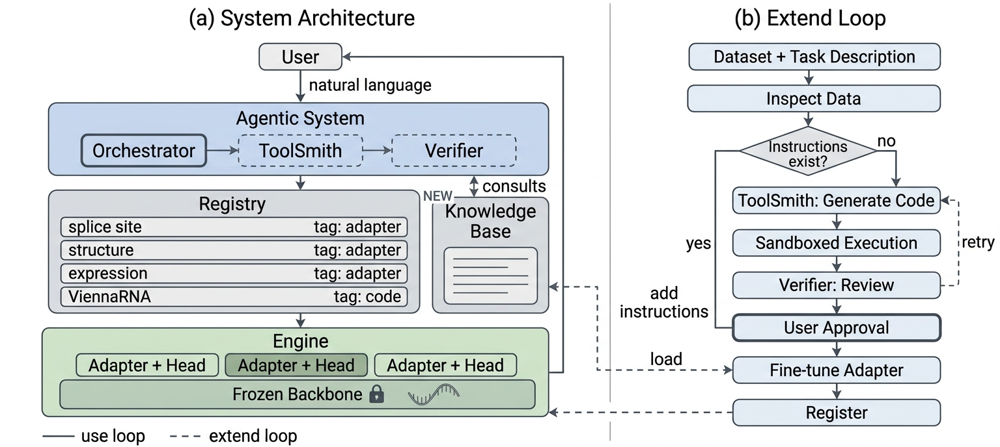

# AdaptRNA: An Extensible RNA Foundation Model Agent with Adapters as Tools

This repository implements the system described in:

**"AdaptRNA: An Extensible RNA Foundation Model Agent with Adapters as Tools."**
(Authors: Ahmadi, Beheshti — School of Computing, Macquarie University)

---

## 🎥 Demo Video
[Watch the Demo](https://youtu.be/ujYRj4pxSlw) 

---

## Table of Contents
- [Overview](#overview)
- [Demo](#-demo-video)
- [System Architecture](#system-architecture)
- [Repository Structure](#repository-structure)
- [Setup](#setup)
  - [Requirements](#requirements)
  - [Install](#install)
  - [Credentials](#credentials)
  - [Backbone weights](#backbone-weights)
  - [Verify](#verify)
- [Usage](#usage)
  - [Scenario 1: Using the registered tools](#scenario-1-using-the-registered-tools)
  - [Scenario 2: Extending the system with a new capability](#scenario-2-extending-the-system-with-a-new-capability)
  - [In the browser](#in-the-browser)
  - [Management CLI](#management-cli)
- [Documentation](#documentation)

---

## Overview

RNA foundation models support a broad range of downstream tasks, but using them still
requires machine-learning expertise, and conventional task-specific fine-tuning produces a
full-sized checkpoint for every capability — so serving *n* tasks means storing and loading
*n* copies of the same large model.

AdaptRNA removes both barriers by treating each **task-specific adaptation of a frozen
foundation model as a callable tool**. Every capability is a lightweight LoRA adapter plus a
task head (~6 MB) docked onto a single resident RiNALMo backbone, so the agent's tool
registry *is* an adapter registry: switching capability is a dictionary lookup, not a 2.5 GB
model reload. The same registry also holds non-neural tools (e.g. a ViennaRNA wrapper), so
the user sees one uniform tool interface regardless of what sits behind it.

Two loops operate over the system:

- **Use loop** — a natural-language request enters, the *Orchestrator* routes it to whichever
  tools the registry currently holds, and the answer comes back with the tool call and its
  output visible.
- **Extend loop** — a user supplies one labelled table and a description of the task it
  encodes. The system profiles the data, consults its knowledge base, has *ToolSmith*
  generate any missing code, checks that code mechanically (executed against the real data in
  an isolated subprocess) and conceptually (an independent *Verifier* agent), fine-tunes an
  adapter in the background, and registers the result as a new callable tool — every
  consequential step behind an explicit human approval.

A fresh install ships **no task definitions and no adapters**. It knows how to serve a
backbone and how to build tools on it; what those tools are comes entirely from the user's
own data.

---

## System Architecture



The system has two layers. An **agentic system** (Orchestrator, ToolSmith, Verifier — each
served by Claude Opus 5 through its native tool-calling interface, each configurable
independently) interprets requests and routes them; beneath it an **engine** holds one frozen
backbone with task-specific adapters docked onto it. Both loops meet at the **registry**, a
persistent store of adapter-based and non-neural tools.

Two rules are enforced in code rather than by prompt:

1. **Hyperparameters come only from the knowledge base.** Every plan is stamped by
   `recommend_training_config`; `start_training` refuses a plan without that stamp, so a
   hand-assembled plan is rejected rather than trusted.
2. **Nothing consequential happens without human approval.** Spending GPU hours, registering
   a new servable tool, and writing generated code into the repository each route through a
   dedicated approval gate. Approval at one step never implies approval for the next.

---

## Repository Structure

```
.
├── engine/                     the fine-tuning engine — one frozen backbone, swappable adapters
│   ├── rinalmo_hub/            framework: registry, LoRA injection, adapter format, multi-adapter hub
│   │   ├── hub.py              RiNALMoHub — N adapters resident in one backbone
│   │   ├── lora.py             LoRA injection, freezing, adapter switching
│   │   ├── adapter.py          adapter file format (weights + head + LoRA geometry + metadata)
│   │   ├── tasks/              task definitions (splice site, MRL, secondary structure)
│   │   └── cli/                train.py · evaluate.py · predict.py
│   └── rinalmo/                vendored RiNALMo backbone (model, alphabet, heads, datamodules)
│
├── agentic/                    the platform — package `adaptrna_agentic`
│   └── adaptrna_agentic/
│       ├── agents/             Orchestrator · ToolSmith · Verifier (LangGraph) + tool factory
│       ├── toolhub/            manifest, registry, adapter runtime, external tools, doctor, prune
│       ├── codegen/            generation pipeline, verification harness, sandbox, staging
│       ├── jobs/               detached training-job runner, store, run analysis
│       ├── profiling/          data profiler + config recommender
│       ├── knowledge/          validated hyperparameter knowledge base (YAML)
│       ├── api/                FastAPI service + SSE streaming
│       └── cli/                chat.py · serve.py · toolhub.py
│
├── adaptrna_custom/            tools built on this install — generated, reviewed, then yours
│   ├── tasks/<name>/           task.py · datamodule.py · config.yaml · spec.json
│   └── tools/                  non-neural wrappers (e.g. ViennaRNA secondary structure)
│
├── ui/                         browser client — plain ES modules, no build step
├── documents/                  technical documentation
├── plans/                      master plan + one detailed plan per phase
├── docs/                       figures used by this README
└── README.md
```

Runtime state lives at the repository root and is git-ignored: `weights/` (backbone
checkpoint), `dataset/`, `outputs/` (one directory per training run), `toolhub_data/` (tool
manifest + registry-owned adapters), `chat_data/` (conversation store), `jobs_data/`
(training-job records).

---

## Setup

### Requirements

| | Required | Notes |
|---|---|---|
| Python | ≥ 3.10 | developed and tested on 3.12 |
| OS | Linux | job supervision reads `/proc`, the codegen sandbox uses `setrlimit`/`setsid` |
| GPU | training and fast inference only | everything else, including both test suites, runs on CPU |
| Disk | ~10 GB | 2.6 GB backbone + datasets + run outputs |
| Network | Anthropic API, weight/dataset downloads | the web UI itself is fully offline — no CDN assets |

### Install

```bash
git clone https://github.com/mhahmadi258/adaptrna.git
cd adaptrna

python -m venv .venv && source .venv/bin/activate

# Both layers, editable, from the repo root
python -m pip install -e ./engine -e ./agentic

# CUDA only — must match your torch build. Imported lazily; without it, training on
# CUDA falls back to a much slower plain-PyTorch attention path.
python -m pip install flash-attn --no-build-isolation

# Test suites
python -m pip install -e "./engine[dev]" -e "./agentic[dev]"
```

### Credentials

Only the LLM-backed paths need a key — the management CLI, both test suites and every
deterministic service run without one.

```bash
# repo root, git-ignored
echo 'ANTHROPIC_API_KEY=sk-ant-...' > .env
```

### Backbone weights

```bash
# Download once (caches in ~/.cache/rinalmo_pretrained/)
python -c "from rinalmo.pretrained import get_pretrained_model; get_pretrained_model('giga-v1')"

# Tell the hub where it is — every training plan takes the checkpoint from the manifest,
# so a run always trains against exactly the backbone the hub serves
python -m adaptrna_agentic.cli.toolhub config --weights ~/.cache/rinalmo_pretrained/giga-v1.pt
```

### Verify

```bash
python -m adaptrna_agentic.cli.toolhub doctor     # checks the install; changes nothing
cd engine  && python -m pytest && cd ..           # CPU, no weights, no datasets
cd agentic && python -m pytest && cd ..           # CPU, no network, no API key
python -m adaptrna_agentic.cli.toolhub list       # a fresh install has nothing to list
```

---

## Usage

### Scenario 1: Using the registered tools

```bash
python -m adaptrna_agentic.cli.chat                 # REPL, session 'default'
python -m adaptrna_agentic.cli.chat --session paper # named persistent session
python -m adaptrna_agentic.cli.chat --once "Is GGC...ACU positive under donor_site?"
```

The Orchestrator decides whether a tool call is required and, when it is, invokes the
corresponding tool from the registry; the call, its output and the response are all shown.

| Ask | What happens |
|---|---|
| *"What tools are available?"* | Lists the registry — adapter-based and non-neural alike — with each tool's state and purpose |
| *"Does this sequence contain a donor splice site?"* | Activates the matching adapter on the resident backbone and returns a probability |
| *"Predict the MRL of this 5' UTR"* | Same path, continuous output |
| *"Give me the secondary structure of this sequence"* | Routes to the ViennaRNA-based tool — same workflow from the user's side |
| *"Disable donor_site"* / *"test it"* | Lifecycle operations; a disabled tool refuses with the fix in the message |

No model is loaded or evicted between these: the backbone loads once when the session opens
and stays frozen, and the adapters remain docked onto that single instance, so the memory
footprint does not change as you move between capabilities.

### Scenario 2: Extending the system with a new capability

Bring one delimited table — `.csv`/`.tsv`, optionally gzipped — with one sequence column and
one label column holding a binary, multiclass or continuous target. Four steps take it to a
registered tool, each its own turn, each ending in your approval; nothing auto-chains.

| Ask | What happens |
|---|---|
| *"Profile ~/data/my_data.csv"* | Reads the file and proposes an interpretation — sequence column, label column, target type, split, plus data-quality warnings (duplicate sequences, leakage across a column split, class imbalance) → **approval**, editable field by field |
| *"Build the task"* | The approved spec renders into a data loader and head — deterministically, from a reviewed template, whenever the shape is one of the three supported; an unusual spec falls through to ToolSmith generation. Either way: a 7-check harness run against your real data in an isolated subprocess + independent Verifier review → **approval on the diff** → landed into `adaptrna_custom/` |
| *"Recommend a training config"* | Hyperparameters derived from the approved spec against the validated knowledge base — never invented → **approval**, editable |
| *"Register it"* | The finished run's adapter becomes a servable tool → **approval** |

Training runs detached in the background; metrics are reported back when it finishes. Only
the adapter weights and task head are stored — a few megabytes — never a copy of the
backbone. Non-neural tools are created and registered through the same process, minus the
fine-tuning stage.

### In the browser

```bash
python -m adaptrna_agentic.cli.serve --open       # 127.0.0.1:8000, opens the UI
```

The same platform with a face on it: streamed chat in the centre, a tool dashboard on the
right you can toggle and test from (which tools are enabled is yours to decide — the
assistant can offer to flip a switch, it cannot flip one), and a rail on the left that
switches between your sessions and your training runs, with a live-tailing log per run.
Approvals arrive as dialogs showing the exact command. Sessions are shared with the terminal
— start a conversation in `chat`, continue it in the browser, and back.

The server binds to loopback and **refuses to start** on any other address without
`ADAPTRNA_API_TOKEN`, because this service can spend GPU hours and write code into your
repository. There is no build step: the UI is plain ES modules served by the API.

### Management CLI

```bash
toolhub="python -m adaptrna_agentic.cli.toolhub"

$toolhub list                                  # every tool, both kinds
$toolhub predict <tool> --sequences ACGU...    # adapter-based tools
$toolhub call <tool> sequence=GGGG             # external (non-neural) tools
$toolhub test <tool>                           # smoke / golden tests
$toolhub doctor                                # what is wrong with this install
$toolhub prune staging|artifacts|jobs|runs|sessions [--older-than N] [--yes]
```

`doctor` is the first thing to run when something looks off — every failure it reports names
the command that fixes it. `prune` is the only command that deletes anything: a dry run
unless you pass `--yes`, and it never touches an artifact a registered tool depends on.

---

## Documentation

| | |
|---|---|
| [documents/](documents/README.md) | Technical documentation: architecture, project structure, setup, configuration, testing, extending, one document per module and per workflow |
| [engine/README.md](engine/README.md) | The fine-tuning engine — complete hyperparameter and task-authoring reference |
| [agentic/README.md](agentic/README.md) | The agent layer — agents, Tool-Hub, codegen pipeline |
| [plans/](plans/) | Design rationale and one detailed plan per development phase |

---

## Acknowledgment

We acknowledge the Centre for Applied Artificial Intelligence at Macquarie University for
funding this research.
