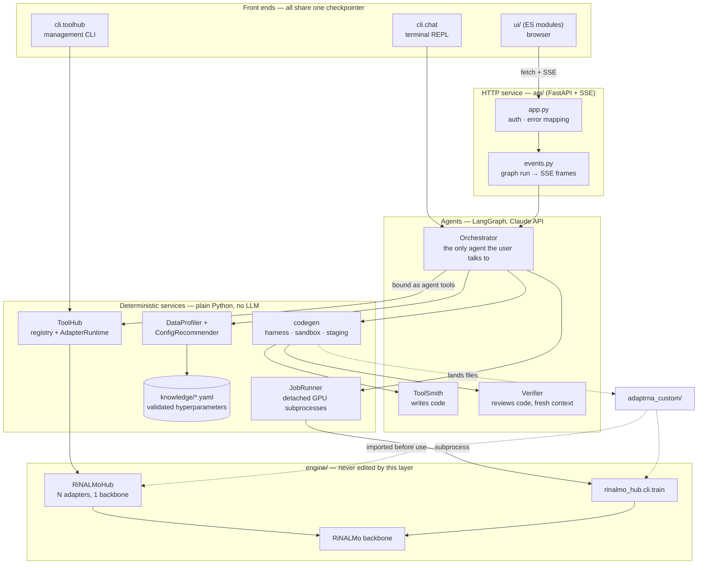

# AdaptRNA — Technical Documentation

Developer-oriented reference for the AdaptRNA repository. Start here, then follow the
links into the areas you need.

> This documentation was written by reading the implementation, not the existing prose.
> Where it disagrees with a README or a plan document, the code is what is described here,
> and the discrepancy is listed in [Known documentation gaps](#known-documentation-gaps).

---

## Contents

1. [What the project is](#1-what-the-project-is)
2. [The three layers](#2-the-three-layers)
3. [High-level architecture](#3-high-level-architecture)
4. [The five user flows](#4-the-five-user-flows)
5. [Entry points](#5-entry-points)
6. [Where state lives](#6-where-state-lives)
7. [Two rules enforced in code](#7-two-rules-enforced-in-code)
8. [Where to start reading the code](#8-where-to-start-reading-the-code)
9. [How this documentation is organised](#9-how-this-documentation-is-organised)
10. [Verified facts](#10-verified-facts)
11. [Known documentation gaps](#known-documentation-gaps)

---

## 1. What the project is

AdaptRNA is a **conversational agent platform for RNA analysis** built on top of a
**task-pluggable fine-tuning engine** for the RiNALMo RNA language model.

The platform ships **no task definitions and no registered tools**. A fresh install knows
how to serve a backbone and build tools on it; it does not know what any of those tools
will be. What it accepts is one delimited table (`.csv`/`.tsv`, optionally gzipped) with a
sequence column and a label column — binary, multiclass or regression — and it walks that
one file through four gated steps to a servable tool: **profile** the data, **build** the
data loader and head, **train** it, and **serve** it. Nothing about any of those steps
assumes a particular kind of RNA task; the system genuinely has no idea what tasks exist
until a user's data creates one.

Two capabilities define it:

* **Serving.** One pretrained transformer backbone is loaded once into memory. Every
  trained task lives as a small LoRA *adapter* file (~6 MB) that is made resident in that
  same backbone. Answering a question with a different task is a dictionary lookup, not a
  2.6 GB model reload.
* **Creation at runtime.** Every tool starts from the user's own data. `create_task_tool`
  turns an approved dataset interpretation into a data loader and head — deterministically,
  from a reviewed template, whenever the spec is one of the three supported shapes; only an
  unusual spec falls through to LLM generation, verified mechanically and reviewed by an
  independent agent either way, then landed into the repository after a human approves the
  diff.

Both neural capabilities (adapters) and classical bioinformatics packages (ViennaRNA) are
exposed as uniform **tools** with one shared lifecycle: register, activate, deactivate,
test, remove, list.

The system is reachable three ways — a terminal REPL, an HTTP API, and a browser UI — all
sharing one conversation store, one backbone, and one set of approval gates.

## 2. The three layers

| Layer | Directory | Python package | Role |
|---|---|---|---|
| **Engine** | [`engine/`](../engine/) | `rinalmo_hub`, `rinalmo` | Fine-tuning framework and the vendored backbone. Training, evaluation, prediction, adapter file format, multi-adapter hub. |
| **Agentic** | [`agentic/`](../agentic/) | `adaptrna_agentic` | The platform: Tool-Hub, LangGraph agents, job runner, data profiler, config recommender, code generation, CLI, HTTP API. |
| **UI** | [`ui/`](../ui/) | — (plain ES modules) | Browser client. No build step; served by the API from `/`. |

Plus one layer that is *output* rather than infrastructure:

| | | |
|---|---|---|
| **Generated code** | [`adaptrna_custom/`](../adaptrna_custom/) | Tasks and wrappers the ToolSmith agent wrote and a human approved. Git-tracked source, yours to edit. |

**The engine is a stable substrate: the agentic layer contains zero engine edits.** It
consumes the engine through exactly three contracts — the `RiNALMoHub` Python API for
inference, the engine's training CLI as a subprocess (with `resolved_config.yaml` and
`metrics.csv` as the interface), and adapter `.pt` files as artifacts.

Naming convention: new platform packages are model-agnostic (`adaptrna_*`). RiNALMo is the
first backbone this platform serves, not its brand. Only the vendored engine packages keep
the `rinalmo` names.

## 3. High-level architecture



The load-bearing separation is **agents thin, logic deterministic**. The LLM is used only
where judgment is genuinely required: understanding intent, writing code, reviewing code,
narrating a result. Registry operations, job management, validation, data profiling,
hyperparameter selection and file handling are plain Python with unit tests.

Full detail: [architecture.md](architecture.md).

## 4. The five user flows

| Flow | Ask | What actually happens |
|---|---|---|
| **A — Inference** | *"Is this sequence positive under my_tool?"* | Orchestrator picks the tool → `AdapterRuntime` activates that adapter on the shared backbone → predicts → answers in task-native terms. |
| **B — Tool management** | *"What tools are available?"*, *"disable my_tool"*, *"test it"* | Registry operations through agent tools; a disabled tool refuses with the fix in the message. |
| **C — New adapter** | *"Fine-tune this data into a tool"* | Profile → **validated** config from the knowledge base → **[approval]** → detached GPU run → analysis (a baseline — there is no reference band for a task the system has never seen) → **[approval]** → registered as a servable tool. |
| **D — New task from one CSV** | *"Profile my data and build a tool from it"* | `profile_dataset` reads a single sequence+label table and proposes a `DatasetSpec` → **[approval]** → `create_task_tool` renders the data loader and head from a reviewed template whenever the spec is a supported shape (binary/multiclass/regression), falling through to ToolSmith generation only when it is not → harness (7 checks) + independent review either way → **[approval on the diff]** → landed into `adaptrna_custom/` with its own `spec.json` → then flow C. |
| **E — New external tool** | *"Wrap this package"* | Wrapper generated against the contract → golden cases run → **[approval to install]** → registered. |

Walkthroughs: [workflows/](workflows/README.md).

## 5. Entry points

| Command | Module | Purpose |
|---|---|---|
| `python -m adaptrna_agentic.cli.chat` | [`cli/chat.py`](../agentic/adaptrna_agentic/cli/chat.py) | Terminal REPL against the orchestrator. The primary interface. |
| `python -m adaptrna_agentic.cli.serve` | [`cli/serve.py`](../agentic/adaptrna_agentic/cli/serve.py) | HTTP API + web UI. `--open` launches a browser. |
| `python -m adaptrna_agentic.cli.toolhub` | [`cli/toolhub.py`](../agentic/adaptrna_agentic/cli/toolhub.py) | Management CLI: list/register/predict/test/config/doctor/prune. Usable with no API key. |
| `python -m adaptrna_agentic.jobs.train_entrypoint` | [`jobs/train_entrypoint.py`](../agentic/adaptrna_agentic/jobs/train_entrypoint.py) | Training seam — imports generated tasks, then delegates to the engine CLI. Launched by the JobRunner, rarely by hand. |
| `python -m rinalmo_hub.cli.train` | [`cli/train.py`](../engine/rinalmo_hub/cli/train.py) | Engine training, directly. |
| `python -m rinalmo_hub.cli.evaluate` | [`cli/evaluate.py`](../engine/rinalmo_hub/cli/evaluate.py) | Score a trained artifact on a split. |
| `python -m rinalmo_hub.cli.predict` | [`cli/predict.py`](../engine/rinalmo_hub/cli/predict.py) | Raw sequences through one or more adapters. |
| `python -m rinalmo_hub.adapter <file>` | [`adapter.py`](../engine/rinalmo_hub/adapter.py) | Inspect an adapter file. |
| `python -m adaptrna_agentic.codegen._harness_runner <spec>` | [`_harness_runner.py`](../agentic/adaptrna_agentic/codegen/_harness_runner.py) | The verification harness. Invoked inside the sandbox, not by hand. |

Everything runs **from the repository root** — the engine's configs reference `weights/…`
and `dataset/…` relative to the working directory.

## 6. Where state lives

All runtime state sits at the repo root and is git-ignored:

| Path | Contents | Owner |
|---|---|---|
| `toolhub_data/tools.json` | The tool manifest: backbone config + one entry per tool. | [`toolhub/manifest.py`](../agentic/adaptrna_agentic/toolhub/manifest.py) |
| `toolhub_data/adapters/*.pt` | Registry-owned adapter copies. | `Registry.register` |
| `toolhub_data/staging/<id>/` | Generated code awaiting approval. Survives the session. | [`codegen/staging.py`](../agentic/adaptrna_agentic/codegen/staging.py) |
| `adaptrna_custom/tasks/<name>/spec.json` | The approved `DatasetSpec` a task landed with — columns, target type, split policy, `head`, `template_version`. Read back by reuse matching (`similar_tasks`), by serving (output notes, validators, pad-sensitivity) and by `doctor`'s stale-template check. A task with no `spec.json` (hand-written, or landed before this phase) simply never matches or gets those notes — absence, not an error. | [`codegen/pipeline.py`](../agentic/adaptrna_agentic/codegen/pipeline.py), [`codegen/staging.py`](../agentic/adaptrna_agentic/codegen/staging.py) |
| `jobs_data/jobs.json` | Training job records (state, PID identity, plan, adapter path). | [`jobs/store.py`](../agentic/adaptrna_agentic/jobs/store.py) |
| `chat_data/sessions.sqlite` | LangGraph checkpointer — every conversation, terminal and browser alike. | `SqliteSaver` |
| `outputs/<run_name>/` | Per-run: `resolved_config.yaml`, `metrics/version_N/metrics.csv`, `train.log`, `exit_code`, `<task>_adapter.pt`. | Engine trainer + entrypoint |
| `weights/`, `dataset/` | Backbone checkpoint and downloaded datasets. | Engine |

Both JSON stores use **atomic writes plus an in-file monotonic revision counter**, so a
second writer is refused with a retryable error rather than silently clobbering the first.

Schemas: [configuration.md](configuration.md).

## 7. Two rules enforced in code

These are the platform's non-negotiables, and both are mechanical rather than prompt-based:

1. **Hyperparameters come only from the knowledge base.** Every plan produced by
   `recommend_training_config` is stamped `source: "recommend_training_config"`;
   `start_training` refuses any plan lacking that stamp. A model that hand-assembles a plan
   is rejected rather than trusted. See [modules/profiling-and-knowledge.md](modules/profiling-and-knowledge.md).
2. **Nothing consequential happens without human approval.** `start_training` (GPU hours),
   `register_trained_adapter` (a new servable tool) and `land_generated_code` (writing code
   into your repository) route through a dedicated `approval` node in the graph that
   contains only `interrupt()`. Approval in one step never implies approval for the next.
   See [modules/agents.md](modules/agents.md#4-the-approval-gate).

## 8. Where to start reading the code

Pick the thread that matches your question:

| Question | Read in this order |
|---|---|
| *How does a chat turn work?* | [`agents/orchestrator.py`](../agentic/adaptrna_agentic/agents/orchestrator.py) → [`agents/tool_factory.py`](../agentic/adaptrna_agentic/agents/tool_factory.py) → [`cli/chat.py`](../agentic/adaptrna_agentic/cli/chat.py) |
| *How does a prediction reach the model?* | [`toolhub/runtime.py`](../agentic/adaptrna_agentic/toolhub/runtime.py) → [`engine/rinalmo_hub/hub.py`](../engine/rinalmo_hub/hub.py) → [`engine/rinalmo_hub/module.py`](../engine/rinalmo_hub/module.py) |
| *How does training get launched and tracked?* | [`profiling/recommender.py`](../agentic/adaptrna_agentic/profiling/recommender.py) → [`jobs/runner.py`](../agentic/adaptrna_agentic/jobs/runner.py) → [`jobs/train_entrypoint.py`](../agentic/adaptrna_agentic/jobs/train_entrypoint.py) → [`jobs/analysis.py`](../agentic/adaptrna_agentic/jobs/analysis.py) |
| *How is generated code kept honest?* | [`codegen/pipeline.py`](../agentic/adaptrna_agentic/codegen/pipeline.py) → [`codegen/_harness_runner.py`](../agentic/adaptrna_agentic/codegen/_harness_runner.py) → [`codegen/staging.py`](../agentic/adaptrna_agentic/codegen/staging.py) |
| *What is a task, concretely?* | [`engine/rinalmo_hub/module.py`](../engine/rinalmo_hub/module.py) (the subclass contract) → [`codegen/templates/task.py.j2`](../agentic/adaptrna_agentic/codegen/templates/task.py.j2) (what gets rendered from an approved spec) → `adaptrna_custom/tasks/<name>/task.py` once you have built one |
| *How does the browser talk to the server?* | [`ui/sse.js`](../ui/sse.js) → [`api/events.py`](../agentic/adaptrna_agentic/api/events.py) → [`api/routers/sessions.py`](../agentic/adaptrna_agentic/api/routers/sessions.py) |

If you only read one file to understand the design, read
[`agents/tool_factory.py`](../agentic/adaptrna_agentic/agents/tool_factory.py): it is the
single place where the deterministic services and the LLM meet.

## 9. How this documentation is organised

```
documents/
├── README.md                 ← you are here: overview, entry points, doc map
├── architecture.md           layering, control flow, data flow, design decisions
├── project_structure.md      every directory and significant file, with its responsibility
├── setup.md                  runtime, dependencies, install, verification, hardware
├── configuration.md          config layering, env vars, on-disk schemas, knowledge base
├── testing.md                test strategy, suites, markers, what each file guards
├── extending.md              "I want to change X — where do I edit?"
├── modules/                  one document per package
│   ├── README.md             module index and dependency graph
│   ├── engine-backbone.md    vendored rinalmo: model, alphabet, heads, datamodules
│   ├── engine-hub.md         rinalmo_hub: registry, module, lora, adapter, config, hub, CLI
│   ├── toolhub.md            manifest, registry, runtime, external tools, doctor, prune
│   ├── agents.md             orchestrator, toolsmith, verifier, tool factory, models
│   ├── codegen.md            pipeline, harness, sandbox, staging, discovery, prompts
│   ├── jobs.md               runner, store, analysis, training entrypoint
│   ├── profiling-and-knowledge.md   profiler, recommender, knowledge base
│   ├── api.md                FastAPI app, SSE events, routers, schemas
│   ├── cli.md                chat, toolhub, serve
│   └── web-ui.md             the browser client
└── workflows/                one document per end-to-end procedure
    ├── README.md             workflow index
    ├── inference-and-tools.md   flows A and B
    ├── finetuning.md            flow C, the headline scenario
    ├── new-task-codegen.md      flow D
    ├── external-tools.md        flow E
    └── operations.md            doctor, prune, failure recovery, troubleshooting
```

Two of these are worth reading early even if you are not yet changing anything:

* **[testing.md](testing.md)** — how 611 tests run with no GPU, no weights and no API key,
  and what each test file was written to prevent. The suite doubles as documentation.
* **[extending.md](extending.md)** — a lookup table from "I want to change X" to the file to
  edit and the things to update alongside it, plus the list of things not to do and why.

Existing prose that remains worth reading, and how it relates:

* [`../plans/MASTER_PLAN.md`](../plans/MASTER_PLAN.md) — the *design rationale*: why each
  decision was made, the engine constraints this layer respects, the phase history. This
  documentation describes what the code does; the master plan explains why.
* [`../plans/PHASE_*.md`](../plans/) — one detailed plan per phase, useful as archaeology.
* [`../README.md`](../README.md), [`../engine/README.md`](../engine/README.md),
  [`../agentic/README.md`](../agentic/README.md) — user-facing quick starts. The engine
  README in particular is a complete hyperparameter reference and is not duplicated here.

## 10. Verified facts

Most of the table below was confirmed by running the code in this checkout on 2026-08-13;
the counts were re-measured on 2026-08-18 after Phase 13 (cold start — see
[`../plans/PHASE_13_COLD_START_SINGLE_CSV.md`](../plans/PHASE_13_COLD_START_SINGLE_CSV.md)):

| Fact | Value |
|---|---|
| Engine test suite | **135 passed**, 7 deselected (`gpu`/`weights`/`data` markers) — unchanged; Phase 13 does not touch `engine/` (D1) |
| Agentic test suite | **611 tests** collected (`pytest tests/ --collect-only`, 2026-08-18), up from 381 before Phase 13 |
| Python | 3.12 (`.venv/`) |
| Registered tools on a fresh install | **none.** The platform ships no task definitions and no adapters; the first `toolhub list` after the Phase 13 clean-slate step (plan §15) shows an empty tool list, and the first tool on any install is one a user built from their own CSV |
| Configured backbone | `giga` at `~/.cache/rinalmo_pretrained/giga-v1.pt` |
| Manifest / adapter / job-store format versions | 1 / 2 / 1 |

## Known documentation gaps

Discrepancies found between the code and its surrounding prose. None of them break a
working install; all are worth fixing.

| # | Where | Issue |
|---|---|---|
| 1 | [`toolhub/doctor.py:174`](../agentic/adaptrna_agentic/toolhub/doctor.py#L174) | The `stale_jobs` remedy tells the user to run `toolhub job-status <id>`. **No such subcommand exists** — the toolhub CLI has no job commands at all. Job state is reachable via the `job_status` agent tool, `GET /api/jobs/{id}`, or `JobRunner.status()`. The reconciliation the message describes does happen, but only through those paths. |
| 2 | [`toolhub/prune.py`](../agentic/adaptrna_agentic/toolhub/prune.py) | `prune(kind="jobs", jobs_dir=…)` selects candidates from the given `jobs_dir` but `_delete_job` reopens the *default* store, so an explicit `jobs_dir` is honoured for planning and ignored for deletion. Unreachable from the CLI (which never passes `jobs_dir`) and masked in tests by `ADAPTRNA_JOBS_DIR`; a latent trap for a future caller. |
| 3 | [`toolhub/prune.py`](../agentic/adaptrna_agentic/toolhub/prune.py) | `prune sessions --older-than N` compares the age of the *whole SQLite file*, not of each session, so it is all-or-nothing per store. The kept-reason string says so ("store younger than…"), but the flag reads as per-session. |

Two gaps this list used to carry are now closed by Phase 13: `agentic/pyproject.toml`'s
`packages`/`package-data` omission (`codegen`, `codegen.templates`, `toolhub.external`,
`knowledge/*.yaml`, `codegen/templates/*.j2` are all declared now — see
[setup.md](setup.md#packaging-caveat)), and the stale `no_match_guidance` text in
`knowledge/task_templates.yaml` (that file is deleted; its replacement,
`target_shapes.yaml`, carries no such text).
