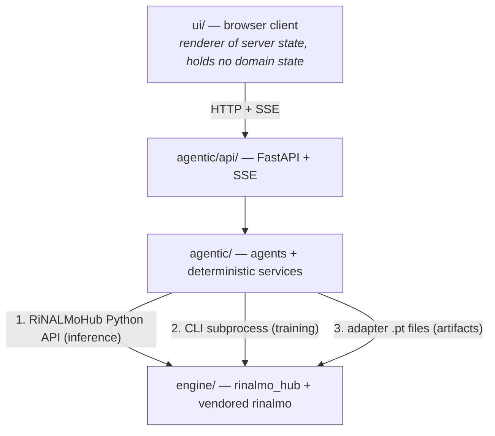
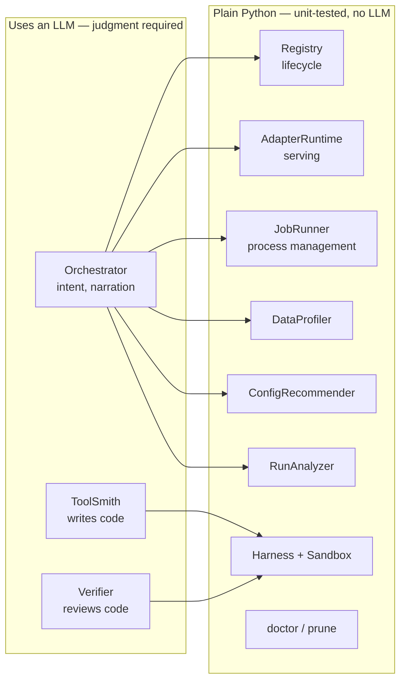
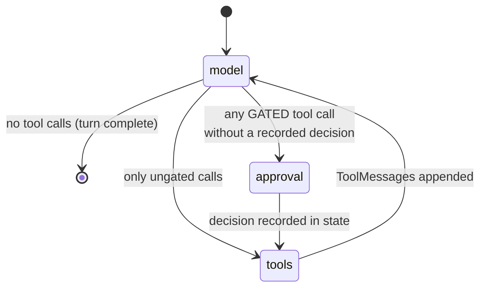
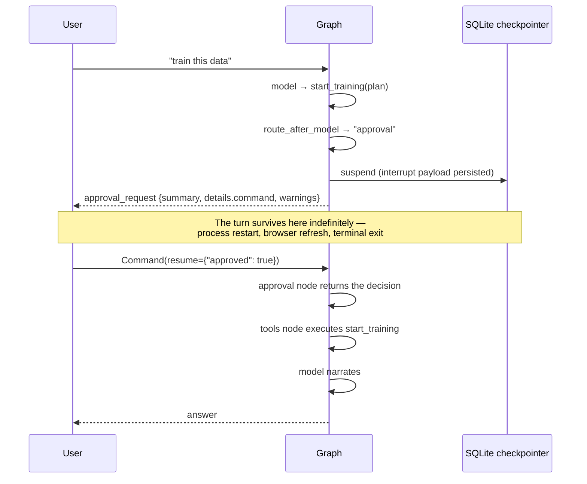
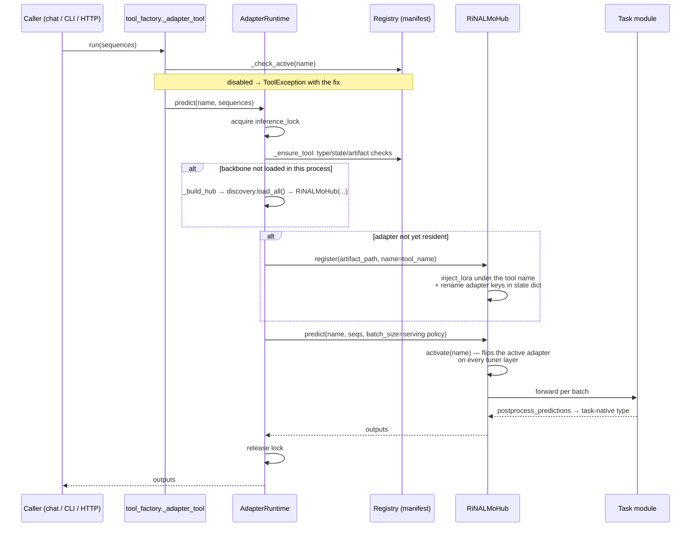
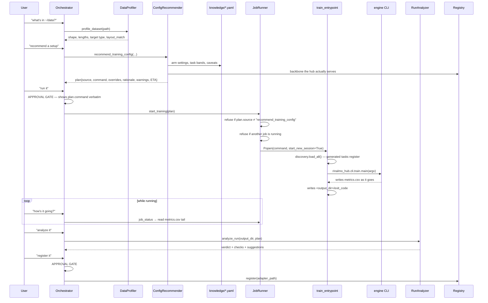
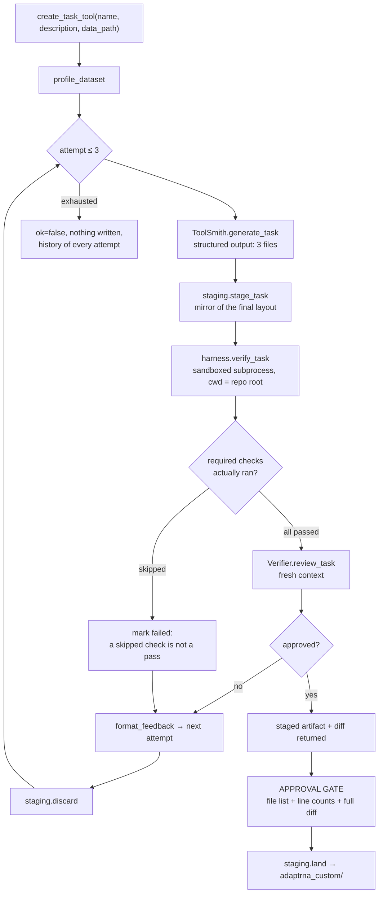
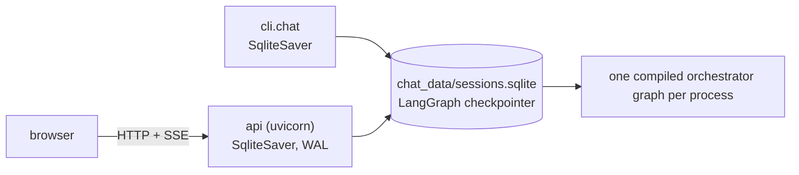

# Architecture

How the pieces fit, what flows between them, and why the boundaries are where they are.

Prerequisite: [README.md](README.md). Component internals: [modules/](modules/README.md).

---

## Contents

1. [Layering and the engine contract](#1-layering-and-the-engine-contract)
2. [The agent/service split](#2-the-agentservice-split)
3. [The orchestrator graph](#3-the-orchestrator-graph)
4. [The approval gate](#4-the-approval-gate)
5. [Inference data flow](#5-inference-data-flow)
6. [Training data flow](#6-training-data-flow)
7. [Code-generation data flow](#7-code-generation-data-flow)
8. [The three front ends and one session store](#8-the-three-front-ends-and-one-session-store)
9. [Concurrency model](#9-concurrency-model)
10. [Failure and recovery design](#10-failure-and-recovery-design)
11. [Engine constraints that shaped this layer](#11-engine-constraints-that-shaped-this-layer)

---

## 1. Layering and the engine contract

The agentic layer touches the engine through exactly **three contracts** and nothing else.
That is why `engine/` contains zero changes made on behalf of the platform:

| # | Contract | Where it is consumed | Interface |
|---|---|---|---|
| 1 | `RiNALMoHub` Python API | [`toolhub/runtime.py`](../agentic/adaptrna_agentic/toolhub/runtime.py) | `RiNALMoHub(...)`, `.register(path, name=)`, `.predict(name, seqs, batch_size=)` |
| 2 | Engine training CLI as a subprocess | [`jobs/runner.py`](../agentic/adaptrna_agentic/jobs/runner.py) | argv in; `resolved_config.yaml` + `metrics/version_N/metrics.csv` + exit status out |
| 3 | Adapter files | [`toolhub/registry.py`](../agentic/adaptrna_agentic/toolhub/registry.py) | `rinalmo_hub.adapter.load_adapter(path)` → task, `lm_config`, LoRA geometry, head config, metadata |

There is exactly **one seam** where the engine cannot see something it needs: a generated
task's `@register_task` decorator has to have fired before the engine can resolve the task
name. That is handled entirely agentic-side by
[`codegen/discovery.py`](../agentic/adaptrna_agentic/codegen/discovery.py), which puts the
repo root on `sys.path` and imports every `adaptrna_custom/tasks/*/task.py`. Three callers
depend on it, and all three matter:

* [`jobs/train_entrypoint.py`](../agentic/adaptrna_agentic/jobs/train_entrypoint.py) — so a generated task is *trainable*;
* [`toolhub/runtime.py`](../agentic/adaptrna_agentic/toolhub/runtime.py) `_load_custom_tasks` — so its adapter is *servable* (a task that trains but cannot serve is a silent dead end);
* [`codegen/_harness_runner.py`](../agentic/adaptrna_agentic/codegen/_harness_runner.py) — so it can be *verified* under the same import path it will later run under.

## 2. The agent/service split

The design rule is **agents thin, logic deterministic**. Concretely:

A registry that "usually" works is worthless; a prompt that occasionally rephrases a
summary is fine. So the *decisions* stay in Python and the *language* stays in the model:

* The **ConfigRecommender** produces every hyperparameter from
  [`knowledge/hyperparameters.yaml`](../agentic/adaptrna_agentic/knowledge/hyperparameters.yaml),
  **and generates the rationale text from the same entries** — so the explanation shown to
  the user and the config actually executed cannot drift apart.
* The **RunAnalyzer** decides `ok | suspicious | failed` from deterministic checks over
  `metrics.csv`. The model narrates that verdict; it never forms one.
* The **Verifier** agent is deliberately *not* asked to check anything a test can prove.
  The harness has already run the code; the agent judges only what a test cannot — whether
  the code does what the user asked, and whether non-tensor state or a boundary-token
  mistake would produce plausible-looking wrong numbers.

## 3. The orchestrator graph

Hand-built `StateGraph` (not the prebuilt agent helper) because the approval gate needs
custom routing. Defined in
[`agents/orchestrator.py`](../agentic/adaptrna_agentic/agents/orchestrator.py).

State is `OrchestratorState` = LangGraph's `MessagesState` plus an `approvals` dict keyed
by tool-call id.

Three nodes:

| Node | Function | Notes |
|---|---|---|
| `model` | `call_model` | Rebuilds the tool list **on every call**, so tools registered or toggled since the last turn appear immediately and disabled tools carry a `DISABLED` note in their description. Prepends `SYSTEM_PROMPT` if the history has no `SystemMessage`. |
| `approval` | `request_approval` | Contains **only** `interrupt()`. Normalises the resumed value into `{approved: bool, note: str}` per call id, accepting a single decision for all calls or a per-id mapping. |
| `tools` | `run_tools` | Executes every call of the turn in one pass. A gated call without approval yields a refusal string rather than executing. Clears `approvals` afterwards, so a later call of the same gated tool asks again. |

The model is resolved **lazily** inside `call_model`, so compiling the graph needs no API
key — which is what lets the whole test suite run without a credential.

## 4. The approval gate

The gate is a **dedicated node, not an `interrupt()` inside a tool**, and the reason is
structural:

> The `tools` node runs every tool call of a turn in one pass. Interrupting from inside it
> would re-execute the calls that already completed when the turn resumes. A node
> containing only `interrupt()` is idempotent: on resume it returns the decision instead of
> raising.

The gated set is `GATED_TOOLS = ("start_training", "register_trained_adapter",
"land_generated_code")` — GPU hours, a new servable tool, and code written into your
repository.

Two helpers build what the human sees:

* `_summarize(call)` — one line: what approving this would do.
* `_details(call)` — the **exact command** for `start_training` (plus output dir, ETA,
  warnings, and a download note when the plan sets `data.prepare`), or the file list,
  staging path and full diff for `land_generated_code`.

Every front end renders the *same* payload:
[`cli/chat.py::_prompt_approval`](../agentic/adaptrna_agentic/cli/chat.py) draws the box in
the terminal; the browser renders the same fields in a modal;
[`api/events.py`](../agentic/adaptrna_agentic/api/events.py) emits it as an
`approval_required` SSE frame. `tests/test_ui_contract.py` pins the field names so a
server-side rename fails in `pytest` rather than blanking a dialog.

## 5. Inference data flow

Four properties worth internalising:

1. **Lazy by decision.** Registry operations never load a backbone. The first forward pass
   does. `warmup()` is the eager escape hatch and returns problems instead of raising, so
   one broken tool cannot stop a chat from starting.
2. **Residency is per process.** Each `toolhub predict` invocation pays its own backbone
   load; the long-lived chat and HTTP processes pay it once.
3. **Deactivation is routing-level.** peft cannot cleanly uninject an adapter, so a
   disabled tool is refused at the `Registry`/`AdapterRuntime` boundary while its weights
   stay resident (megabytes). `rebuild()` drops the hub entirely for full cleanup.
4. **Serving policy is per tool.** `serving.batch_size` in the manifest; `mrl` is forced to
   `1` at registration because its head is pad-sensitive (predictions would depend on batch
   composition).

## 6. Training data flow

The job is **detached** (`start_new_session=True`): a real run takes minutes to hours, the
chat must stay responsive, and the run must survive the chat exiting. Consequently job
state is always derived from disk — the `exit_code` file, `metrics.csv`, and PID liveness —
never from a live process handle.

Full walkthrough: [workflows/finetuning.md](workflows/finetuning.md).

## 7. Code-generation data flow

Two design points make this trustworthy rather than theatrical:

* **The harness runs from the repository root**, exactly as the JobRunner runs real
  training. Verifying under a different working directory makes repo-relative data paths
  unresolvable, which *skips* the data-dependent checks instead of failing them — a harness
  that passes everything. Hence `REQUIRED_FOR_GENERATED = ("datamodule",
  "forward_backward", "metrics")`: generated code cannot be approved unless those actually
  **ran**.
* **Check 6 is an adapter round-trip prediction equivalence test.** Randomise everything
  the adapter is supposed to carry → predict → save → reload into a *fresh* module →
  predict again → require identical outputs. That converts this project's worst silent
  failure (task state that never reaches the adapter file) from a checklist question into a
  hard test.

Full walkthrough: [workflows/new-task-codegen.md](workflows/new-task-codegen.md).

## 8. The three front ends and one session store

A conversation is a LangGraph **thread**, identified by `thread_id` (the session name).
Because both front ends open the same SQLite file, a session started in the terminal
continues in the browser and back. The API sets `PRAGMA journal_mode=WAL` and
`busy_timeout=5000` explicitly — a fresh database starts in rollback-journal mode where a
writer blocks every reader, which would defeat the point.

Streaming contract, in [`api/events.py`](../agentic/adaptrna_agentic/api/events.py):

| Event | Payload | Meaning |
|---|---|---|
| `text` | `{delta}` | Token-by-token assistant text |
| `tool_call` | `{name, args}` | The model asked for a tool |
| `tool_result` | `{name, content}` | Result, truncated to 2000 chars for display |
| `approval_required` | the interrupt payload | **The stream ends here.** The turn stays suspended in the checkpointer. |
| `done` | `{answer}` | Turn complete |
| `error` | `{message, type}` | Anything that went wrong; the stream is the error channel |

The approval round trip is deliberately *three* requests rather than one long-held
connection: a gate can wait minutes for a human, and a dropped connection would strand the
turn. Ending the stream leaves it suspended where it belongs — in the checkpointer.
`POST /resume` returns a **new** stream continuing the same turn, which is why the browser
client has no separate resume path (`consume()` is simply called again).

## 9. Concurrency model

| Concern | Mechanism | Where |
|---|---|---|
| Two predictions for different adapters overlapping | `threading.RLock` inside `AdapterRuntime` | `runtime.inference_lock` |
| Two processes writing the tool manifest | In-file monotonic `revision`; mismatch → `ConcurrentModificationError` | `manifest.save()` |
| Two processes writing the job store | Same revision scheme | `store.save()` |
| Two training jobs at once | `JobRunner.start` refuses unless `allow_concurrent` | `runner.start` |
| Half-written state files | `mkstemp` + `os.replace` (atomic) | both stores |
| HTTP handlers blocking the event loop | Handlers are `def`, not `async def` → Starlette threadpool | `api/routers/tools.py` |

The inference lock lives inside `AdapterRuntime` rather than at the call sites so that
**every** caller is covered — CLI, chat tools, HTTP — instead of each entry point having to
remember. This matters because `RiNALMoHub.predict` calls `activate()`, which flips the
active adapter across the *whole* backbone: two concurrent predictions for different tools
could otherwise interleave that mutation and silently answer from the wrong adapter.

The stores **detect** concurrent writes; they do not prevent them. Two chat processes are
fine; the second to save is asked to retry. Over HTTP a `ConcurrentModificationError`
becomes `409 {"error": …, "retryable": true}` — and `retryable` is load-bearing: polling
clients must keep their last good render **and keep polling**, because the likeliest moment
for a 409 is just after a run starts, exactly when someone is watching.

## 10. Failure and recovery design

| Failure | Detection | Response |
|---|---|---|
| Training process died without writing `exit_code` | `_refresh`: `Popen.poll()` or PID identity check | Record marked `failed` |
| PID recycled by the kernel | `(pid, /proc/<pid>/stat` field 22`)` pair must both match | `cancel` refuses to signal; record closed out as failed |
| Zombie process | `/proc/<pid>/stat` state `Z` (a zombie still answers signal 0) | Treated as gone |
| Missing adapter file | `AdapterRuntime._require_artifact` before any engine call | `ToolHubError` naming the tool and the fix |
| Registration interrupted between artifact copy and manifest write | Copy to `.pt.incoming`, write manifest, *then* `replace` | Neither orphan file nor dangling entry |
| Generated task fails to import | `discovery.load_all` collects `(name, exception)` pairs | Reported by name; other tasks stay available |
| Runaway generated code | Subprocess with `RLIMIT_AS`/`RLIMIT_CPU`/`RLIMIT_FSIZE` + `setsid` + timeout | Reported as data in the verification report |
| Broken install generally | `toolhub doctor` | Every failure names the command that fixes it |

`doctor` changes nothing; `prune` is the only command in the project that deletes, it is a
dry run unless given `--yes`, and it never touches an artifact or output directory a
registered tool depends on. Details: [workflows/operations.md](workflows/operations.md).

**The sandbox is accident-isolation, not adversarial sandboxing.** The code it runs was
written by this project's own model from the user's description on the user's machine, and
a human reviews the diff before it lands. The realistic risks are infinite loops, runaway
memory and stray writes — those are what it stops. The human diff gate is the real security
boundary; a container is the upgrade path if generated code ever arrives from an untrusted
source.

## 11. Engine constraints that shaped this layer

These are engine behaviours that forced a design decision upstream. They are the most
useful thing to know before changing anything.

| Engine fact | Consequence in the agentic layer |
|---|---|
| Construction order is load-bearing: build module → load backbone → inject LoRA → load adapter | The agentic layer **reuses** engine code paths and never reimplements loading |
| Trainable state outside `head.*` / LoRA keys / declared extras silently does not persist in an adapter file | Harness check 6 (round-trip prediction equivalence) turns this into a hard test |
| The hub refuses full-FT exports (only the head travels in the file) | Adapter tools are LoRA-only; the pipeline defaults to LoRA; the registry refuses full-FT files with the rationale up front |
| Pad-sensitive heads (MRL) make predictions depend on batch composition | Per-tool `serving.batch_size`, forced to 1 at registration for `mrl` |
| `RiNALMoHub.predict` activates an adapter across the whole backbone | Inference serialised by `AdapterRuntime.inference_lock` |
| Non-autocast half precision trips a dtype promotion in the engine's `TokenDropout` | Serving runs fp32 (`dtype: auto` resolves to *None*, i.e. the model default) |
| FlashAttention's backward is non-deterministic (forward is deterministic) | Run analysis uses tolerances; a difference inside tolerance is never called a regression |
| No metric-based checkpoint selection exists — the final epoch is what gets tested | Safe today; adding early stopping would require MRL-style tasks to switch to `val_split=holdout` first |
| `configs/base.yaml` defaults `pretrained_weights` to `weights/giga-v1.pt` relative to the working directory, a path that need not exist | Every plan sets `pretrained_weights` and `lm_config` from the **manifest's** backbone; a hub with no checkpoint warns rather than silently training from random weights |
| Gradient checkpointing is unconditionally on; `need_attn_weights=True` forces the slow attention path | Do not "optimize" either; attention-map features would need explicit design |

The master plan's §7 is the canonical list, with the dates and incidents behind each entry:
[`../plans/MASTER_PLAN.md`](../plans/MASTER_PLAN.md).
