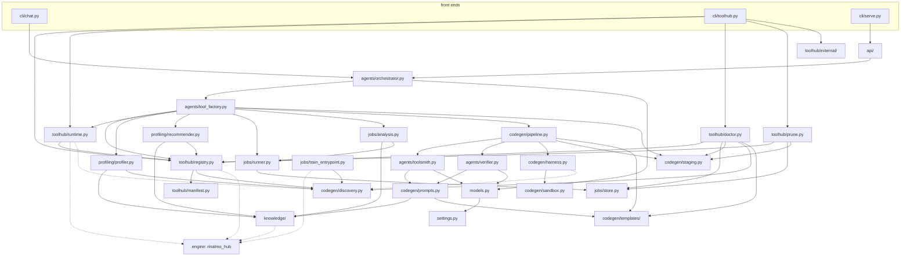

# Module Reference

One document per package. Each covers purpose, internal structure, important classes and
functions, inputs and outputs, dependencies, and the assumptions worth knowing before you
change anything.

---

## Index

### Agentic layer — `agentic/adaptrna_agentic/`

| Document | Package | In one line |
|---|---|---|
| [toolhub.md](toolhub.md) | `toolhub/` | The deterministic heart: what tools exist (manifest + registry) and how they run (`AdapterRuntime`), plus external tools, `doctor` and `prune`. |
| [agents.md](agents.md) | `agents/`, `models.py`, `settings.py` | The three LangGraph agents, the approval gate (including human edits at the gate), and the ToolHub → LangChain bridge that defines all 17 management tools. |
| [codegen.md](codegen.md) | `codegen/`, `codegen/templates/` | Two paths to task code — a deterministic template renderer, and a fallback ToolSmith ⇄ Verifier loop — converging on the same seven-check verification harness, sandbox, staging and discovery. |
| [jobs.md](jobs.md) | `jobs/` | Launching detached GPU training, tracking it from disk, and judging the result. |
| [profiling-and-knowledge.md](profiling-and-knowledge.md) | `profiling/`, `knowledge/` | Data profile in, executable and *grounded* training plan out. |
| [api.md](api.md) | `api/` | FastAPI service, the SSE contract, and the approval round trip over HTTP. |
| [cli.md](cli.md) | `cli/` | `chat`, `toolhub`, `serve` — the three executables. |

### Engine layer — `engine/`

| Document | Package | In one line |
|---|---|---|
| [engine-hub.md](engine-hub.md) | `rinalmo_hub/` | The fine-tuning framework: task registry, `BaseDownstreamModule`, LoRA, the adapter format, config layering, `RiNALMoHub`, three CLIs. |
| [engine-backbone.md](engine-backbone.md) | `rinalmo/` | The vendored RiNALMo model, alphabet, prediction heads, benchmark datamodules and utilities. |

### Other

| Document | Location | In one line |
|---|---|---|
| [web-ui.md](web-ui.md) | `ui/` | The browser client: eight files, no build step, no client-side domain state. |

Generated code lives in `adaptrna_custom/` and is documented in
[../project_structure.md](../project_structure.md#adaptrna_custom--generated-code-git-tracked)
— it is *output*, and its structure is defined by [codegen.md](codegen.md).

---

## Dependency graph

Arrows point from consumer to dependency. Dashed arrows are lazy — the import happens
inside a function, so the module loads without it.

Four structural rules the graph encodes:

1. **`toolhub/` never imports LangChain.** [`agents/tool_factory.py`](../../agentic/adaptrna_agentic/agents/tool_factory.py)
   is the only place the two meet.
2. **`models.py` is the only provider-aware module.** Nothing else imports
   `langchain_anthropic`, even indirectly by name.
3. **Every engine import is lazy**, inside a function. That is what keeps the agentic
   package importable in milliseconds and its unit tests torch-free until a fixture asks
   for a model.
4. **`manifest.py` is pure data.** It imports neither the engine nor LangChain, and touches
   `torch` only inside the `auto` device/dtype resolvers.

## Conventions used throughout the agentic layer

| Convention | Why |
|---|---|
| Errors carry the fix in the message | `ToolHubError("… Enable it with `toolhub activate x`.")` — the same string is what the CLI prints, what the model receives as a tool result, and what an HTTP client shows. Phase 7 standardised the wording precisely so a second front end would need no wording of its own. |
| Reports are plain dicts, not objects | `{ok, checks: [...], …}` from `smoke_test`, `run_golden`, `verify_task`, `analyze_run`, `doctor.run_checks`, `prune`. They are agent-tool-ready, JSON-serialisable and directly renderable. |
| Failure is data, not an exception | The verification harness, the sandbox and the smoke tests never raise for the *subject's* misbehaviour — a crash, a hang and a failed check are all things the report must describe. |
| Heavy imports inside functions | `import torch`, `import pandas`, `from rinalmo_hub… import …` all appear at call sites. |
| `REPO_ROOT` resolves every relative path | Defined once in [`settings.py`](../../agentic/adaptrna_agentic/settings.py) as three parents up from that file. |
