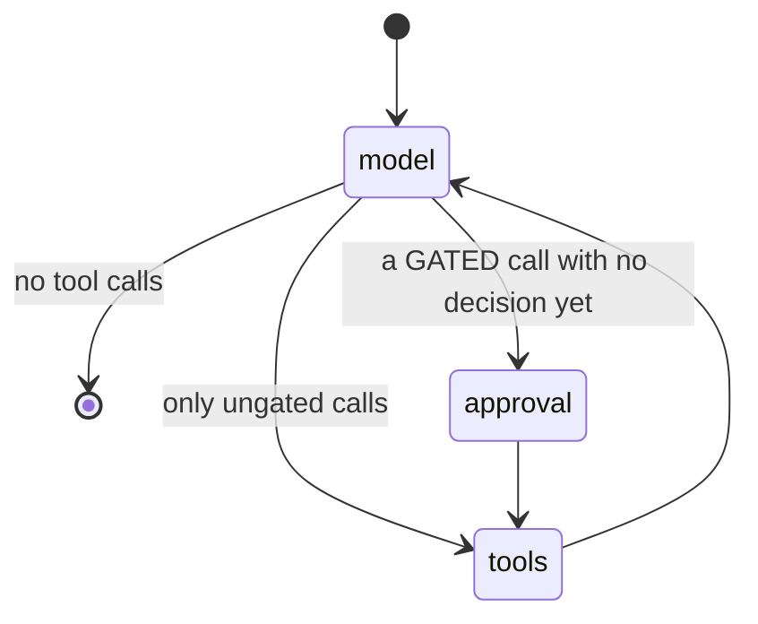

# `agents/` — the three agents and the tool bridge

`agentic/adaptrna_agentic/agents/`, plus `models.py` and `settings.py`

Three agents, matching the three genuinely distinct judgment roles. Everything else in the
platform is a deterministic service and never talks to a model.

---

## Contents

1. [The three roles](#1-the-three-roles)
2. [`settings.py` and `models.py` — the provider seam](#2-settingspy-and-modelspy--the-provider-seam)
3. [`orchestrator.py` — the graph](#3-orchestratorpy--the-graph)
4. [The approval gate](#4-the-approval-gate)
5. [`tool_factory.py` — the ToolHub → LangChain bridge](#5-tool_factorypy--the-toolhub--langchain-bridge)
6. [`toolsmith.py`](#6-toolsmithpy)
7. [`verifier.py`](#7-verifierpy)
8. [`hello.py`](#8-hellopy)
9. [Testing these without a key](#9-testing-these-without-a-key)
10. [Assumptions and limitations](#10-assumptions-and-limitations)

---

## 1. The three roles

| Agent | Role | Why it is separate |
|---|---|---|
| **Orchestrator** | The only agent the user talks to. Understands intent, answers questions, calls inference and management tools **directly**, walks the user through the creation flows, presents approval gates. | An executor-agent indirection for single tool calls adds latency and context loss with zero benefit. Delegation is reserved for long multi-step work. |
| **ToolSmith** | Generates the three files of a new engine task, or an external wrapper module. | Codegen wants a focused, file-centric context and its own prompt discipline, not the chat history. |
| **Verifier** | Reviews ToolSmith output in a **fresh context**. | An auditor that inherits the writer's context inherits the writer's blind spots. Independence is the point. |

Each is a thin wrapper around one model call (ToolSmith, Verifier) or one graph
(Orchestrator). The loop that drives ToolSmith and Verifier, the staging, and every check
applied to what they return are plain Python in [codegen.md](codegen.md).

## 2. `settings.py` and `models.py` — the provider seam

```python
ROLES = ("orchestrator", "toolsmith", "verifier")
DEFAULT_MODEL = "anthropic:claude-opus-5"
DEFAULT_MAX_TOKENS = 8192
REPO_ROOT = Path(__file__).resolve().parent.parent.parent    # settings.py lives 3 deep
```

`Settings.from_env(env_file=None)` is a frozen dataclass (derive variants with
`dataclasses.replace`). It loads `<repo>/.env` when present with `override=False`, so real
environment variables always win over the file, then resolves per-role specs.

`build_chat_model(role, settings=None, **overrides)` is the **only** provider-aware function
in the codebase:

```python
spec = settings.model_for(role)                  # e.g. "anthropic:claude-opus-5"
if spec.startswith("anthropic"):
    require_api_key()                            # at CONSTRUCTION, never at import
return init_chat_model(spec, max_tokens=..., **overrides)
```

LangChain's `init_chat_model` resolves the provider prefix, so no module imports
`langchain_anthropic` — swapping providers is a `Settings` edit. Checking the key at
construction rather than import is what lets every deterministic code path and the entire
test suite run without a credential.

## 3. `orchestrator.py` — the graph

```python
build_orchestrator_graph(model=None, registry=None, runtime=None, checkpointer=None)
```

Every argument is an injection seam. Defaults: the configured orchestrator model (resolved
**lazily inside the node**, so compiling needs no API key), a default-data-dir `Registry`,
and its `AdapterRuntime`. Pass a checkpointer for persistent sessions — and for the
approval gate, which needs to suspend and resume.



`OrchestratorState = MessagesState + {approvals: Dict[call_id, decision]}`.

### `call_model`

* Resolves the model on first use.
* **Rebuilds the tool list on every call** — `bind_tools(build_agent_tools(registry,
  runtime))`. Descriptions therefore reflect current tool states, and tools registered or
  toggled since the last turn are picked up immediately.
* Prepends `SYSTEM_PROMPT` if the history does not already start with a `SystemMessage`.

The system prompt is worth reading in full ([source](../../agentic/adaptrna_agentic/agents/orchestrator.py));
its load-bearing instructions are: use tools for any prediction, never guess sequence
properties; report probabilities as probabilities; **which tools are enabled is the
user's decision, not yours** — a disabled tool is a deliberate choice, never work around
it; **never invent hyperparameters** — present the knowledge base's reasons rather than
your own; if the user declines a gated action, say so plainly and do not retry; never
present a truncated smoke run as a real result.

### `run_tools`

Executes every tool call of the turn in one pass. Three branches per call:

1. gated **and** not approved → a refusal string telling the model not to retry;
2. unknown tool name → *"Use list_tools to see what exists"*;
3. otherwise invoke, catching `Exception` so one bad call never kills the turn.

Results become `ToolMessage`s with content run through `stringify_tool_output` (JSON for
non-strings). Then `approvals` is **cleared**, so a later call of the same gated tool asks
again rather than inheriting an earlier "yes".

### `route_after_model`

`END` if no tool calls; `"approval"` if any gated call lacks a recorded decision; else
`"tools"`.

## 4. The approval gate

```python
GATED_TOOLS = ("start_training", "register_trained_adapter", "land_generated_code",
               "activate_tool", "deactivate_tool")
```

GPU hours, a new servable tool, code written into your repository — and, added in Phase 10,
changing which tools the assistant may run at all.

That last pair is gated for a different reason than the other three. Training and codegen
are gated for **cost and blast radius**: they are expensive, slow, or hard to undo. Enabling
a tool is none of those — it is instant, free and trivially reversible. It is gated for
**authority**: the switch is how the user says which capabilities they trust, so flipping it
is theirs to do. An assistant that re-enables a tool in order to get on with a task has
overruled the person it works for, which is why the fix was a gate and not a better prompt
(though the prompt changed too — the gate stops the action, the prompt has to stop the
intent, or every disabled tool becomes an unrequested modal).

**The gate is a dedicated node, not an `interrupt()` inside a tool.** From the module
docstring:

> The tools node runs every tool call of a turn in one pass, so interrupting from within it
> would re-execute the calls that already completed when the turn resumes. A node
> containing only `interrupt()` is idempotent: on resume it returns the decision instead of
> raising.

The interrupt payload:

```python
{"type": "approval_request",
 "requests": [{"id": call_id, "tool": name, "args": {...},
               "summary": _summarize(call), "details": _details(call)}]}
```

`_summarize` gives one line per call:

| Tool | Summary |
|---|---|
| `start_training` | `Train <task> (<arm>) — ETA <eta>, output <dir>` |
| `register_trained_adapter` | `Register job '<id>' as the servable tool '<name>'` |
| `land_generated_code` | `Write generated <kind> '<name>' into the project: <files>` |

`_details` supplies what the human actually needs to judge it: for `start_training` the
**exact command**, output dir, ETA, warnings, and a download note when the plan sets
`data.prepare`; for `land_generated_code` the file list with line counts, the staging path,
and the full diff.

Resuming accepts either one decision for everything or a per-call-id mapping, and coerces
`bool` or a `"y"/"yes"/"approve"/"true"` string into `{"approved": ...}`.

`tests/test_approval_gate.py` asserts the property that matters: **the absence of a side
effect at the interrupt**. If the gate were implemented inside the tools node, the tool
would already have executed.

## 5. `tool_factory.py` — the ToolHub → LangChain bridge

The single place the deterministic services and LangChain meet. `build_agent_tools(registry,
runtime)` returns 16 management tools plus one tool per registered entry.

### Binding policy

**Every registered tool is bound, including disabled ones** — a disabled entry carries
`" (currently DISABLED — only the user can enable it. You may offer to ask them, which is
what activate_tool('<name>') does; it does not switch the tool on by itself.)"` appended to
its description, and *execution* enforces state at call time through the shared registry.

Phase 4 bound everything so the model could activate a tool and use it in the same turn.
**Phase 10 reversed that**: everything is still bound, but for a different reason. The model
needs to see a disabled tool in order to *mention* it — "vienna_fold is off, shall I ask you
to enable it?" — and the refusal it gets on calling one now says who owns the switch instead
of teaching an activate-first lifecycle. Bound so it can ask; enforced so it cannot act.

Adapter tool descriptions also gain an output note so the model knows what it will get:

```python
splice_site → "Returns one probability per sequence that it contains a splice site."
mrl         → "Returns one predicted mean ribosome load per sequence (original scale)."
sec_struct  → "Returns one base-pairing matrix per sequence (large output)."
```

### The 16 management tools

| Group | Tools | Backed by |
|---|---|---|
| Lifecycle | `list_tools`, `tool_info`, **`activate_tool`**, **`deactivate_tool`**, `test_tool` | `Registry`, `AdapterRuntime.smoke_test`, `contract.run_golden` |
| Pipeline | `profile_dataset`, `recommend_training_config`, **`start_training`**, `job_status`, `list_jobs`, `analyze_run`, **`register_trained_adapter`** | [profiling](profiling-and-knowledge.md), [jobs](jobs.md) |
| Codegen | `create_task_tool`, `create_external_tool`, `list_staged_code`, **`land_generated_code`** | [codegen](codegen.md) |

**Bold** = gated.

Two guardrails implemented here rather than in a prompt:

```python
# start_training
if plan.get("source") != PLAN_SOURCE:
    raise ToolHubError("This plan did not come from recommend_training_config. …")

# register_trained_adapter
if status["state"] != "succeeded": raise ToolHubError(f"Job '{job_id}' is {state} …")
if not record.adapter_path:        raise ToolHubError("… LoRA runs write one; full "
                                                      "fine-tuning runs do not …")
```

The first exists because a model whose deterministic tool errors will route around it — in
practice, by hand-assembling a training plan when the recommender refused an unknown task.
Guardrails that matter are enforced in code.

`register_trained_adapter` also stamps `provenance.job_id` and
`provenance.training_metrics` onto the entry after registration and saves again.

### Error surfacing

```python
@_surface_errors        # ToolHubError | KeyError | ValueError | FileNotFoundError → ToolException
```

combined with `handle_tool_error=True` on every `StructuredTool`, so a refusal comes back to
the model as a **tool result it can act on** rather than an exception that kills the turn.
The message is the same string the CLI prints.

### Wrapping registered tools

* **Adapter tools** — `_adapter_tool` builds a `StructuredTool` named after the entry, with
  an explicit `_SequencesInput` schema, that checks `active` then calls
  `runtime.predict(...)` and JSON-ifies tensors.
* **External tools** — `_external_tool` imports the recorded module and function and wraps
  it with `functools.wraps`, which **preserves the real signature** so
  `StructuredTool.from_function` infers the args schema from it. That is the contract's
  typed JSON-scalar kwargs paying off.

A registered tool whose name collides with a management tool raises at build time, naming
the fix (`re-register it under a different --name`).

### Staged artifacts

`_STAGES: dict` holds staged codegen artifacts by id **in the chat process only** — a stage
that is never landed leaves nothing behind but a temp directory. `staged(stage_id)` falls
back to `staging.load_stage()` on disk, so a user can review generated code in an editor
and approve it in a later session.

## 6. `toolsmith.py`

One structured model call per attempt, and nothing else.

```python
generate_task(task_name, description, profile, feedback=None, model=None) -> {filename: content}
generate_external_tool(package, description, feedback=None, model=None) -> str
```

Structured output schemas: `GeneratedTask{files: [GeneratedFile{filename, content}], notes}`
and `GeneratedTool{content, notes}`.

One piece of defensive normalisation: returned filenames are reduced to their basename
(`"adaptrna_custom/tasks/x/task.py"` → `"task.py"`), so **staging owns the layout** rather
than the model.

Prompt assembly lives in [`codegen/prompts.py`](codegen.md#7-promptspy).

## 7. `verifier.py`

```python
review_task(description, profile, files, harness_summary, model=None) -> Review
format_feedback(harness_summary, review) -> str
```

The `Review` schema is the design in miniature:

| Field | Meaning |
|---|---|
| `approved` | *"True only if you would be comfortable with these numbers in a paper"* |
| `findings` | Specific, actionable problems. Empty when approving. |
| `owns_unsaved_state` | Silent-failure question 1: state predictions depend on that is not carried in the adapter file, or `null` |
| `boundary_tokens` | Silent-failure question 2: how CLS/EOS/padding are handled in `extract_features`, and whether that is right for this head |
| `notes` | Free text |

The division of labour is deliberate. The harness has **already proved mechanically**
whether the code imports, trains a step, round-trips through an adapter file and serves —
including the *tensor* half of the silent-state trap. This agent judges only what a test
cannot: whether the code does what the user asked, and whether *non-tensor* state or a
CLS/EOS mistake would quietly produce plausible-looking wrong numbers.

`format_feedback` assembles what ToolSmith gets on the next attempt: the harness summary,
then findings, then either silent-failure answer that came back non-null.

## 8. `hello.py`

The Phase-0 scaffold: a `StateGraph` with a `model` node and a prebuilt `ToolNode`, and one
real tool (`gc_content`). Hand-built rather than using the prebuilt agent helper on purpose
— it establishes the exact model-node ⇄ tool-node loop the orchestrator later extends with
custom routing.

Still used: `tests/test_graph_wiring.py` drives the full loop with a scripted model, and
`tests/test_hello_tool.py` covers `gc_content`'s validation. Not reachable from any CLI.

## 9. Testing these without a key

`tests/scripted_model.py` provides `ScriptedChatModel`, a `BaseChatModel` that honours
`bind_tools`, replays a fixed list of `AIMessage`s, and records every invocation's messages
in `.calls`. That is what makes 381 tests run with no network and no credential.

```python
from scripted_model import scripted, tool_call

model = scripted([
    AIMessage(content="", tool_calls=[tool_call("list_tools", {})]),
    AIMessage(content="Here they are."),
])
graph = build_orchestrator_graph(model=model, registry=nano_registry, runtime=runtime)
```

`tests/scenarios/*.yaml` take this further: recorded conversations as **data**, so a new
flow is a new YAML file rather than new code. Four exist — `inference`, `management`,
`training_gate`, `failure_paths`. They pin *wiring and contracts*, not prompts; the model is
scripted, so what is asserted is what the graph and the tools do with a given sequence of
model outputs.

## 10. Assumptions and limitations

* **The orchestrator holds one runtime**, so the backbone loads once per chat process.
  Tool lifecycle changes made outside that process are picked up at the next turn (because
  the tool list is rebuilt every model call), but the *manifest object* is the one loaded at
  construction — a `Registry` re-read is not performed mid-session.
* **Approvals are per turn.** Clearing `approvals` in `run_tools` is what guarantees this.
* **`_STAGES` is process-local.** Cross-session approval works only because
  `staged()` falls back to disk.
* **The gate assumes the last message carries the tool calls** (`state["messages"][-1]`),
  which holds for the model→approval→tools path but would need revisiting if a node were
  ever inserted between them.
* **Model choice is per role, not per call.** All three default to
  `anthropic:claude-opus-5`; per-role env overrides are the cost lever.
