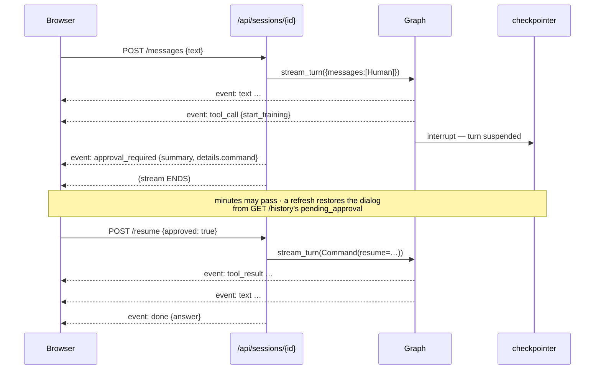

# `api/` — the HTTP service

`agentic/adaptrna_agentic/api/`

The same platform over HTTP, so a browser can drive it and a session started in the terminal
continues in the browser (and back).

> Every endpoint wraps something the CLI already does — no new capability, no second
> implementation to drift. What it adds is a second **front end**, sharing sessions with the
> terminal through the same checkpointer.

---

## Contents

1. [Layout](#1-layout)
2. [`app.py` — assembly, errors, auth](#2-apppy--assembly-errors-auth)
3. [`deps.py` — the singletons](#3-depspy--the-singletons)
4. [`events.py` — the SSE contract](#4-eventspy--the-sse-contract)
5. [The endpoint surface](#5-the-endpoint-surface)
6. [The approval round trip](#6-the-approval-round-trip)
7. [Security posture](#7-security-posture)
8. [Assumptions and limitations](#8-assumptions-and-limitations)

---

## 1. Layout

| File | Lines | Responsibility |
|---|---:|---|
| `app.py` | 114 | `create_app()`: error handlers, bearer middleware, router mounting |
| `deps.py` | 88 | `Services` singletons; the WAL checkpointer; `is_loopback` |
| `events.py` | 127 | Graph run → SSE frames; `history()`; `pending_approval()` |
| `schemas.py` | 24 | Request bodies only — responses are the CLI's own plain dicts |
| `routers/system.py` | 35 | `/health`, `/api/doctor` |
| `routers/tools.py` | 108 | list / info / activate / deactivate / test / predict / call |
| `routers/jobs.py` | 53 | list / status / logs / analysis / cancel |
| `routers/sessions.py` | 175 | list / create / rename / delete / history / messages (SSE) / resume (SSE) |
| `sessions_store.py` | 130 | Sessions as a resource: recency listing and rename, straight SQL over the checkpointer's own tables |
| `routers/ui.py` | 58 | The app shell at `/`, static assets at `/ui` |

**The only deletable thing here is a session.** Everything else — tools, artifacts, jobs,
runs, staged code — stays a human action at the CLI, because for expensive and
hard-to-reproduce things a shell prompt really is a better boundary than a button.

Phase 8 and Phase 9 said that of *everything*, sessions included. Phase 10 narrowed it. A
conversation is neither expensive nor hard to recreate, the client that lists them is exactly
where a person expects to manage them, and the CLI alternative was
`toolhub prune sessions --older-than N --yes` — which computes age from the mtime of the
whole SQLite file, so it cannot even target one session. That was friction without safety.
The *agent* still cannot delete anything at all.

## 2. `app.py` — assembly, errors, auth

```python
create_app(services=None, **service_kwargs) -> FastAPI
```

`services` is injectable, which is what lets the HTTP tests run with no API key and no GPU.
Routers mount under `/api` except `system` (which owns `/health` at the root) and `ui`.

### Error mapping

Phase 7 standardised the platform's error messages precisely so a second front end would
need no wording of its own: **the body a browser shows is the text the terminal prints.**

| Exception | Status | Body |
|---|---|---|
| `ConcurrentModificationError` | **409** | `{error, retryable: true}` |
| `ToolHubError` | **409** | `{error, type: "ToolHubError"}` |
| `KeyError` | **404** | `{error}` — the registry/store message listing what does exist |
| `FileNotFoundError` | **400** | `{error}` |
| `ValueError` | **400** | `{error}` |
| anything else | **500** | `{error: "internal error", request_id}` |

The 500 handler never leaks a traceback; it logs `[<request_id>] <type>: <message>` on the
server so the response can be tied to the log line.

`retryable: true` is load-bearing, not decoration. A 409 while a store is mid-write is a
*transient* answer, and the likeliest moment for it is just after a run starts — exactly
when a client is watching most closely. Polling clients must keep their last good render
**and keep polling**; the browser's job monitor re-arms its timer on failure for this
reason.

### Auth middleware

```python
if token and request.url.path != "/health":
    if request.headers.get("authorization") != f"Bearer {token}":
        return 401 {"error": "missing or invalid bearer token"}
```

Required **only when a token is configured**. `/health` is deliberately exempt: a probe
should not need a credential, and the endpoint is status-only so it leaks no paths.

## 3. `deps.py` — the singletons

```python
@dataclass
class Services:
    registry: Registry
    runtime: AdapterRuntime      # ONE per process — the backbone is 2.6 GB
    graph: Any                   # one compiled orchestrator graph
    checkpointer: Any
    db_path: Path
    token: str | None
    @property
    def inference_lock(self): return self.runtime.inference_lock
```

This is the whole concurrency story in one file. Inference safety lives **inside**
`AdapterRuntime`, not here, so every caller is covered rather than each entry point having
to remember.

```python
open_checkpointer(db_path=None) -> (SqliteSaver, path)
    connection.execute("PRAGMA journal_mode=WAL")
    connection.execute("PRAGMA busy_timeout=5000")
```

Both PRAGMAs are set explicitly rather than assumed: a fresh database starts in
rollback-journal mode, where a writer blocks every reader — and two processes sharing
sessions is the entire point of this service. The path defaults to `chat_db_path()`, i.e.
the same file `cli/chat.py` uses.

## 4. `events.py` — the SSE contract

The only genuinely new logic in this layer, and deliberately a plain generator over the
graph so it is testable without a server.

```python
sse(event, data) -> "event: <name>\ndata: <json>\n\n"
stream_turn(graph, config, payload) -> Iterator[str]
pending_approval(graph, config) -> dict | None
history(graph, config) -> [{role, content, name?, tool_calls?}]
```

`stream_turn` consumes `graph.stream(payload, config, stream_mode=["updates", "messages"])`:
`messages` chunks become `text` frames (token by token), `updates` chunks become `tool_call`
and `tool_result` frames.

| Event | Payload | Meaning |
|---|---|---|
| `text` | `{delta}` | Assistant text, incrementally |
| `tool_call` | `{name, args}` | The model asked for a tool |
| `tool_result` | `{name, content}` | Truncated to `RESULT_PREVIEW_CHARS = 2000`; the full value stays in session history |
| `approval_required` | the interrupt payload | **The stream ends here** |
| `done` | `{answer}` | The last `AIMessage` with no tool calls |
| `error` | `{message, type}` | Any exception — the stream is the error channel, so callers have one place to handle failure |

`history()` is what a UI reconnecting mid-conversation needs: human turns, assistant turns
(with their `tool_calls`), and tool results, each truncated the same way.

## 5. The endpoint surface

Interactive docs at `/docs` on a running server.

### System

| Method | Path | Returns |
|---|---|---|
| `GET` | `/health` | `{status, install, failed_checks, backbone_loaded}` — runs the full doctor but reports only statuses. Unauthenticated. |
| `GET` | `/api/doctor` | The complete doctor report, every check with its remedy |

### Tools

| Method | Path | Notes |
|---|---|---|
| `GET` | `/api/tools` | `[{name, type, state, task, description}]` |
| `GET` | `/api/tools/{name}` | The full manifest entry |
| `POST` | `/api/tools/{name}/activate` · `/deactivate` | `{name, state}` |
| `POST` | `/api/tools/{name}/test` | Smoke report (adapter) or golden report (external) |
| `POST` | `/api/tools/{name}/predict` | Body `{sequences, batch_size?}`. **Adapter tools only** — an external tool gets a 409 pointing at `/call`. Serialised inside the runtime. |
| `POST` | `/api/tools/{name}/call` | Body `{args}`. **External tools only**; refuses a disabled tool with the activate instruction. |

Handlers are `def`, **not `async def`**, so Starlette runs them in its threadpool — a
prediction that occupies the GPU for a second does not freeze the event loop, and `/health`
keeps answering.

### Jobs — read-only, plus cancel

| Method | Path | Notes |
|---|---|---|
| `GET` | `/api/jobs` | Newest first |
| `GET` | `/api/jobs/{id}` | Full status including live progress from `metrics.csv` |
| `GET` | `/api/jobs/{id}/logs?tail=N` | `1 ≤ N ≤ 2000`, default 40 |
| `GET` | `/api/jobs/{id}/analysis` | The RunAnalyzer report for that run |
| `POST` | `/api/jobs/{id}/cancel` | 409 when not running, or when the PID cannot be proved to be ours |

**Starting a job is deliberately not here.** It happens through the chat, behind the
approval gate, so a human sees the exact command before GPU time is spent.

### Sessions

| Method | Path | Notes |
|---|---|---|
| `GET` | `/api/sessions` | `[{id, updated_at, checkpoints}]`, **newest first**. `updated_at` is decoded from the newest checkpoint's UUIDv6 — no timestamp is stored anywhere |
| `POST` | `/api/sessions` | Body `{id}` → 201 and the new row. Refuses (409) a duplicate, (400) a blank name. Seeds an empty checkpoint so the session survives a reload before its first turn |
| `PATCH` | `/api/sessions/{id}` | Body `{id: new}` → the renamed row. `thread_id` is part of the primary key, so this is an `UPDATE` across the checkpointer's tables. Refuses (404) unknown, (409) an occupied name or a session with a pending approval |
| `DELETE` | `/api/sessions/{id}` | `{deleted: id}`. Irreversible; reuses `prune.delete_session`, so there is one deletion path, not two |
| `GET` | `/api/sessions/{id}/history` | `{session, messages, pending_approval}` |
| `POST` | `/api/sessions/{id}/messages` | Body `{text}` → **SSE stream**. Refuses (409) if the session is already waiting on an approval. |
| `POST` | `/api/sessions/{id}/resume` | Body `{approved, note?}` → **a new SSE stream** continuing the same turn. Refuses (409) if nothing is pending. |

SSE responses carry `Cache-Control: no-cache`, `Connection: keep-alive`, and
`X-Accel-Buffering: no` — proxies otherwise buffer SSE into uselessness.

### UI

`GET /` serves `ui/index.html` with `Cache-Control: no-store` (the shell names the asset
files; a stale copy would reference modules that no longer exist). Assets mount at `/ui`,
**not** `/`, which would shadow `/api` and `/health`. If `ui/` is absent — the package
installed away from its checkout — `/` returns a 503 page saying the API itself is fine.

## 6. The approval round trip



Why the stream ends rather than staying open:

> A gate can wait minutes for a human, and a suspended turn survives in the checkpointer
> where a held-open connection would not.

The client decides and calls `/resume`, which returns a **new** stream continuing the same
turn — which is why [`ui/app.js`](web-ui.md) has no separate resume path: `consume()` is
simply called again.

## 7. Security posture

This service can spend GPU hours and write code into the repository, so:

* it **binds loopback by default** (`127.0.0.1:8000`);
* it **refuses to start** on any other address without `ADAPTRNA_API_TOKEN` — the check
  lives in [`cli/serve.py::check_binding`](cli.md#servepy), before uvicorn is imported, so
  the dangerous configuration is not reachable by accident;
* a configured token is required on every path except `/health`;
* the only delete endpoint is `DELETE /api/sessions/{id}` — no tool removal, no pruning, no
  job or artifact deletion;
* `POST /api/jobs/{id}/cancel` inherits the recycled-PID guard rather than reimplementing
  it.

`tests/test_api_security.py` covers the refusal, the 401, and the `/health` exemption.

The posture is a deliberate **single-user** design, not a starting point for a shared
deployment. Multi-user would need per-user sessions, authorisation on tool lifecycle
operations, and a real audit trail.

## 8. Assumptions and limitations

* **One process, one backbone, one graph.** Horizontal scaling would need the inference lock
  to become something cross-process.
* **Predictions are serialised**, so throughput is one at a time. Correctness first.
* **`routers/jobs.py` builds a fresh `JobRunner` per request.** Harmless — all job state is
  on disk — but it means the in-process `Popen` handle cache never applies to jobs started
  through the chat in the same server, only to whichever object started them.
* **Session ids are unvalidated strings** used directly as `thread_id`s. On loopback with a
  single user that is fine; it is not an authorisation boundary.
* **`/api/tools/{name}/test` can be slow** — it may trigger a backbone load. It runs in the
  threadpool, so it does not block liveness.
* **SSE only, no WebSocket.** The client reads frames off `fetch` because `EventSource`
  cannot POST.
