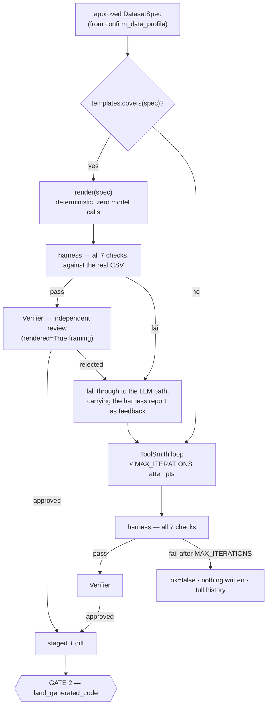

# `codegen/` — writing, verifying and landing new code

`agentic/adaptrna_agentic/codegen/`

The platform's differentiator: when the user approves a dataset spec at gate 1, this
package produces the task code for it, **proves it works against that data**, has it
independently reviewed, and stages it for a human to approve as a diff.

Nothing here writes into the repository. Landing is a separate, gated step.

There are **two ways the code gets written** (Phase 13 D13). A spec the deterministic
template covers is rendered — no model call, byte-identical output for identical input.
Only a spec outside that declared space, or one whose rendered code fails verification,
reaches the ToolSmith/Verifier loop this package always had. Both paths converge on the
same harness and the same independent review before either may be staged.

---

## Contents

1. [The pipeline at a glance](#1-the-pipeline-at-a-glance)
2. [`codegen/templates/` — the deterministic path](#2-codegentemplates--the-deterministic-path)
3. [`pipeline.py` — the bounded loop, and where it isn't bounded](#3-pipelinepy--the-bounded-loop-and-where-it-isnt-bounded)
4. [`harness.py` and `_harness_runner.py` — the seven checks](#4-harnesspy-and-_harness_runnerpy--the-seven-checks)
5. [`sandbox.py`](#5-sandboxpy)
6. [`staging.py`](#6-stagingpy)
7. [`discovery.py`](#7-discoverypy)
8. [`prompts.py` — the fallback path's context](#8-promptspy--the-fallback-paths-context)
9. [External-wrapper generation](#9-external-wrapper-generation)
10. [How the harness is itself kept honest](#10-how-the-harness-is-itself-kept-honest)
11. [Assumptions and limitations](#11-assumptions-and-limitations)

---

## 1. The pipeline at a glance



`create_task(spec)` in `pipeline.py` is what `tool_factory.create_task_tool` calls, and it
is the single entry point for both paths. The tool result names which one produced the
code (`"path": "template"` / `"path": "generated"`), with `"fell_back_from_template": true`
and a reason when the template was tried and rejected. A user must never be unsure whether
a human's reviewed template or a model wrote the code they are approving.

## 2. `codegen/templates/` — the deterministic path

```
agentic/adaptrna_agentic/codegen/templates/
├── __init__.py
├── render.py               covers(spec) · render(spec) -> {task.py, datamodule.py, config.yaml}
├── TEMPLATE_VERSION         a single integer, bumped on any change to the .j2 files
├── task.py.j2
├── datamodule.py.j2
└── config.yaml.j2
```

```python
covers(spec: dict) -> bool     # whitelist predicate — see below
render(spec: dict) -> {"task.py": str, "datamodule.py": str, "config.yaml": str}
TEMPLATE_VERSION: int          # read once at import from the TEMPLATE_VERSION file (currently 2)
```

### `covers(spec)`

A plain, deliberately conservative predicate over the spec — it does not try to be
exhaustively correct, because the real backstop is reactive rather than predictive: a spec
it wrongly accepts still has to pass the identical harness and review as generated code
(§4), and a bad fit fails there and falls through. What it actually checks:

* `target_type` is one of `binary` / `multiclass` / `regression`;
* `task_name` is a valid Python identifier;
* `sequence_column`, `label_column` and `path` are present;
* `format.separator` is `,` or `\t`;
* `head.primary_metric` is set;
* for `binary`/`multiclass`: `classes` has between 2 and `MAX_CLASSES` (20) entries, and for
  `binary` specifically exactly 2, with `positive_class` one of them;
* `split.mode` is `random` (fractions sum to 1.0 ±1e-6, an int seed) or `column` (a column
  name and a non-empty mapping).

Anything else — a spec field outside this list, or a value outside these ranges — makes
`covers()` return `False`, and the spec falls straight to the LLM loop with no attempt at
rendering.

### `render(spec)`

Re-checks `covers(spec)` and raises `ValueError` rather than silently emitting code for a
spec it does not support — `covers()` is meant to gate the caller, not to be trusted blindly
by `render()` itself. Builds one Jinja2 context (`_context`) from the spec and renders all
three `.j2` templates against it with `jinja2.StrictUndefined`, so a template referencing a
context key nobody supplied fails loudly at render time instead of emitting a blank.

* **Complete, self-contained output.** The rendered `task.py` is a full
  `BaseDownstreamModule` subclass — head, `extract_features`, loss, metrics, adapter state,
  all written out. No shipped base class stands behind it, which is what keeps a rendered
  task exactly as readable and editable as a generated one.
* **Conditionals stay shallow.** Three target types × two split modes is handled by
  branching on `target_type` and `split_mode` inside the templates (`` blocks), not
  by a matrix of template files. A fourth axis is the signal to reconsider the mechanism,
  not to nest further.
* **Version-stamped.** Every rendered file's first line is
  `# rendered by adaptrna template v<N> from spec.json`. `pipeline._attempt_template` also
  stamps `template_version` onto the `spec.json` that lands beside the code — see §3 and
  §6 — which is what lets `toolhub doctor`'s `template_version` check (`toolhub.md`) tell a
  task rendered from a superseded version apart from one the LLM path wrote (no
  `template_version` key at all) or one landed before this phase (no `spec.json` at all).
* **Ordinary reviewed code.** The `.j2` files are written by a human, live in the
  repository, and are covered by golden-file tests (`test_templates_render.py`) that assert
  byte-for-byte output for each of the three target types × two split modes. The review that
  used to happen per generated task happens here, once, in a pull request against the
  templates.

## 3. `pipeline.py` — the bounded loop, and where it isn't bounded

```python
MAX_ITERATIONS = 3

create_task(spec, *, sequences=None, max_iterations=3, toolsmith_model=None,
            verifier_model=None, data_dir=None, skip_review=False) -> CodegenResult
create_external_tool(name, package, description, *, ...) -> CodegenResult
```

`create_task(spec)` refuses a spec whose `source` is not `"confirm_data_profile"` one level
up, in `tool_factory.create_task_tool` — the same mechanical guard the training plan uses,
so a model that finds gate 1 inconvenient cannot hand-assemble a spec and skip it. It then:

1. Calls `templates.covers(spec)`. If it returns `True`, tries the template path exactly
   **once** (`_attempt_template`) — render, stage, harness, review. `max_iterations` bounds
   only the *fallback* loop: a deterministic renderer cannot be usefully retried (identical
   spec in, identical code out, identical failure out), so writing a render → fail → render
   loop that burns three identical attempts would be a bug, not extra safety. If that one
   attempt is approved, `create_task` returns immediately with `result.path = "template"`.
2. Otherwise (never covered, or the one template attempt failed) falls through to the
   ToolSmith/Verifier loop, up to `max_iterations` (still 3) attempts, exactly as before
   Phase 13 — generate → stage → harness → review → retry with the failure as feedback.
   `result.path` is set back to `"generated"`, and if a template attempt was made first,
   `result.fell_back_from_template = True` with `result.fallback_reason` naming why (the
   harness failed, or the review rejected the rendered code as a **template fitness**
   finding — logged as a template bug report, not a per-task failure, so a pattern of
   rejections becomes a template fix rather than a slow drip of silent fallbacks).

A fourth attempt at the same failing idea being rarely the fix is still the reasoning
behind the fallback's own cap; it just no longer applies to the template path, which was
never retriable in the first place.

### Result types

```python
Attempt(index, files, harness_report, review=None, ok=False)
    .summary() -> "attempt 2: harness failed: ['datamodule'] | reviewer: …"

CodegenResult(ok, kind, name, attempts=[], stage=None, path="generated",
              fell_back_from_template=False, fallback_reason=None)
    .to_dict() -> {ok, kind, name, iterations, history[], path,
                   fell_back_from_template?, fallback_reason?,
                   harness, review, stage_id, staging_path, files[], conclusion?}
```

`to_dict()` is what the agent sees, and therefore what the gate-2 payload is built from.
`path`, and `fell_back_from_template`/`fallback_reason` when set, are always present so the
approval surfaces (CLI, API, UI) can say plainly which mechanism produced the code. On
failure it carries `conclusion`: *"Gave up after N attempt(s); nothing was written. The
last failure is above."* — plus the full per-attempt history.

### The "a skipped check is not a pass" rule

```python
unmet = harness.unmet_requirements(report)      # required checks whose status != "pass"
if unmet:
    report["ok"] = False
    report["failed"] += unmet
```

Applied identically on both paths (`_attempt_template` and the main loop). This is the
single most important line of defence in the package, and it exists because of a real
incident: a verification harness that ran in a different working directory than the code
would actually run in *skipped* the data-dependent checks instead of failing them,
producing a green report for code that had never touched the user's data.

### Other guards

* `_reject_existing(name)` refuses to generate a task whose name already exists in
  `adaptrna_custom/tasks/` — *"Landed code is yours: edit it directly, or choose another
  name."* Runs once, before either path is tried.
* A staging failure (e.g. the model returned only two of the three files, or a spec so
  malformed `stage_task` refuses it) is recorded as a normal failed attempt with a `files`
  check, and its message becomes the next attempt's feedback rather than crashing the flow.
* `skip_review=True` exists for tests, so either path's deterministic half can be exercised
  without a Verifier model.

## 4. `harness.py` and `_harness_runner.py` — the seven checks

`harness.py` is the launcher and summariser; `_harness_runner.py` is what actually runs,
**inside the sandbox**, as `python -m adaptrna_agentic.codegen._harness_runner <spec.json>`.
Identical on both the template and the generated path — Phase 13's D15 is explicit that
rendered code gets **no shortcut**: the checks prove properties of *template-plus-data*, not
of the template alone.

```python
verify_task(task_name, *, task_module=None, config_path=None, sequences=None,
            only=None, sys_path=None, timeout=600) -> report
```

**Never raises for the task's misbehaviour** — a crash, a hang and a failed check are all
results the report needs to describe. A run that produces no payload at all becomes a report
with a single failed `harness` check carrying the last 15 stderr lines.

> The subprocess runs with `cwd=REPO_ROOT`, exactly as the JobRunner runs real training.

Report shape:

```python
{"task": str, "ok": bool,
 "checks": [{"name", "status" ∈ {pass, skip, fail}, "detail", "traceback"?}],
 "failed": [str],
 "sandbox": {"timed_out": bool, "returncode": int|None, "limits": {...}}}
```

### The checks

| # | Name | Proves | Skips when |
|---|---|---|---|
| 1 | `import` | The module imports and `@register_task` registered the expected name. Reports every available task on failure, and points at the likely cause (name ≠ config's `task:`). | — |
| 2 | `config_head` | The config resolves through the engine's own `resolve_config`, its `task:` matches, and its `head:` block actually **builds a head** (a `TypeError` here means `build_head` rejected the config's kwargs). | no config path given |
| 3 | `datamodule` | `build_datamodule(cfg)` constructs, `prepare_data()`/`setup("fit")` run, and a real batch is drawn from `train_dataloader()`. Reports element shapes. | `FileNotFoundError` → *"dataset not available here"* |
| 4 | `forward_backward` | Forward runs, the loss is **finite**, `backward()` reaches every trainable tensor, and **no frozen parameter received a gradient**. | no batch |
| 5 | `metrics` | `update_metrics` + `compute_metrics` return a dict of finite scalars, **and `PRIMARY_METRIC` is among the keys `compute_metrics` returns** (Phase 13; stage-suffix aware — the check runs the `val` stage but `PRIMARY_METRIC` conventionally names `test/…`, so only the part after the slash is compared). | no batch |
| 6 | `adapter_roundtrip` | **Predictions are identical across save → load.** | — |
| 7 | `serving` | The adapter registers into a real `RiNALMoHub` and predicts one output per sequence — the way a registered tool does. | — |

```python
STRUCTURAL_CHECKS      = ("import", "config_head", "adapter_roundtrip", "serving")
REQUIRED_FOR_GENERATED = ("datamodule", "forward_backward", "metrics")
```

`STRUCTURAL_CHECKS` need no dataset, which is what makes them usable as the fast **control**
in CI (§10). `REQUIRED_FOR_GENERATED` are the ones that must actually run before generated
*or rendered* code may be approved.

Everything runs on a **`nano`** backbone (6 blocks, width 320) with `NANO_LORA = {r: 4,
alpha: 8, dropout: 0.0, layer_stride: 3}` — instant on CPU, no weights required.

### Check 5's `PRIMARY_METRIC` assertion, and why it was added

Before Phase 13 a task could register a `PRIMARY_METRIC` that nothing `compute_metrics`
returns, and the failure surfaced hours later as an analyzer reporting `primary_value: null`
on a finished run — silent at write time, expensive at read time. Check 5 now catches it at
verification, on both paths: the template's `PRIMARY_METRIC` is set directly from
`spec["head"]["primary_metric"]`, and `HARD_REQUIREMENTS` (§8) makes it a hard requirement
for the LLM path too. A matching deliberately-broken fixture (a task whose `PRIMARY_METRIC`
names a metric it never computes) lives in `tests/fixtures/broken_task_sources.py`, per the
rule in [extending.md](../extending.md#add-a-harness-check) that a check with no catch test
is a check nobody knows works.

### Check 6 in detail — why it is the important one

The project's number-one silent failure is task state that predictions depend on but that
never reaches the adapter file. Instead of asking a reviewer *"did you remember
`ADAPTER_EXTRA_PREFIXES`?"*, this **proves** it:

```python
torch.manual_seed(0); source = build_module(lora=NANO_LORA, apply_lora=True)
_randomise_adapter_state(source)            # move every adapter-owned tensor off its default
before = predict(source)
source.save_adapter(path)

torch.manual_seed(0); target = build_module(...)   # identical fresh backbone from the seed
target.load_adapter(path)
after = predict(target)

assert _same(before, after)
```

`_randomise_adapter_state` deliberately touches everything **except** the backbone's own
weights (which are rebuilt identically from the seed, so touching them would make the
comparison meaningless) — while still including LoRA tensors, which live inside the backbone
but belong to the adapter. Buffers are randomised too, which is what catches a missing
`ADAPTER_EXTRA_PREFIXES` for something like a regression head's target scaler.

On failure the message names both remedies: tensors → `ADAPTER_EXTRA_PREFIXES`; plain
Python values → `adapter_extra_payload()` / `load_adapter_extra()`.

### Check 4's one deliberate exemption

```python
trainable = [(n, p) for n, p in module.named_parameters()
             if p.requires_grad and "lm_mask_head" not in n]
```

`RiNALMo.forward` always runs its masked-LM head, whose output never reaches a downstream
loss. That is also why the engine configures DDP with `find_unused_parameters=True`. It is
never counted as a defect in the task.

### `sys.path` ordering

```python
ensure_importable()                       # repo root FIRST
for entry in reversed(spec["sys_path"]):  # then staging roots, inserted ABOVE it
    sys.path.insert(0, entry)
```

Order is load-bearing. Staged code is verified before it lands, and its tree mirrors the
final layout, so `adaptrna_custom.tasks.<x>` must resolve to the **staged** copy rather than
to the identically named package at the repo root that does not yet contain it. Inserting
the repo root afterwards would shadow the staging tree.

### `summarize(report)`

One line per check, used both for the CLI and — verbatim — as the "Automated verification
(already run)" block in the Verifier prompt:

```
task 'my_task': PASS
  [ok  ] import: registered; available tasks: [...]
  [ok  ] datamodule: batch drawn; element shapes/types: [(32, 402), (32,)]
  [ok  ] adapter_roundtrip: predictions identical across save/load ([...])
```

## 5. `sandbox.py`

```python
run_python(args, *, timeout=600, memory_mb=32768, cpu_seconds=900,
           file_size_mb=512, cwd=None, env=None) -> SandboxResult
```

Applied in the child between fork and exec:

| Limit | Value | Purpose |
|---|---|---|
| `os.setsid()` | — | Own process group, so a timeout kills the whole tree |
| `RLIMIT_AS` | 32 GiB | Bound on pathological runaway (a datamodule that reads a 400 GB array) |
| `RLIMIT_CPU` | 900 s | The better guard against infinite loops |
| `RLIMIT_FSIZE` | 512 MB | Stray writes |
| `RLIMIT_CORE` | 0 | No core dumps |
| wall-clock `timeout` | 600 s | `subprocess.run(timeout=…)` |

The memory limit is deliberately loose: `RLIMIT_AS` caps *virtual* address space and
PyTorch reserves far more than it uses — measured here, 10.4 GiB just to import torch and
build a nano model with 128 OpenMP threads, 5.5 GiB with the thread caps the sandbox sets.
CPU time is the real guard.

Results come back over a **marker line** rather than plain stdout:

```python
RESULT_MARKER = "__ADAPTRNA_RESULT__"
emit_payload(d)       # child: print(MARKER + json.dumps(d))
extract_payload(out)  # parent: the LAST marked line, parsed
```

so progress bars, warnings and torch chatter cannot corrupt the result.

> **This is accident-isolation, not adversarial sandboxing**, and the distinction is
> deliberate. The code executed here — whether rendered by the template or written by this
> project's own model — runs from the user's own data on the user's own machine, and a
> human reviews the diff before it lands. The realistic risks are accidents. If code ever
> arrived from an untrusted source, the upgrade path is a container, not a bigger `rlimit`.
> **The human diff gate is the real security boundary.**

## 6. `staging.py`

The staging tree **mirrors the final layout exactly**:

```
toolhub_data/staging/<name>-<uuid8>/
└── adaptrna_custom/
    ├── __init__.py
    ├── tasks/__init__.py
    │   └── <name>/{__init__.py, task.py, datamodule.py, config.yaml, spec.json}
    └── tools/{__init__.py, <name>.py}          (external wrappers)
```

so the module path that gets verified (`adaptrna_custom.tasks.<name>.task`) is the module
path that will be imported after landing. Verifying code at one import path and shipping it
at another is how you get a green report for something that then fails on first real use.

`TASK_FILES = ("task.py", "datamodule.py", "config.yaml")` is what `stage_task` *requires*
present in `files` — but it writes **every** key in `files`, so `spec.json` (added by the
pipeline before staging, on both paths — see §3 and §2's version-stamping note) rides along
as a fourth file without `staging.py` itself needing to know it exists. A landed task's
directory is therefore always `{__init__.py, task.py, datamodule.py, config.yaml,
spec.json}` — the approved `DatasetSpec` sits beside the code it produced, which is what
makes reuse matching (`profiling-and-knowledge.md`) and spec-driven serving
([toolhub.md](toolhub.md)) possible after the session that generated the code has ended.

| Function | Purpose |
|---|---|
| `stage_task(name, files, data_dir=None)` | Requires at least `task.py`, `datamodule.py`, `config.yaml`; refuses with the missing list. Writes package markers. |
| `stage_tool(name, content, data_dir=None)` | One module under `tools/` |
| `load_stage(stage_id)` | Reconstruct from disk — staging outlives the process **deliberately**, so the user can open the files in an editor and approve in a later session |
| `list_stages()` | Everything awaiting approval |
| `land(stage)` | Copy into `<repo>/adaptrna_custom/`, creating the task's `__init__.py` if new. Returns the written paths. **The gated step.** |
| `discard(stage)` | `shutil.rmtree`, used between failed attempts |

`Stage.summary()` gives `[{path, lines}]`. The `{path, lines, content}` triples that go into
the approval payload are built in `agents/orchestrator.py::_details`, so the approval window
can render the code inline.

**Landing a `kind="tool"` stage** (`land_generated_code` in `tool_factory.py`) does one
extra step after writing the file: it evicts the stale staging-directory copy of the module
from `sys.modules` (the verification pipeline imported it from there), calls
`discovery.ensure_importable()` to put the repo root on `sys.path`, then calls
`registry.register_external(stage.module_path)` — so the tool is **registered and active
immediately** after approval, with no separate CLI step. The `sys.modules` eviction is
necessary because Python caches the staging-path import; without it the landed file would
be shadowed by the old cached module. **Landing a `kind="task"` stage** is copy-only — a
task is not usable until a training run produces an adapter for it, so there is nothing to
register at this step.

## 7. `discovery.py`

The seam that makes generated (and rendered) code first-class.

```python
CUSTOM_PACKAGE = "adaptrna_custom"
CUSTOM_ROOT    = REPO_ROOT / CUSTOM_PACKAGE

ensure_importable()          # put REPO_ROOT on sys.path
custom_task_names()          # every tasks/*/ that has a task.py
landed_spec(task)            # the DatasetSpec a task landed with (spec.json), or None
task_module_path(name)       # "adaptrna_custom.tasks.<name>.task"
tool_module_path(name)       # "adaptrna_custom.tools.<name>"
load_all(only=None)          # import them all; RETURNS [(name, exception)] rather than raising
describe_failures(failures)  # "x: ImportError: …; y: SyntaxError: …"
```

`landed_spec(task)` reads `adaptrna_custom/tasks/<task>/spec.json` and returns the parsed
dict, or `None` if the file is missing or unreadable — a task landed by hand, or landed
before Phase 13, simply has none, and every caller (the reuse matcher, the recommender's
derived values, `registry.register`'s pad-sensitivity and validator selection, the
`template_version` doctor check) treats that absence the same way: reported, never an
error, and falling back to the pre-Phase-13 behaviour (no note, no special validator, not
pad-sensitive).

`load_all` returning failures instead of raising is the point: **one broken generated task
must not make every other task unavailable.** Three callers depend on it, and all three
matter — the training entrypoint (so a generated task is trainable), the ToolHub runtime (so
its adapter is servable), and the harness (so it verifies under the real import path).

## 8. `prompts.py` — the fallback path's context

Context assembly for the ToolSmith/Verifier loop only — the template path makes no model
call, so nothing here runs on it. Everything supplied already exists somewhere in the
project or is derived from the approved spec; this module's only job is to put the right
pieces in front of the right agent.

Phase 13 removed the platform's own task knowledge from this prompt (D6): there are no
shipped tasks to describe as "the closest known shape", and no shipped example to read
verbatim. What replaced both:

| Constant / function | Contents |
|---|---|
| `SUBCLASS_CONTRACT` | The engine's required and optional hooks and class attributes, plus *"Never edit anything under engine/"*. Kept here rather than parsed out of the engine so the generator sees a stable, complete statement. |
| `SILENT_FAILURE_RULES` | The two questions, with the exact remedies and the `representation[:, 0]` / `[..., 1:-1, :]` idioms spelled out. |
| `HARD_REQUIREMENTS` | Three files; `task:` must equal the registered name; import the datamodule by its **absolute** `adaptrna_custom.tasks.<name>.datamodule` path; use `lightning.pytorch`, never `pytorch_lightning`; return JSON-serialisable values from `postprocess_predictions`; read **exactly** the spec's `sequence_column`/`label_column` from its `path`; implement **the approved split** and nothing else; `PRIMARY_METRIC` must equal `spec["head"]["primary_metric"]` and must be a key `compute_metrics` actually returns; invalid-alphabet rows are handled per `spec["on_invalid"]`. |
| `spec_section(spec)` | The approved `DatasetSpec` as JSON, framed as *"the contract with the user, already agreed at gate 1"* — not a suggestion to second-guess. |
| `recipe_section(spec)` | **Only** the one `target_shapes.yaml` entry matching the spec's `target_type` (via `knowledge.target_shape`), keyed on target type and carrying no task identity: head shape, `extract_features` expression, loss, metrics, `primary_metric`, `predict_output`, `pad_sensitive`, and the shape's own silent-failure trap. |
| `split_instructions(spec)` | Exact split instructions generated from `spec["split"]` — the fractions/seed/stratification, or the column and mapping, spelled out so there is nothing left to improvise. |
| `worked_example()` | **Not a shipped file any more.** Calls `codegen.templates.render()` against a tiny synthetic `sequence,label` fixture spec (the same CSV the Stage-0 harness controls and the template golden tests use) and returns the rendered `task.py`/`datamodule.py`/`config.yaml`. A neutral, guaranteed-correct example — it is the same reviewed template that produces production code on the covered path, rendered for a binary target, carrying no RNA task identity at all. |
| `task_user_prompt(spec, feedback=None)` | Assembles the task description, `spec_section`, `recipe_section`, `split_instructions`, the contract, the silent-failure rules, the requirements, `worked_example()`, and — on a retry — *"Your previous attempt failed verification … Fix these specific problems. Keep everything that worked."* |
| `verifier_system_prompt()` | *"…in a fresh context and independently of whoever wrote it… do not re-litigate what the harness already proved."* |
| `verifier_user_prompt(..., rendered=False)` | What the user asked, the spec, the harness summary, the code, and the checklist ending *"Approve only if you would be comfortable with these numbers in a paper."* `rendered=True` swaps the framing paragraph (see below). |
| `external_tool_prompt(...)` | The full `contract.py` source. **No reference wrapper any more** (D2 — `vienna.py` is deleted; see [toolhub.md §5](toolhub.md#5-external--non-neural-tools)); the contract itself is the whole prompt. |

### The Verifier's narrower question on the template path

`verifier_user_prompt(..., rendered=True)` — set by `pipeline._attempt_template` when it
calls `verifier.review_task(..., rendered=True)` — swaps in a different framing paragraph
instead of the open-ended authorship one:

> *"This code was rendered deterministically from the approved spec below, by a reviewed
> template — there is no author whose judgment you are auditing. Ask only the narrower
> question: does this code do what this spec says, for this data? A rejection here means
> the template does not fit this spec, not that someone made a mistake."*

The rest of the checklist (`SILENT_FAILURE_RULES`, the column/loss/metric/config checks) is
identical either way — the harness has already proved the tensor half of the silent-state
trap on both paths; the Verifier's job is the same non-tensor judgment call regardless of
who (or what) wrote the code. What differs is only what a rejection *means*: on the fallback
path it is feedback for the next ToolSmith attempt; on the template path it is a template
bug report, and it routes to the fallback rather than to a retry (§3), because a
deterministic renderer would reproduce the identical rejection on a second try.

`tests/test_prompts.py` asserts on what goes into these prompts — including, since Phase 13,
that they contain **no task names** — on the reasoning that *a generator that never sees the
contract writes code that fails check 1*.

## 9. External-wrapper generation

`create_external_tool` follows the same loop but verifies differently — `_verify_wrapper`
runs **in process** rather than in the sandbox:

1. `contract.load_spec(module_path)` — the gate. A module without a valid `SPEC`, or
   declaring a function it does not define, fails here and the loop retries.
2. If the wrapped package is not installed, the golden check is recorded as **`skip`** and
   the attempt still succeeds (contract validity is what was being checked).
3. Otherwise every function's golden cases run through `contract.run_golden` against a
   synthetic `ToolEntry`.

> Wrapper modules are small and import a package the user already approved, so the sandbox's
> process isolation buys little here; the contract loader is the gate.

Note the asymmetry with tasks: for wrappers a skipped golden check does **not** block
success, because the package's absence is a property of the environment, not of the code.
There is no template path for external tools — every wrapper still goes through the
ToolSmith/Verifier loop, since `contract.py` describes a *shape* a wrapper must satisfy, not
a small enough space to render deterministically the way a `sequence,label` task is.

## 10. How the harness is itself kept honest

The harness is the trust boundary, so it is itself controlled — `tests/test_harness.py`
runs it in both directions:

* **Controls:** hand-written **fixture tasks**, one per supported target type
  (`tests/fixtures/target_type_tasks.py`), must **PASS** its structural checks. Phase 13
  moved these controls off the shipped engine tasks that used to serve this role — the
  agentic layer's own test suite is now forbidden from naming them (D1/D11,
  `test_no_shipped_task_knowledge.py`) — and re-pointed them at fixtures with no task
  identity, written specifically to give the harness a known-good control without which its
  green reports mean nothing. The same fixtures back `test_codegen_target_types.py`'s
  fallback-path regression test.
* **Catches:** `tests/fixtures/broken_task_sources.py` contains deliberately defective
  tasks — one per failure mode, including one whose `PRIMARY_METRIC` names a metric it never
  computes (§4) — and each must **FAIL** the specific check that exists to catch it.

That pairing is what makes a green harness report mean something. The template path adds
its own parallel discipline on top: `test_templates_cover.py` guards `covers()` against
over-claiming, and `test_codegen_paths.py` asserts the template path makes **zero model
calls** and that a harness failure on rendered code falls through rather than retrying.

## 11. Assumptions and limitations

* **Linux only** — `resource.setrlimit`, `os.setsid` and `preexec_fn` have no portable
  fallback.
* **The template path gets exactly one attempt; the fallback gets `MAX_ITERATIONS` (3).**
  No adaptive budget on either.
* **Generated and rendered code are both accident-isolated, not sandboxed.** The human diff
  gate is the real boundary.
* **A landed task's config lives beside its code**, not under `engine/configs/` — the
  recommender's `_config_path` checks `adaptrna_custom/tasks/<t>/config.yaml` first.
* **The harness verifies on `nano`, not `giga`.** It proves structure, gradients, state
  round-tripping and serving — not that the task learns anything. That is what the training
  run and the analyzer are for.
* **A template fix does not reach already-landed tasks.** Deliberate — landed code, rendered
  or generated, is the user's from the moment it lands. Made *visible* rather than silent by
  the version stamp in every rendered file, the `template_version` field in `spec.json`, and
  a `toolhub doctor` check listing tasks rendered from a superseded version
  ([toolhub.md](toolhub.md)).
* **`_verify_wrapper` mutates `sys.path`** for the duration of the check (restored in a
  `finally`), and imports generated wrapper code into the *current* process.
* **Landing overwrites by path.** `land()` writes every file in the stage; `_reject_existing`
  prevents that for a task name that already exists, but a stage loaded from disk for a name
  that has since been landed would overwrite it.
