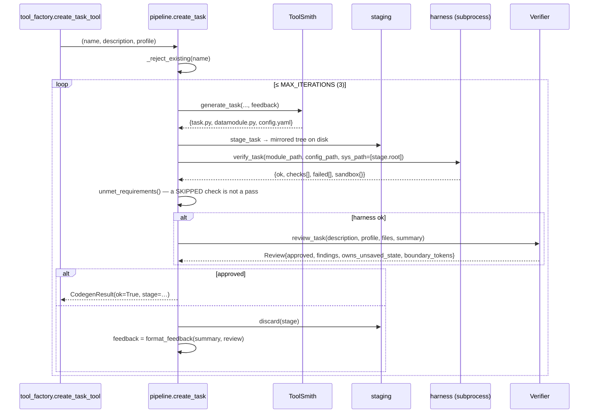

# `codegen/` — writing, verifying and landing new code

`agentic/adaptrna_agentic/codegen/`

The platform's differentiator: when no existing task can read the user's data, this package
generates one, **proves it works against that data**, has it independently reviewed, and
stages it for a human to approve as a diff.

Nothing here writes into the repository. Landing is a separate, gated step.

---

## Contents

1. [The pipeline at a glance](#1-the-pipeline-at-a-glance)
2. [`pipeline.py` — the bounded loop](#2-pipelinepy--the-bounded-loop)
3. [`harness.py` and `_harness_runner.py` — the seven checks](#3-harnesspy-and-_harness_runnerpy--the-seven-checks)
4. [`sandbox.py`](#4-sandboxpy)
5. [`staging.py`](#5-stagingpy)
6. [`discovery.py`](#6-discoverypy)
7. [`prompts.py`](#7-promptspy)
8. [External-wrapper generation](#8-external-wrapper-generation)
9. [How the harness is itself kept honest](#9-how-the-harness-is-itself-kept-honest)
10. [Assumptions and limitations](#10-assumptions-and-limitations)

---

## 1. The pipeline at a glance



## 2. `pipeline.py` — the bounded loop

```python
MAX_ITERATIONS = 3

create_task(task_name, description, profile, *, sequences=None, max_iterations=3,
            toolsmith_model=None, verifier_model=None, data_dir=None,
            skip_review=False) -> CodegenResult
create_external_tool(name, package, description, *, ...) -> CodegenResult
```

Three attempts, because *a fourth attempt at the same failing idea is rarely the fix* — the
loop reports honestly and stops rather than burning tokens.

### Result types

```python
Attempt(index, files, harness_report, review=None, ok=False)
    .summary() -> "attempt 2: harness failed: ['datamodule'] | reviewer: …"

CodegenResult(ok, kind, name, attempts=[], stage=None)
    .to_dict() -> {ok, kind, name, iterations, history[], harness, review,
                   stage_id, staging_path, files[], conclusion?}
```

`to_dict()` is what the agent sees. On failure it carries `conclusion`: *"Gave up after N
attempt(s); nothing was written. The last failure is above."* — plus the full per-attempt
history, so the user learns what went wrong rather than just that it did.

### The "a skipped check is not a pass" rule

```python
unmet = harness.unmet_requirements(report)      # required checks whose status != "pass"
if unmet:
    report["ok"] = False
    report["failed"] += unmet
    summary += ("\n  [FAIL] required checks did not run: … The datamodule must read the "
                "user's data from the paths in config.yaml (paths are resolved from the "
                "repository root).")
```

This is the single most important line of defence in the package, and it exists because of
a real incident: a verification harness that ran in a different working directory than the
code would actually run in *skipped* the data-dependent checks instead of failing them,
producing a green report for code that had never touched the user's data.

### Other guards

* `_reject_existing(name)` refuses to generate a task whose name already exists in
  `adaptrna_custom/tasks/` — *"Landed code is yours: edit it directly, or choose another
  name."*
* A staging failure (e.g. the model returned only two of the three files) is recorded as a
  normal failed attempt with a `files` check, and its message becomes the next attempt's
  feedback rather than crashing the flow.
* `skip_review=True` exists for tests, so the deterministic half can be exercised without a
  Verifier model.

## 3. `harness.py` and `_harness_runner.py` — the seven checks

`harness.py` is the launcher and summariser; `_harness_runner.py` is what actually runs,
**inside the sandbox**, as `python -m adaptrna_agentic.codegen._harness_runner <spec.json>`.

```python
verify_task(task_name, *, task_module=None, config_path=None, sequences=None,
            only=None, sys_path=None, timeout=600) -> report
```

**Never raises for the task's misbehaviour** — a crash, a hang and a failed check are all
results the report needs to describe. A run that produces no payload at all becomes a report
with a single failed `harness` check carrying the last 15 stderr lines.

> The subprocess runs with `cwd=REPO_ROOT`, exactly as the JobRunner runs real training.

Report shape:

```python
{"task": str, "ok": bool,
 "checks": [{"name", "status" ∈ {pass, skip, fail}, "detail", "traceback"?}],
 "failed": [str],
 "sandbox": {"timed_out": bool, "returncode": int|None, "limits": {...}}}
```

### The checks

| # | Name | Proves | Skips when |
|---|---|---|---|
| 1 | `import` | The module imports and `@register_task` registered the expected name. Reports every available task on failure, and points at the likely cause (name ≠ config's `task:`). | — |
| 2 | `config_head` | The config resolves through the engine's own `resolve_config`, its `task:` matches, and its `head:` block actually **builds a head** (a `TypeError` here means `build_head` rejected the config's kwargs). | no config path given |
| 3 | `datamodule` | `build_datamodule(cfg)` constructs, `prepare_data()`/`setup("fit")` run, and a real batch is drawn from `train_dataloader()`. Reports element shapes. | `FileNotFoundError` → *"dataset not available here"* |
| 4 | `forward_backward` | Forward runs, the loss is **finite**, `backward()` reaches every trainable tensor, and **no frozen parameter received a gradient**. | no batch |
| 5 | `metrics` | `update_metrics` + `compute_metrics` return a dict of finite scalars. | no batch |
| 6 | `adapter_roundtrip` | **Predictions are identical across save → load.** | — |
| 7 | `serving` | The adapter registers into a real `RiNALMoHub` and predicts one output per sequence — the way a registered tool does. | — |

```python
STRUCTURAL_CHECKS      = ("import", "config_head", "adapter_roundtrip", "serving")
REQUIRED_FOR_GENERATED = ("datamodule", "forward_backward", "metrics")
```

`STRUCTURAL_CHECKS` need no dataset, which is what makes them usable as the fast **control**
over the shipped tasks in CI. `REQUIRED_FOR_GENERATED` are the ones that must actually run
before generated code may be approved.

Everything runs on a **`nano`** backbone (6 blocks, width 320) with `NANO_LORA = {r: 4,
alpha: 8, dropout: 0.0, layer_stride: 3}` — instant on CPU, no weights required.

### Check 6 in detail — why it is the important one

The project's number-one silent failure is task state that predictions depend on but that
never reaches the adapter file. Instead of asking a reviewer *"did you remember
`ADAPTER_EXTRA_PREFIXES`?"*, this **proves** it:

```python
torch.manual_seed(0); source = build_module(lora=NANO_LORA, apply_lora=True)
_randomise_adapter_state(source)            # move every adapter-owned tensor off its default
before = predict(source)
source.save_adapter(path)

torch.manual_seed(0); target = build_module(...)   # identical fresh backbone from the seed
target.load_adapter(path)
after = predict(target)

assert _same(before, after)
```

`_randomise_adapter_state` deliberately touches everything **except** the backbone's own
weights (which are rebuilt identically from the seed, so touching them would make the
comparison meaningless) — while still including LoRA tensors, which live inside the backbone
but belong to the adapter. Buffers are randomised too, which is what catches a missing
`ADAPTER_EXTRA_PREFIXES` for something like MRL's target scaler.

On failure the message names both remedies: tensors → `ADAPTER_EXTRA_PREFIXES`; plain
Python values → `adapter_extra_payload()` / `load_adapter_extra()`.

### Check 4's one deliberate exemption

```python
trainable = [(n, p) for n, p in module.named_parameters()
             if p.requires_grad and "lm_mask_head" not in n]
```

`RiNALMo.forward` always runs its masked-LM head, whose output never reaches a downstream
loss. That is also why the engine configures DDP with `find_unused_parameters=True`. It is
never counted as a defect in the task.

### `sys.path` ordering

```python
ensure_importable()                       # repo root FIRST
for entry in reversed(spec["sys_path"]):  # then staging roots, inserted ABOVE it
    sys.path.insert(0, entry)
```

Order is load-bearing. Staged code is verified before it lands, and its tree mirrors the
final layout, so `adaptrna_custom.tasks.<x>` must resolve to the **staged** copy rather than
to the identically named package at the repo root that does not yet contain it. Inserting
the repo root afterwards would shadow the staging tree.

### `summarize(report)`

One line per check, used both for the CLI and — verbatim — as the "Automated verification
(already run)" block in the Verifier prompt:

```
task 'splice_simple': PASS
  [ok  ] import: registered; available tasks: [...]
  [ok  ] datamodule: batch drawn; element shapes/types: [(32, 402), (32,)]
  [ok  ] adapter_roundtrip: predictions identical across save/load ([...])
```

## 4. `sandbox.py`

```python
run_python(args, *, timeout=600, memory_mb=32768, cpu_seconds=900,
           file_size_mb=512, cwd=None, env=None) -> SandboxResult
```

Applied in the child between fork and exec:

| Limit | Value | Purpose |
|---|---|---|
| `os.setsid()` | — | Own process group, so a timeout kills the whole tree |
| `RLIMIT_AS` | 32 GiB | Bound on pathological runaway (a datamodule that reads a 400 GB array) |
| `RLIMIT_CPU` | 900 s | The better guard against infinite loops |
| `RLIMIT_FSIZE` | 512 MB | Stray writes |
| `RLIMIT_CORE` | 0 | No core dumps |
| wall-clock `timeout` | 600 s | `subprocess.run(timeout=…)` |

The memory limit is deliberately loose: `RLIMIT_AS` caps *virtual* address space and
PyTorch reserves far more than it uses — measured here, 10.4 GiB just to import torch and
build a nano model with 128 OpenMP threads, 5.5 GiB with the thread caps the sandbox sets.
CPU time is the real guard.

Results come back over a **marker line** rather than plain stdout:

```python
RESULT_MARKER = "__ADAPTRNA_RESULT__"
emit_payload(d)       # child: print(MARKER + json.dumps(d))
extract_payload(out)  # parent: the LAST marked line, parsed
```

so progress bars, warnings and torch chatter cannot corrupt the result.

> **This is accident-isolation, not adversarial sandboxing**, and the distinction is
> deliberate. The code executed here was written by this project's own model, from the
> user's description, on the user's machine, and a human reviews the diff before it lands.
> The realistic risks are accidents. If generated code ever arrives from an untrusted
> source, the upgrade path is a container, not a bigger `rlimit`. **The human diff gate is
> the real security boundary.**

## 5. `staging.py`

The staging tree **mirrors the final layout exactly**:

```
toolhub_data/staging/<name>-<uuid8>/
└── adaptrna_custom/
    ├── __init__.py
    ├── tasks/__init__.py
    │   └── <name>/{__init__.py, task.py, datamodule.py, config.yaml}
    └── tools/{__init__.py, <name>.py}          (external wrappers)
```

so the module path that gets verified (`adaptrna_custom.tasks.<name>.task`) is the module
path that will be imported after landing. Verifying code at one import path and shipping it
at another is how you get a green report for something that then fails on first real use.

| Function | Purpose |
|---|---|
| `stage_task(name, files, data_dir=None)` | Requires exactly `task.py`, `datamodule.py`, `config.yaml`; refuses with the missing list. Writes package markers. |
| `stage_tool(name, content, data_dir=None)` | One module under `tools/` |
| `load_stage(stage_id)` | Reconstruct from disk — staging outlives the process **deliberately**, so the user can open the files in an editor and approve in a later session |
| `list_stages()` | Everything awaiting approval |
| `land(stage)` | Copy into `<repo>/adaptrna_custom/`, creating the task's `__init__.py` if new. Returns the written paths. **The gated step.** |
| `discard(stage)` | `shutil.rmtree`, used between failed attempts |

`Stage.summary()` gives `[{path, lines}]`. The `{path, lines, content}` triples that go into
the approval payload are built in `agents/orchestrator.py::_details`, so the approval window
can render the code inline.

**Landing a `kind="tool"` stage** (`land_generated_code` in `tool_factory.py`) does one
extra step after writing the file: it evicts the stale staging-directory copy of the module
from `sys.modules` (the verification pipeline imported it from there), calls
`discovery.ensure_importable()` to put the repo root on `sys.path`, then calls
`registry.register_external(stage.module_path)` — so the tool is **registered and active
immediately** after approval, with no separate CLI step. The `sys.modules` eviction is
necessary because Python caches the staging-path import; without it the landed file would
be shadowed by the old cached module.

## 6. `discovery.py`

The seam that makes generated code first-class.

```python
CUSTOM_PACKAGE = "adaptrna_custom"
CUSTOM_ROOT    = REPO_ROOT / CUSTOM_PACKAGE

ensure_importable()          # put REPO_ROOT on sys.path
custom_task_names()          # every tasks/*/ that has a task.py
task_module_path(name)       # "adaptrna_custom.tasks.<name>.task"
tool_module_path(name)       # "adaptrna_custom.tools.<name>"
load_all(only=None)          # import them all; RETURNS [(name, exception)] rather than raising
describe_failures(failures)  # "x: ImportError: …; y: SyntaxError: …"
```

`load_all` returning failures instead of raising is the point: **one broken generated task
must not make every other task unavailable.** Three callers depend on it, and all three
matter — the training entrypoint (so a generated task is trainable), the ToolHub runtime (so
its adapter is servable), and the harness (so it verifies under the real import path).

## 7. `prompts.py`

Context assembly. Everything it supplies already exists somewhere in the project; this
module's only job is to put the right pieces in front of the right agent.

| Constant / function | Contents |
|---|---|
| `SUBCLASS_CONTRACT` | The engine's required and optional hooks and class attributes, plus *"Never edit anything under engine/"*. Kept here rather than parsed out of the engine so the generator sees a stable, complete statement. |
| `SILENT_FAILURE_RULES` | The two questions, with the exact remedies and the `representation[:, 0]` / `[..., 1:-1, :]` idioms spelled out. |
| `HARD_REQUIREMENTS` | Three files; `task:` must equal the registered name; import the datamodule by its **absolute** `adaptrna_custom.tasks.<name>.datamodule` path; use `lightning.pytorch`, never `pytorch_lightning`; return JSON-serialisable values from `postprocess_predictions`. |
| `worked_example()` | The full text of `engine/examples/ncrna_classification/{task,datamodule,config}` |
| `template_for_profile(profile)` | The knowledge base's closest task shape, scored on target type + typical length |
| `task_user_prompt(...)` | Task + description, the data profile as JSON, the closest shape, the contract, the silent-failure rules, the requirements, the worked example, and — on a retry — *"Your previous attempt failed verification … Fix these specific problems. Keep everything that worked."* |
| `verifier_system_prompt()` | *"…in a fresh context and independently of whoever wrote it… do not re-litigate what the harness already proved."* |
| `verifier_user_prompt(...)` | What the user asked, the data, the harness summary, the generated code, and the checklist ending *"Approve only if you would be comfortable with these numbers in a paper."* |
| `external_tool_prompt(...)` | The full `contract.py` source plus the full `vienna.py` source as the reference to imitate |

`tests/test_prompts.py` asserts on what goes into these, on the reasoning that *a generator
that never sees the contract writes code that fails check 1*.

## 8. External-wrapper generation

`create_external_tool` follows the same loop but verifies differently — `_verify_wrapper`
runs **in process** rather than in the sandbox:

1. `contract.load_spec(module_path)` — the gate. A module without a valid `SPEC`, or
   declaring a function it does not define, fails here and the loop retries.
2. If the wrapped package is not installed, the golden check is recorded as **`skip`** and
   the attempt still succeeds (contract validity is what was being checked).
3. Otherwise every function's golden cases run through `contract.run_golden` against a
   synthetic `ToolEntry`.

> Wrapper modules are small and import a package the user already approved, so the sandbox's
> process isolation buys little here; the contract loader is the gate.

Note the asymmetry with tasks: for wrappers a skipped golden check does **not** block
success, because the package's absence is a property of the environment, not of the code.

## 9. How the harness is itself kept honest

The harness is the trust boundary, so it is itself controlled — `tests/test_harness.py`
runs it in both directions:

* **Controls:** the shipped tasks must **PASS** its structural checks. A harness that fails
  a known-good task is broken.
* **Catches:** `tests/fixtures/broken_task_sources.py` contains deliberately defective
  tasks — one per failure mode — and each must **FAIL** the specific check that exists to
  catch it.

That pairing is what makes a green harness report mean something.

## 10. Assumptions and limitations

* **Linux only** — `resource.setrlimit`, `os.setsid` and `preexec_fn` have no portable
  fallback.
* **Three attempts, then stop.** No adaptive budget.
* **Generated code is accident-isolated, not sandboxed.** The human diff gate is the real
  boundary.
* **A generated task's config lives beside its code**, not under `engine/configs/` — the
  recommender's `_config_path` checks `adaptrna_custom/tasks/<t>/config.yaml` first.
* **The harness verifies on `nano`, not `giga`.** It proves structure, gradients, state
  round-tripping and serving — not that the task learns anything. That is what the training
  run and the analyzer are for.
* **`_verify_wrapper` mutates `sys.path`** for the duration of the check (restored in a
  `finally`), and imports generated wrapper code into the *current* process.
* **Landing overwrites by path.** `land()` writes every file in the stage; `_reject_existing`
  prevents that for a task name that already exists, but a stage loaded from disk for a name
  that has since been landed would overwrite it.
