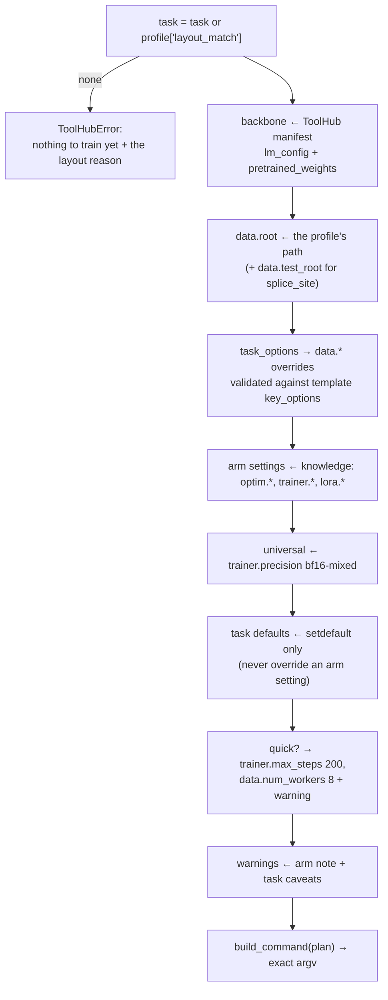

# `profiling/` and `knowledge/` — grounded recommendations

`agentic/adaptrna_agentic/profiling/`, `agentic/adaptrna_agentic/knowledge/`

Data in, an **executable and grounded** training plan out. Both modules are deterministic
and LLM-free: the model narrates what they produce, it never invents a hyperparameter.

---

## Contents

1. [Why this is not a prompt](#1-why-this-is-not-a-prompt)
2. [`knowledge/` — the corpus](#2-knowledge--the-corpus)
3. [`profiler.py` — describing a dataset](#3-profilerpy--describing-a-dataset)
4. [`recommender.py` — the plan](#4-recommenderpy--the-plan)
5. [The plan stamp](#5-the-plan-stamp)
6. [Typical usage](#6-typical-usage)
7. [Assumptions and limitations](#7-assumptions-and-limitations)

---

## 1. Why this is not a prompt

Hyperparameters are the place where a plausible-sounding wrong answer costs hours of GPU
time and produces a number someone might publish. So:

* every value comes from [`knowledge/hyperparameters.yaml`](../../agentic/adaptrna_agentic/knowledge/hyperparameters.yaml);
* **every rationale line is generated from the same entries**, so what the user is told and
  what the run actually does cannot drift apart;
* the resulting plan is **stamped**, and `start_training` refuses anything unstamped.

That last point exists because of an observed behaviour: a model whose deterministic tool
errors will route around it — here, by hand-assembling a training plan when the recommender
refused an unknown task. Guardrails that matter are enforced in code, not in the prompt.

## 2. `knowledge/` — the corpus

```python
load_knowledge()                    # both YAMLs merged, lru_cached
arm(name)                           # "lora" | "full_ft"; KeyError lists the known arms
task_knowledge(name)                # KeyError if unknown
task_knowledge_or_generic(name)     # falls back, with known=False
generic_task_knowledge(name, primary_metric=None)
primary_metric_of(name)             # a registered task's own PRIMARY_METRIC, best effort
templates() / template_for(task)
universal()
```

Contents and full schema: [../configuration.md §4](../configuration.md#4-the-knowledge-base).

### The generic fallback

The most interesting function here, because of what it refuses to do:

```python
generic_task_knowledge(name) → {
    "primary_metric": <the task's own PRIMARY_METRIC, if importable>,
    "reference": {"band": None, "tolerance": 0.0,
                  "sources": ["No validated reference run for '<name>' yet."], ...},
    "wall_clock": {"reference": "unknown (no reference run for this task)"},
    "caveats": ["'<name>' is not in the knowledge base. The arm settings below are the "
                "project's validated values, which transfer across tasks, but there is no "
                "reference band to judge the result against — treat this run as the baseline."],
    "known": False,
}
```

> The *arm* settings (LoRA lr 3e-4 + clip 1.0 + stride 3, bf16-mixed) were validated across
> tasks and transfer; a *reference metric band* is a property of a specific task and dataset
> and cannot be transferred.

Saying so plainly is the entire point of the entry. `primary_metric_of` reaches for the
task's own `PRIMARY_METRIC` class attribute — importing generated tasks first via
`discovery.load_all()` — and returns `None` on any failure rather than raising, because
absence is a reportable state.

## 3. `profiler.py` — describing a dataset

```python
profile_dataset(path) -> dict        # a file or a directory; agent-tool ready
```

At the boundary of what the engine can read, the profiler's job is **to be clear rather
than to improvise**: it reports the shape it sees, names the nearest task template, and
states plainly when a new datamodule would be needed. Silently reshaping a user's file into
some upstream layout is how you get confidently wrong numbers later.

### What it recognises

| Input | Detection | Reported |
|---|---|---|
| Directory | always | `entries` (first 40), `entry_count` |
| Spliceator layout | `<root>/GS_1/` exists | `folds`, `fold_files`, `ss_types`, `splits` (row counts per CSV), plus sequence stats read from the first fold — which is `;`-separated and **headerless**: `group;sequence;label` |
| MRL layout | `*.csv.gz` present | `gzipped_csvs` |
| `.csv` / `.tsv` / `.txt` | suffix | `columns`, `sampled_rows`, `missing_values`, sequence/target columns |
| `.fa` / `.fasta` (`.gz` too) | suffix | record count, length stats, alphabet |
| anything else | — | `{"kind": "unknown", "size_bytes": …}` |

Sampling is capped at `_SAMPLE_ROWS = 2000`.

### Column detection

```python
_SEQUENCE_HINTS = ("seq", "sequence", "utr", "rna", "dna")
_TARGET_HINTS   = ("rl", "label", "target", "y", "value", "score", "class")
_SEQUENCE_PURITY = 0.9      # ≥90% of sampled values must be nucleotide-only, length ≥ 10
```

Name hints first, then content sniffing. The sniffing loop deliberately avoids
`dtype == object`, which is not portable — pandas 3 gives string columns a `str` dtype — and
instead skips numeric/bool kinds (`"ifbc"`) and sniffs the rest, which works on both 2.x
and 3.x.

Target typing: 2 unique numeric values → `binary`; ≤20 unique integers → `multiclass`;
otherwise `continuous`; non-numeric → `binary` (2 uniques) or `categorical`. Summaries are
min/max/mean for wide numerics, class counts otherwise. `_alphabet` returns `rna`, `dna`
(has `T`, no `U`) or `other`.

### Layout matching

```python
match, reason = _match_layout(path, profile)
profile["layout_match"]  = match     # a task name, or None
profile["layout_reason"] = reason
if match is None: profile["guidance"] = knowledge["no_match_guidance"]
```

Matching is **exact**: a template matches when every path in its `required_paths` exists
under the root (`GS_1` for splice_site, the named `.csv.gz` for mrl, `bpRNA` for
sec_struct). When nothing matches, `_nearest_template` scores every template on target type
(+2 exact, +1 for binary-ish) and closeness of median sequence length, and the reason names
that nearest shape and what it expects.

> ⚠️ `no_match_guidance` still claims the new-task flow is not automated. It is — see
> [../README.md gap #3](../README.md#known-documentation-gaps).

## 4. `recommender.py` — the plan

```python
recommend(profile, task=None, arm="lora", quick=False, seed=42,
          run_name=None, task_options=None, registry=None) -> plan
```

Plan schema: [../configuration.md §8](../configuration.md#8-the-training-plan).

### Assembly order



### Why the backbone comes from the manifest

```python
overrides["lm_config"]          = backbone.lm_config
overrides["pretrained_weights"] = str(_resolve_weights(backbone.weights))
```

The engine's own default is `weights/giga-v1.pt` relative to the **working directory** — a
path that need not exist. The hub knows where the checkpoint actually lives, and *an
adapter trained on a different backbone than the hub serves could not be hosted alongside
the existing tools*. If the hub has no checkpoint configured, the plan does not fail: it
sets `pretrained_weights=null` and emits a warning that the run would start from randomly
initialised weights.

A configured-but-missing checkpoint **does** raise, with the fix in the message.

### The command

```python
build_command(plan) -> [
    sys.executable, "-m", "adaptrna_agentic.jobs.train_entrypoint",
    "--task", task, "--config", config_path, "--output_dir", output_dir,
    "--seed", str(seed),
    *(["--use_lora"] if arm == "lora" else []),
    *chain.from_iterable(["--set", f"{k}={render(v)}"] for k, v in overrides.items()),
]
```

Note the entrypoint, not `rinalmo_hub.cli.train` — that is what makes generated tasks
trainable. `_render` normalises `True/False` → `true/false` and `None` → `null` to match the
engine's `parse_scalar`.

This command is shown **verbatim** in the approval gate. The strongest cheap guarantee in
the test suite is that `tests/test_recommender.py` parses it with the engine's own CLI
parser — so a plan that would not run cannot pass review.

### Config path resolution

```python
_config_path(task):
    adaptrna_custom/tasks/<task>/config.yaml   if it exists    # a generated task
    engine/configs/tasks/<task>.yaml           otherwise
```

### Run naming

`<task>[_<ss_type|dataset|val_split>…]_<arm>_<YYYYmmdd_HHMMSS>`, e.g.
`splice_site_acceptor_lora_20260812_185058`. The timestamp makes it collision-free, and
because the job id **is** this basename, it is also the id you refer to later.

## 5. The plan stamp

```python
PLAN_SOURCE = "recommend_training_config"
plan["source"] = PLAN_SOURCE
```

Checked in [`tool_factory.start_training`](agents.md#the-16-management-tools):

```python
if plan.get("source") != PLAN_SOURCE:
    raise ToolHubError(
        "This plan did not come from recommend_training_config. Hyperparameters must come "
        "from the project's knowledge base of validated runs, not from you — call "
        "recommend_training_config and pass its result through unchanged. If it refused, "
        "report why rather than assembling a plan.")
```

The message is written **to the model**, and it names the correct next action. That is the
pattern for every refusal in this codebase.

## 6. Typical usage

```python
from adaptrna_agentic.profiling.profiler import profile_dataset
from adaptrna_agentic.profiling.recommender import recommend

profile = profile_dataset("~/data/train_data")
profile["layout_match"]      # 'splice_site'
profile["ss_types"]          # ['acceptor', 'donor']

plan = recommend(profile, task_options={"ss_type": "acceptor"})
plan["estimated_wall_clock"] # '~7 min'
plan["overrides"]["optim.lr"]# 0.0003
" ".join(plan["command"])    # what the approval gate shows, byte for byte

# A short smoke run instead:
plan = recommend(profile, quick=True)
plan["warnings"]             # ['Quick run: capped at 200 steps. … NOT comparable …']
```

An invalid task option is refused with the valid set:

```python
recommend(profile, task_options={"ss_type": "exon"})
# ToolHubError: 'exon' is not a valid data.ss_type for splice_site.
#               Options: ['donor', 'acceptor']
```

## 7. Assumptions and limitations

* **`data.root` is the profiled path**, or its parent if a file was profiled. The profiler
  does not search upward for a dataset root.
* **`data.test_root` for splice_site** is guessed as a sibling `test_data/` directory,
  falling back to `data.root` itself if absent.
* **Layout matching is exact**, so a Spliceator-shaped dataset laid out differently will not
  match — by design. The nearest-template reason then tells the user what a matching layout
  would look like.
* **The profiler samples**, so a target type inferred from the first 2000 rows can be wrong
  for a pathological file.
* **Only two arms exist**, `lora` and `full_ft`; `full_ft` is allowed but carries the
  warning that its export cannot become a served tool.
* **`recommend` does not check that the data is *good*** — only that the engine can read it.
  Quality is what the training run and [the analyzer](jobs.md#7-analysispy--the-runanalyzer)
  are for.
* **`knowledge/*.yaml` is loaded once per process** (`lru_cache`). Editing it requires a
  restart.
