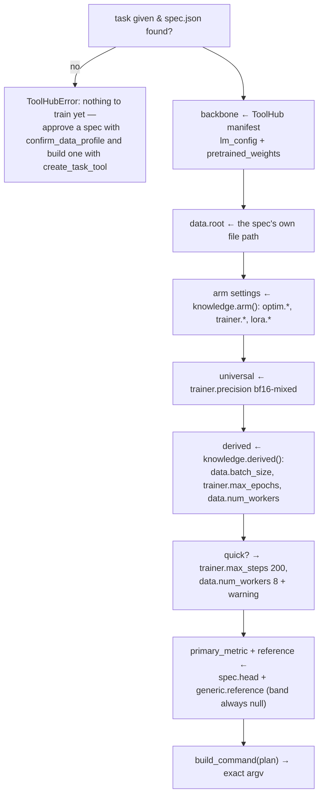

# `profiling/` and `knowledge/` — grounded recommendations

`agentic/adaptrna_agentic/profiling/`, `agentic/adaptrna_agentic/knowledge/`

One CSV in, an **approved `DatasetSpec`** out (step 1); an approved spec in, an **executable
training plan** out (step 3). Both modules are deterministic and LLM-free: the model
narrates what they produce, it never invents a column, a target type or a hyperparameter.

---

## Contents

1. [Why this is not a prompt](#1-why-this-is-not-a-prompt)
2. [`knowledge/` — the corpus](#2-knowledge--the-corpus)
3. [`profiler.py` — one table in, a `DatasetSpec` out](#3-profilerpy--one-table-in-a-datasetspec-out)
4. [Quality checks and warnings](#4-quality-checks-and-warnings)
5. [The split](#5-the-split)
6. [Reuse: `_similar_tasks`](#6-reuse-_similar_tasks)
7. [`recommender.py` — the plan](#7-recommenderpy--the-plan)
8. [The two stamps](#8-the-two-stamps)
9. [Typical usage](#9-typical-usage)
10. [Assumptions and limitations](#10-assumptions-and-limitations)

---

## 1. Why this is not a prompt

Hyperparameters are the place where a plausible-sounding wrong answer costs hours of GPU
time and produces a number someone might publish, and a mis-read column is the place where
it produces a confidently wrong model instead. So:

* every hyperparameter comes from
  [`knowledge/hyperparameters.yaml`](../../agentic/adaptrna_agentic/knowledge/hyperparameters.yaml)
  — verbatim (`arms:`, `universal:`) or as the output of a rule executed against the
  approved spec (`generic.derived`);
* **every rationale line is generated from the same entries**, so what the user is told and
  what actually runs cannot drift apart;
* the profiler's interpretation is put through a **gate** (`confirm_data_profile`) rather
  than assumed, and the resulting spec — like the resulting plan — is **stamped**;
  `create_task_tool` and `start_training` each refuse anything not carrying their stamp.

That last point exists because of an observed behaviour: a model whose deterministic tool
errors will route around it — by hand-assembling a spec or a plan when the gate or the
recommender refused something. Guardrails that matter are enforced in code, not in the
prompt.

## 2. `knowledge/` — the corpus

```python
load_knowledge()                # both YAMLs merged, lru_cached
arm(name)                       # "lora" | "full_ft"; KeyError lists the known arms
universal()                     # bf16-mixed + the FlashAttention non-determinism note
generic_knowledge()             # the generic: section — no reference band, ever
derived(rule_name)              # one derivation rule from generic.derived
target_shape(target_type)       # the recipe for binary | multiclass | regression
```

Contents and full schema: [../configuration.md §4](../configuration.md#4-the-knowledge-base).

### The `generic:` section

There is exactly one entry now, because there are no known tasks any more to carry
per-task ones:

```python
generic_knowledge() → {
    "label": "An unseen task trained from a single sequence+label table",
    "reference": {"band": None, "tolerance": 0.0,
                  "sources": ["No validated reference run: this task did not exist "
                              "before your data."]},
    "derived": {"batch_size": {...}, "max_epochs": {...}, "num_workers": {...}},
    "wall_clock": {"reference": "unknown — no run of this task exists yet", ...},
    "caveats": ["This task has no reference band. The first successful run becomes the "
                "baseline that later runs of the same task are compared against."],
}
```

`reference.band` is always `null` — a real, permanent state, not a placeholder waiting to
be filled in per task. That is what makes this needs-no-analyzer-change: the analyzer's
`previous_best` path for a task with no reference band already existed before this phase,
so a generic entry simply always takes it.

The *arm* settings (LoRA lr 3e-4 + clip 1.0 + stride 3, bf16-mixed) still transfer across
tasks and stay in `arms:`/`universal:` unchanged — they were validated across tasks, not
against one dataset. What cannot transfer — batch size, epoch count, worker count — is not
looked up at all; it is **derived** from the approved spec by the three rules under
`generic.derived`.

#### The three derivation rules

| Rule | Executed by | Reads from the spec | Produces |
|---|---|---|---|
| `batch_size` (`piecewise_on_median_length`) | `recommender._piecewise_on_median_length` | `length.median` | the batch for the first `[threshold_nt, batch]` pair the median clears (shorter sequences → more headroom → a larger batch), `fallback` beyond the table |
| `max_epochs` (`step_budget`) | `recommender._step_budget` | `split.row_counts.train`, the chosen batch size | the fewest epochs whose total optimiser steps reach `target_steps`'s low end, clamped to `clamp` |
| `num_workers` | flat value | — | `8`, always |

Each rule carries a `why:` line, and `recommender.py` generates the rationale shown at the
gate from the same line — never a separate explanation that could drift from what actually
runs:

```python
rationale.append(f"data.batch_size {batch_size}: {batch_rule['why']}")
rationale.append(
    f"trainer.max_epochs {max_epochs}: {rows_train:,} training rows at batch "
    f"{batch_size} is {steps_per_epoch:,} steps per epoch; {max_epochs} epochs ≈ "
    f"{total_steps:,} optimiser steps, inside the {low:,}-{high:,} budget."
)
```

### `target_shapes.yaml`

Three entries, keyed by **target type** — `binary`, `multiclass`, `regression` — not by a
task shape or a dataset layout; there is nothing left to match against. Each recipe supplies
`head`/`extract_features` (prose read by the ToolSmith fallback prompt), `loss`, `metrics`,
`primary_metric` (filled straight into `DatasetSpec.head`, never chosen by the model),
`predict_output` (the sentence appended to a registered tool's description), `pad_sensitive`
(`true` only for regression's pooled head, which forces serving batch size 1) and
`adapter_state` — the concrete silent-failure trap for that shape, e.g. binary's
`positive_class` deciding what a prediction *means* and having to travel via
`adapter_extra_payload()`/`load_adapter_extra()`.

Read by `profiler.py` (`_head_from_target_shape`, at proposal and at gate-1 re-approval),
by the templates (`codegen/templates/*.j2` — independently written, describing the same
recipe in code) and by the ToolSmith fallback prompt (exactly the one entry matching the
approved target type). `tests/test_knowledge.py` fails loudly if an edit drops one of these
values, because the recommender and the templates have no other source for them.

## 3. `profiler.py` — one table in, a `DatasetSpec` out

```python
profile_dataset(path) -> dict     # proposal; agent-tool ready
confirm_profile(spec) -> dict     # gate 1's re-validation; what confirm_data_profile calls
```

Full schema: [../configuration.md §11](../configuration.md#11-the-datasetspec-schema).

This build starts empty and accepts exactly one input: `.csv`, `.tsv`, or either gzipped —
one delimited table with one sequence column and one label column. There is no directory
profiling, no layout matching, no format-specific sniffing left; anything else is refused by
name rather than reshaped:

> `This build trains from a single table (.csv/.tsv, optionally gzipped) containing one
> sequence column and one label column. '<path>' is a directory.`

### Column and target detection

Name hints first, then content sniffing:

```python
_SEQUENCE_HINTS = ("seq", "sequence", "utr", "rna", "dna")
_LABEL_HINTS = ("rl", "label", "target", "y", "value", "score", "class")
_SEQUENCE_PURITY = 0.9      # ≥90% of a 200-value sample must be nucleotide-only, len ≥ 10
```

The sniffing loop skips numeric/bool dtype kinds (`"ifbc"`) and sniffs the rest, which works
whether a string column's dtype is `object` (pandas 2.x) or `str` (pandas 3.x).

Target typing runs on the **full column**, not a sample — a sampled class count is how you
get a stratified split that is not:

* 2 unique values (numeric or not) → `binary`
* ≤20 unique integers, or ≤20 unique non-numeric values → `multiclass`
* otherwise numeric → `regression`
* a label column that looks per-position (free text within 20% of the sequences' own median
  length), or holds more than 20 distinct free-text values → **refused** (D7), naming what
  is supported instead:

  > `The label column 'annotation' holds per-position strings the same length as the
  > sequences. This build trains three head shapes from one sequence+label table: binary
  > classification, multiclass classification (≤20 classes), and regression on a
  > continuous target. Per-position and structure targets are not supported here.`

No conversion is offered and none is improvised.

`positive_class` (binary only) defaults to the minority class — "the thing being detected"
is usually the rarer one — but is always shown and always editable at the gate; flipping it
inverts every downstream metric and the sign of what `predict` reports, without touching
`classes`' display order (a profiling artifact, not a polarity decision).

`head` is filled from `knowledge.target_shape(target_type)` (`_head_from_target_shape`),
never chosen by the model.

## 4. Quality checks and warnings

Every check below produces one warning string on `spec["warnings"]`. Nothing is silently
dropped or fixed — the gate exists precisely so a human decides what to do about each one.

| Check | Function | Fires when |
|---|---|---|
| Duplicate sequences | `_duplicate_warning` | any sequence appears more than once — the same sequence can then land on both sides of a random split |
| Class imbalance | `_imbalance_warning` | the minority class is under 10% of labeled rows |
| Invalid characters | `_invalid_sequence_warning` | a sequence contains anything outside `ACGTUN` — names the offending characters and the row count; `on_invalid` (`"fail"` by default) decides whether the datamodule fails loudly or drops these rows |
| Missing values | `_missing_values_warning` | the sequence column has missing values |
| Length spread | `_length_spread_warning` | `max / median > 4` — batch size is derived from the median and memory is driven by the max |
| Tiny data | `_tiny_data_warning` | fewer than 200 usable rows after splitting |
| Leakage across a column split | `_leakage_warning` | (mode `"column"` only) a sequence appears in more than one named split group — computed exactly, e.g. *"318 sequences appear in both the train and test groups"* |
| Dropped rows | inline in `_quality_warnings` | (mode `"column"` only) rows whose split-column value names no split in the mapping |
| No held-out set | inline in `_quality_warnings` | (mode `"random"` only) `fractions.test == 0` — the primary metric falls back to `val/*` |

## 5. The split

`_propose_split` looks for a split-candidate column (≤10 distinct values, excluding the
sequence and label columns) whose values look like split names (`train`/`training`,
`val`/`valid`/`validation`/`dev`, `test`/`testing`, case-insensitive). Found one → propose
`mode: "column"` with the obvious mapping. Otherwise → `mode: "random"`,
`{train: 0.8, val: 0.1, test: 0.1}`, `seed: 42`, `stratify: true` for classification.

At gate 1, `confirm_profile` re-validates and **recomputes** the split against the real file
(`_validate_and_recompute_split`), whatever the human changed:

* random fractions must be non-negative and sum to 1.0 (±1e-6);
* `test` may be 0 (see the warning above);
* column mode needs a non-empty `mapping` naming at least one split; values not named are
  dropped, and the drop count is reported;
* every mode returns `row_counts` recomputed from the file, never the original ratios — the
  user approves actual numbers.

## 6. Reuse: `_similar_tasks`

The direct replacement for the deleted `layout_match`/`_nearest_template` mechanism — built
from the user's own landed tasks, never from a shipped template:

```python
spec["similar_tasks"] = [
    {"task": "donor_sites", "score": 5.0,
     "why": "same columns ('sequence', 'label'), same target type (binary), "
            "median length 400 vs 400",
     "spec_path": "adaptrna_custom/tasks/donor_sites/spec.json"},
]
```

Compares the proposed spec against every landed task's own `spec.json`
(`codegen/discovery.landed_spec`). The floor is **columns and target type both matching**
(+2 each) — nothing below that ever appears. Class-count agreement and median length within
20% each add +1, but neither alone clears the floor. A landed task with no `spec.json`
(predates this build, or was landed by hand) simply never matches; that is never an error.
It is shown at gate 1 as a non-authoritative suggestion, never an automatic branch.

## 7. `recommender.py` — the plan

```python
recommend(task, spec=None, arm="lora", quick=False, seed=42,
          run_name=None, registry=None) -> plan
```

Plan schema: [../configuration.md §8](../configuration.md#8-the-training-plan).

`task` names a **landed** task (`adaptrna_custom/tasks/<task>/`); `spec` defaults to the
`spec.json` that task landed with. Passing `spec` explicitly points an *existing* task at a
new file of the same shape (reuse, §6) without regenerating any code — only `data.root`
changes.



### Why the backbone comes from the manifest

```python
overrides["lm_config"]          = backbone.lm_config
overrides["pretrained_weights"] = str(_resolve_weights(backbone.weights))
```

The engine's own default is `weights/giga-v1.pt` relative to the **working directory** — a
path that need not exist. The hub knows where the checkpoint actually lives, and *an
adapter trained on a different backbone than the hub serves could not be hosted alongside
the existing tools*. If the hub has no checkpoint configured, the plan does not fail: it
sets `pretrained_weights=null` and emits a warning that the run would start from randomly
initialised weights.

A configured-but-missing checkpoint **does** raise, with the fix in the message.

### The command

```python
build_command(plan) -> [
    sys.executable, "-m", "adaptrna_agentic.jobs.train_entrypoint",
    "--task", task, "--config", config_path, "--output_dir", output_dir,
    "--seed", str(seed),
    *(["--use_lora"] if arm == "lora" else []),
    *chain.from_iterable(["--set", f"{k}={render(v)}"] for k, v in overrides.items()),
]
```

Note the entrypoint, not `rinalmo_hub.cli.train` — that is what makes generated tasks
trainable. `_render` normalises `True/False` → `true/false` and `None` → `null` to match the
engine's `parse_scalar`.

This command is shown **verbatim** in the approval gate, and rebuilt if the human edits
`overrides`/`seed`/`arm`/`quick_run` at that gate (§8 below) — the strongest cheap guarantee
in the test suite is that `tests/test_recommender.py` parses it with the engine's own CLI
parser, so a plan that would not run cannot pass review.

### Config path resolution

```python
_config_path(task):
    adaptrna_custom/tasks/<task>/config.yaml   if it exists    # a landed task
    engine/configs/tasks/<task>.yaml           otherwise
```

The second branch exists for generality — the recommender does not assume every task it is
asked about was landed through this build's own pipeline.

### Run naming

`<task>_<arm>_<YYYYmmdd_HHMMSS>`, e.g. `donor_sites_lora_20260812_185058`. The timestamp
makes it collision-free, and because the job id **is** this basename, it is also the id you
refer to later.

## 8. The two stamps

```python
PROFILE_SOURCE = "profile_dataset"          # profiling/profiler.py
SPEC_SOURCE    = "confirm_data_profile"     # profiling/profiler.py — confirm_profile re-stamps
PLAN_SOURCE    = "recommend_training_config" # profiling/recommender.py
```

Three refusals, all following the same shape: `confirm_data_profile` refuses a spec whose
`source` is not `"profile_dataset"`; `create_task_tool` refuses a spec whose `source` is not
`"confirm_data_profile"`; `start_training` refuses a plan whose `source` is not
`"recommend_training_config"`.

```python
if plan.get("source") != PLAN_SOURCE:
    raise ToolHubError(
        "This plan did not come from recommend_training_config. Hyperparameters must come "
        "from the project's knowledge base of validated runs, not from you — call "
        "recommend_training_config and pass its result through unchanged. If it refused, "
        "report why rather than assembling a plan.")
```

Same reason every time: a model whose deterministic tool errors will route around it by
hand-assembling the next thing in the chain, and that has to fail loudly rather than
silently succeed with an invented value. The message is written **to the model**, and it
names the correct next action — the pattern for every refusal in this codebase.

Approving a spec or a plan at its gate does not skip this: `confirm_data_profile`
**re-validates and re-stamps** on approval — a user who switches `target_type` from
`regression` to `multiclass` gets a spec whose `classes`, `class_counts`, `row_counts` and
`head` all follow, never a spec that says one thing and trains another.

## 9. Typical usage

```python
from adaptrna_agentic.profiling.profiler import profile_dataset, confirm_profile
from adaptrna_agentic.profiling.recommender import recommend

spec = profile_dataset("~/data/my_data.csv")
spec["target_type"]           # 'binary'
spec["split"]["row_counts"]   # {'train': 19350, 'val': 2419, 'test': 2419}
spec["similar_tasks"]         # [] on a fresh install, or reuse suggestions later

approved = confirm_profile(spec)    # what the confirm_data_profile tool does at gate 1
approved["source"]                  # 'confirm_data_profile'

# create_task_tool(approved) lands a task named approved["task_name"] …

plan = recommend("my_task")
plan["overrides"]["data.batch_size"]   # 32, derived from the spec's median length
plan["reference"]["band"]              # None — always, for a brand-new task
" ".join(plan["command"])              # what the approval gate shows, byte for byte

# A short smoke run instead:
plan = recommend("my_task", quick=True)
plan["warnings"]             # ['Quick run: capped at 200 steps. … NOT comparable …']
```

An untrainable task name is refused plainly:

```python
recommend("no_such_task")
# ToolHubError: No dataset spec found for 'no_such_task'. This build derives batch size and
#               epoch count from the spec.json a task lands with — land it through
#               confirm_data_profile, create_task_tool and land_generated_code first, or
#               pass spec explicitly.
```

## 10. Assumptions and limitations

* **`data.root` is the spec's own file path** — a single file, not a directory. The reader
  never searches upward for a dataset root.
* **Target typing reads the full column**, but sequence/label detection during column
  sniffing samples the first 200 non-null values — a pathological file could still fool
  that first pass.
* **Reuse matching is a suggestion, never a branch**, and a candidate below the similarity
  floor is never shown at all — a weak suggestion here costs a wrong training run.
* **Only two arms exist**, `lora` and `full_ft`; `full_ft` is allowed but carries the
  warning that its export cannot become a served tool.
* **`recommend` does not check that the data is *good*** — only that a task landed against
  it. Quality is what the training run and
  [the analyzer](jobs.md#7-analysispy--the-runanalyzer) are for.
* **`knowledge/*.yaml` is loaded once per process** (`lru_cache`). Editing it requires a
  restart.
