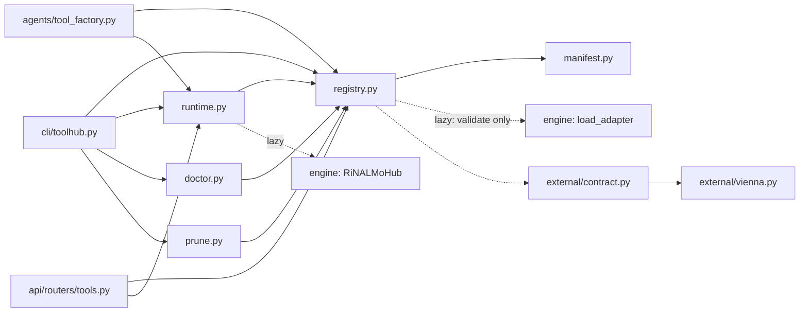

# `toolhub/` — the Tool-Hub

`agentic/adaptrna_agentic/toolhub/`

The deterministic heart of the platform: a **registry** (what tools exist and in what
state) plus a **runtime** (how they execute). No LLM anywhere in this package, and no
LangChain import — the bridge to the agents lives in
[`agents/tool_factory.py`](agents.md).

---

## Contents

1. [Responsibilities and layout](#1-responsibilities-and-layout)
2. [`manifest.py` — state on disk](#2-manifestpy--state-on-disk)
3. [`registry.py` — lifecycle](#3-registrypy--lifecycle)
4. [`runtime.py` — one backbone, all adapters](#4-runtimepy--one-backbone-all-adapters)
5. [`external/` — non-neural tools](#5-external--non-neural-tools)
6. [`errors.py`](#6-errorspy)
7. [`doctor.py` — what is wrong with this install](#7-doctorpy--what-is-wrong-with-this-install)
8. [`prune.py` — the only destructive path](#8-prunepy--the-only-destructive-path)
9. [Typical usage](#9-typical-usage)
10. [Assumptions and limitations](#10-assumptions-and-limitations)

---

## 1. Responsibilities and layout

| File | Lines | Responsibility |
|---|---:|---|
| `manifest.py` | 203 | Dataclasses + JSON I/O for `tools.json`. Pure data; never imports the engine. |
| `registry.py` | 348 | register / activate / deactivate / remove / list / verify / configure_backbone. Imports the engine only to *validate adapter files*. |
| `runtime.py` | 314 | `AdapterRuntime`: lazy backbone, residency, serialised inference, smoke tests. |
| `external/contract.py` | 200 | The wrapper contract: spec dataclasses, loader, install helpers, golden runner. |
| `external/vienna.py` | 101 | The hand-written reference wrapper, and the template the ToolSmith imitates. |
| `errors.py` | 15 | `ToolHubError`, `ConcurrentModificationError`. Separate module to avoid import cycles. |
| `doctor.py` | 241 | Read-only health checks, each with a remedy. |
| `prune.py` | 291 | The one destructive command in the project. |



## 2. `manifest.py` — state on disk

Schema and field semantics: [../configuration.md §5](../configuration.md#5-toolhub_datatoolsjson--the-manifest).

### Path resolution

```python
resolve_data_dir(explicit) -> explicit  or  $ADAPTRNA_TOOLHUB_DIR  or  <repo>/toolhub_data
resolve_path(p)            -> p.expanduser(), and if relative, <repo>/p
```

Stored artifact paths are repo-root-relative when the registry owns them, absolute when
`--link`ed. `~` expands either way.

### `BackboneConfig`

One backbone per hub — every adapter tool must match its `lm_config`.

```python
lm_config: str = "giga"           # nano | micro | mega | giga
weights:   str | None             # None ⇒ random backbone (tests only)
device:    str = "auto"           # resolved_device(): cuda if available else cpu
dtype:     str = "auto"           # resolved_dtype(): None ⇒ the model default (fp32)
```

`resolved_dtype()` returning `None` for `auto` is deliberate and load-bearing: casting the
whole engine to bf16 for **non-autocast** inference trips a dtype promotion in the engine's
`TokenDropout` (an fp32 scalar promotes activations to fp32, which then meet bf16 layer-norm
weights). An explicit `dtype: bfloat16` is user-opt-in and will fail on that path.

### `Manifest`

`load()` / `save()` with two protections:

* **Atomic** — `mkstemp` in the same directory, write, `os.replace`. A crash mid-write can
  never leave a half-written manifest.
* **Optimistic concurrency** — `save()` compares `disk_revision()` against the revision it
  read; a mismatch raises `ConcurrentModificationError` and writes nothing. The counter
  lives *inside the file* rather than being an mtime, because two writes of identical
  content inside one filesystem timestamp tick are indistinguishable by mtime — and that is
  exactly the racing case.

## 3. `registry.py` — lifecycle

### `Registry(data_dir=None)`

Loads the manifest at construction. All methods operate on that in-memory copy and `save()`
immediately.

| Method | Behaviour |
|---|---|
| `list()` | Entries sorted by name |
| `get(name)` | `KeyError` listing the known tools |
| `register(adapter_path, *, name, description, batch_size, test_sequences, link)` | Validate → copy → save → move. Returns the `ToolEntry`. |
| `register_external(module_path, *, only)` | One entry per wrapper function, named `<family>_<function>`. Calls `discovery.ensure_importable()` first so `adaptrna_custom.tools.*` wrappers resolve. Refuses the **whole batch** before writing anything if any name collides. |
| `activate(name)` / `deactivate(name)` | Flip `state`; routing-level only |
| `remove(name, *, keep_artifact)` | Delete the entry, then the artifact — but only if `_owns()` it (inside `toolhub_data/adapters/`). A `--link`ed source is never touched. |
| `verify()` | `{missing_artifacts, orphan_artifacts}` — manifest ↔ disk in both directions. Read-only; feeds `doctor` and `prune`. |
| `configure_backbone(*, weights, lm_config, device, dtype)` | `weights="null"` clears it. Changing `lm_config` with tools registered is refused. |

### What `register()` refuses, and why

```python
FileNotFoundError            # the adapter file does not exist
ToolHubError: already registered (from '<source>')
ToolHubError: is a full fine-tuning export        # lora is None and metadata.arm == "full_ft"
ToolHubError: trained on the '<x>' backbone, but this ToolHub serves '<y>'
```

The full-FT refusal is the most important one. Only the *head* travels in such a file, so
serving it would silently pair a fine-tuned head with the pretrained backbone. The engine's
hub enforces this too; checking here fails before anything is copied and states the reason
up front.

### The two-phase artifact write

```python
staged_copy = dest.with_suffix(".pt.incoming")
shutil.copy2(source, staged_copy)      # 1. copy aside
...
self.manifest.save()                   # 2. write the manifest (may raise)
staged_copy.replace(dest)              # 3. only now move into place
```

with rollback (`tools.pop(name)`, `staged_copy.unlink`) on any exception. Copy-first would
leave an orphaned artifact; manifest-first would leave an entry pointing at nothing.
`tests/test_registry_atomicity.py` pins both directions.

### Serving policy

```python
PAD_SENSITIVE_TASKS = {"mrl"}
```

If no `batch_size` is given and the task is in that set, `serving.batch_size` is set to `1`
and a sentence is appended to the description explaining why. MRL's head sees padding
through biases and InstanceNorm, so batch composition would change predictions.

## 4. `runtime.py` — one backbone, all adapters

### `AdapterRuntime(registry)`

State: `_hub` (the `RiNALMoHub`, or `None`), `_resident` (names injected into it), and
`inference_lock` (an `RLock`).

| Method | Behaviour |
|---|---|
| `loaded` | Is the backbone resident **in this process**? |
| `warmup()` | Build the hub, register every active adapter. Returns a list of problem strings rather than raising — one tool with a missing artifact must not stop a chat from starting. |
| `rebuild()` | Drop the hub entirely. The full-cleanup counterpart to routing-level deactivation. |
| `predict(name, sequences, batch_size=None)` | The main path. Serialised. |
| `smoke_test(name)` | Run the stored test sequences and validate output form. Returns a report dict. |

### The lazy load path

```python
_build_hub():
    weights = resolve_path(backbone.weights)          # ToolHubError if missing, with the fix
    from rinalmo_hub.hub import RiNALMoHub            # ToolHubError if the engine is absent
    self._load_custom_tasks()                         # discovery.load_all() — generated tasks
    return RiNALMoHub(weights, lm_config, device, dtype)
```

`_load_custom_tasks` is the serving half of the codegen seam: the engine resolves an
adapter's task through `get_task(name)`, which only knows what `@register_task` has
registered. Without this call a generated task would train fine and then fail to serve.

### Why inference is serialised

`RiNALMoHub.predict` calls `activate()`, which flips the active adapter on **every** tuner
layer of the shared backbone. Two concurrent predictions for different tools could
interleave that mutation and answer from the wrong adapter — a silent wrong answer, not a
crash. The lock lives here rather than at the call sites so every caller (CLI, chat tools,
HTTP) is covered rather than each entry point having to remember. Throughput is one
prediction at a time; correctness first. Guarded by `tests/test_api_concurrency.py`.

### `_ensure_tool(name)` — the four gates before any forward pass

1. The entry exists (`registry.get`).
2. It is an **adapter** tool (external tools get a message pointing at `toolhub call`).
3. It is **active** (else: *"disabled. Enable it with `toolhub activate <name>`"*).
4. Its artifact **exists** — checked here so a missing file surfaces as a message naming
   the tool, rather than a raw torch/OS error from deep inside the engine's loader.

Then the hub is built if needed, and the adapter registered if not yet resident — which
covers tools registered or re-activated after the hub was built.

### Smoke tests

`smoke_test` returns `{name, task, ok, checks: [str], outputs}`. Checks applied:

* one output per input sequence;
* a per-task **output-form validator**:

| Task | Validator asserts |
|---|---|
| `splice_site` | one finite probability per sequence, within `[0, 1]` |
| `mrl` | one finite scalar per sequence, non-negative (the engine clamps at 0) |
| `sec_struct` | a square matrix per sequence whose side equals the sequence length |
| *anything else* | `_validate_generic`: no non-finite values |

* optional exact comparison against `test.expected` within `test.tolerance` (default 1e-4).

A failing predict is reported inside the dict, not raised — the report *is* the error
channel.

## 5. `external/` — non-neural tools

### The contract (`contract.py`)

A wrapper module must:

1. define module-level `SPEC: ExternalToolSpec`;
2. define one module-level callable per `FunctionSpec.name`, taking JSON-scalar keyword
   arguments and returning a JSON-serialisable dict;
3. **validate inputs before importing the wrapped package**, so a missing package fails at
   the call boundary with the install hint, and validation tests run without it.

```python
PackageSpec(pip="ViennaRNA", import_name="RNA")
GoldenCase(args={...}, expect={...})           # exact, or {"approx": x, "tol": t}
FunctionSpec(name, description, golden=(...))  # description becomes the tool description
ExternalToolSpec(name, description, package, functions)   # name is the family prefix
```

| Function | Purpose |
|---|---|
| `load_spec(module_path)` | Import + validate. Refuses a module with no `SPEC`, a declared function that does not exist, or one that is not callable. Returns `(spec, module)`. |
| `is_available(package)` / `installed_version(package)` | `importlib.util.find_spec` / `importlib.metadata.version` |
| `install_command(package)` | The exact argv — **constructed, never executed here**. The caller owns the approval gate. |
| `install(package)` | Runs it; raises `ToolHubError` with the last 2000 chars of stderr on failure. |
| `call_entry(entry, arguments)` | Import the recorded module, call the recorded function with `**arguments`. |
| `run_golden(entry)` | Report in the same shape as `smoke_test`. A disabled tool returns `ok: false` with the activate hint. |
| `golden_as_dicts(fn)` | Goldens as plain dicts, so the manifest entry is self-contained. |

### The reference wrapper (`vienna.py`)

Two functions, `fold(sequence)` and `cofold(sequence_a, sequence_b)`, each returning
`{"structure": str, "mfe": float}`. `_clean()` upper-cases, maps `T→U`, rejects empty input
and non-ACGU characters — **before** `import RNA`.

Golden cases are pinned against ViennaRNA 2.7.2 and mix two kinds of evidence: an *a
priori* case (`AAAA…` cannot pair with itself → all dots, 0.0) and captured cases (the
classic hairpin `GGGGAAAACCCC` → `((((....))))` at −5.4). The cofold golden documents a
non-obvious detail: the returned structure spans both strands with the `&` dropped, so 8+8
bases give a 16-character string.

This module is read verbatim into the ToolSmith prompt as the template to imitate.

## 6. `errors.py`

```python
ToolHubError(RuntimeError)                    # anything the ToolHub refuses, with the fix
ConcurrentModificationError(ToolHubError)     # a JSON store changed since it was read
```

A separate module so `contract`, `registry` and `runtime` can share them without cycles.
The API maps both to HTTP: `ConcurrentModificationError` → `409 {retryable: true}`, other
`ToolHubError` → `409 {type: "ToolHubError"}`.

## 7. `doctor.py` — what is wrong with this install

Read-only. `run_checks(data_dir=None, jobs_dir=None) -> {status, checks, failed, warned}`,
where each check is `{name, status, detail, remedy, data}` and `status ∈ {ok, warn, fail}`.
The overall status is the worst individual one.

| Check | Fails when | Warns when |
|---|---|---|
| `engine` | `rinalmo_hub` cannot be imported | — |
| `backbone` | the configured checkpoint does not exist | none is configured (training would use random weights) |
| `artifact:<tool>` | a tool points at a file that is gone | — |
| `orphan_artifacts` | — | adapter files no tool references |
| `external_tools` | a registered external tool's package is not importable | — |
| `custom_tasks` | a generated task fails to import | — |
| `stale_jobs` | a record says `running` but the process is gone or its PID was recycled | — |
| `job_outputs` | — | a succeeded job's output directory is gone |
| `staging` | — | staged artifacts never landed or cleaned |
| `disk:{outputs,toolhub_data,chat_data}` | — | over 5 GB |

The governing rule: *a health check that reports green on a broken install is worse than no
health check.* `tests/test_doctor.py` therefore exercises every check against a
purpose-built **broken** install — the same discipline as the codegen harness controls.

> ⚠️ The `stale_jobs` remedy string tells you to run `toolhub job-status <id>`, which is not
> a subcommand. See [../README.md gap #1](../README.md#known-documentation-gaps).

`format_report(report)` renders the CLI's text form; `--json` prints the dict.

## 8. `prune.py` — the only destructive path

Three rules, in this order:

1. **Never delete anything the manifest references** — a registered tool's artifact, or the
   output directory of the job that produced one. Referenced items are listed as *kept*,
   with the reason.
2. **Dry run by default.** `--yes` performs it.
3. **`runs` always requires an explicit age filter**, because it deletes GPU-hours
   artifacts.

Deliberately **not** exposed as an agent tool: deletion stays a human action at the CLI.

| Target | Candidates | Skipped when |
|---|---|---|
| `staging` | `toolhub_data/staging/<id>/` | younger than `--older-than` |
| `artifacts` | orphans from `registry.verify()` | referenced by a tool (listed explicitly) |
| `sessions` | `thread_id`s in `sessions.sqlite` | the **store file** is younger than `--older-than` |
| `jobs` | job records | still running · produced a registered tool · younger than the filter |
| `runs` | `outputs/*/` | produced a registered tool · a job is still writing to it · younger than the filter |

`prune()` returns `{kind, applied, would_remove|removed, kept, reclaimed_bytes}`.
Removal dispatches on the candidate's `data`: a `thread_id` deletes rows from the
checkpointer tables, a `job_id` drops a store record, anything else unlinks a path.

Two caveats, both real:

* `sessions --older-than` compares the age of the **whole SQLite file**, not each session —
  all-or-nothing per store (the kept-reason string says "store younger than…").
* `_delete_job` reopens the *default* job store, so an explicit `jobs_dir=` passed to
  `prune()` is honoured for planning and ignored for deletion. Unreachable from the CLI,
  which never passes it.

## 9. Typical usage

```python
from adaptrna_agentic.toolhub.registry import Registry
from adaptrna_agentic.toolhub.runtime import AdapterRuntime

registry = Registry()                       # or Registry("/tmp/my_hub")
runtime  = AdapterRuntime(registry)         # nothing is loaded yet

registry.configure_backbone(weights="~/.cache/rinalmo_pretrained/giga-v1.pt")
entry = registry.register("outputs/my_run/splice_site_adapter.pt",
                          name="donor", description="Donor sites, 400 nt windows")

runtime.predict("donor", ["ACGU..."])       # backbone loads HERE, on first use
runtime.smoke_test("donor")

registry.deactivate("donor")                # routing-level; weights stay resident
```

External tools:

```python
from adaptrna_agentic.toolhub.external import contract

spec, module = contract.load_spec("adaptrna_agentic.toolhub.external.vienna")
if not contract.is_available(spec.package):
    print("Would run:", " ".join(contract.install_command(spec.package)))   # gate here
    contract.install(spec.package)
registry.register_external("adaptrna_agentic.toolhub.external.vienna")
contract.run_golden(registry.get("vienna_fold"))
```

Generated wrappers in `adaptrna_custom/tools/` are importable because
`register_external` (and `build_agent_tools` at startup) calls `discovery.ensure_importable()`,
which puts the repo root on `sys.path`. Built-in wrappers like `vienna.py` live inside the
installed package and have always been importable.

## 10. Assumptions and limitations

* **One backbone per hub.** Changing `lm_config` with tools registered is refused; remove
  them first. Nothing in the project has ever served two backbones simultaneously.
* **Residency is per process.** Every `toolhub predict` invocation pays its own load; the
  chat and HTTP processes pay it once.
* **Deactivation does not free memory.** peft cannot cleanly uninject an adapter. Resident
  adapters cost megabytes; `rebuild()` is the full cleanup.
* **The stores detect concurrent writes, they do not prevent them.** The second writer is
  asked to retry.
* **Serving is fp32.** Half-precision serving needs an engine fix or an autocast wrapper.
* **`AdapterRuntime._resident` is read from outside the class** (`cli/toolhub.py`,
  `cli/chat.py` print it). If you rename it, grep first.
