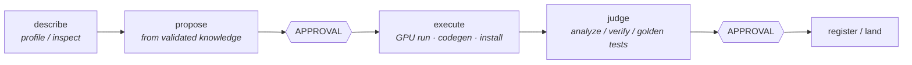
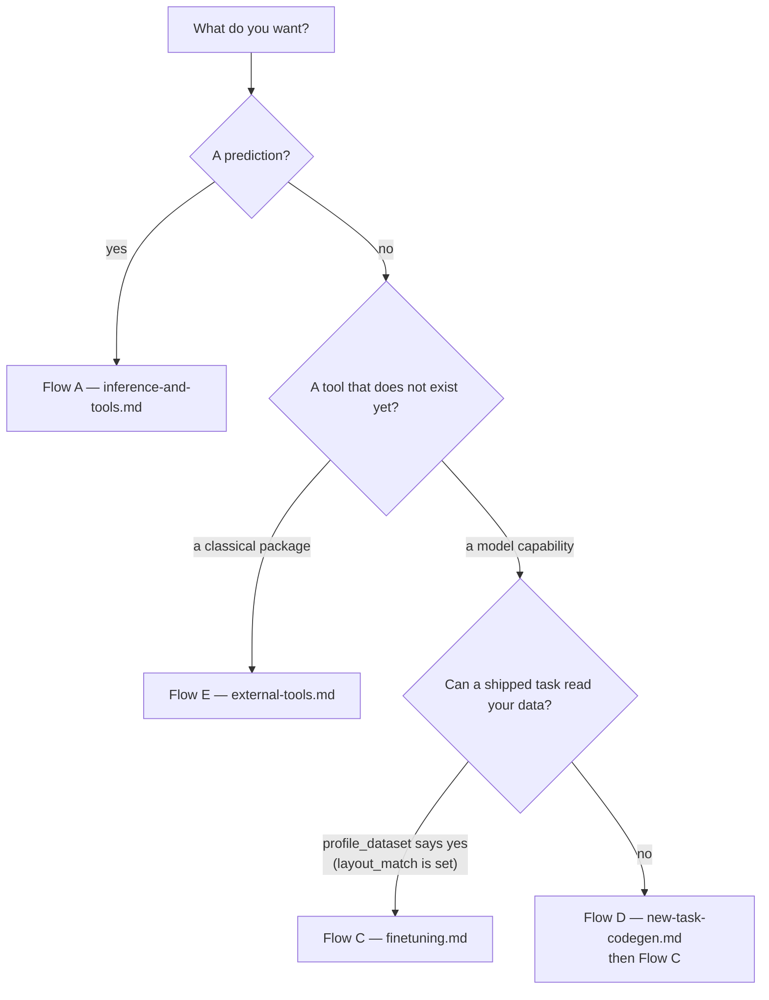

# Workflows

End-to-end procedures, step by step, naming the modules involved at each step.

| Document | Flow | Start here when you want to… |
|---|---|---|
| [inference-and-tools.md](inference-and-tools.md) | A + B | Ask a question and get a prediction; list, enable, disable or test tools |
| [finetuning.md](finetuning.md) | C | Turn your data into a new servable adapter tool |
| [new-task-codegen.md](new-task-codegen.md) | D | Get a task written for data no shipped task can read |
| [external-tools.md](external-tools.md) | E | Wrap a classical bioinformatics package as a tool |
| [operations.md](operations.md) | — | Diagnose a broken install, reclaim disk, recover from a failure |

Setup and installation are in [../setup.md](../setup.md). The engine's own training,
evaluation and prediction commands — used directly, outside the agent platform — are
documented in [`../../engine/README.md`](../../engine/README.md) and summarised in
[../modules/engine-hub.md](../modules/engine-hub.md#8-cli).

---

## The shape shared by every creation flow

Two invariants hold across all of them:

1. **Approval in one step never implies approval for the next.** Starting a training run and
   registering its result are two separate gates, and a decline at either is final for that
   turn — the orchestrator is instructed not to retry the same action.
2. **What you are shown is what will happen.** The gate renders the exact command, the exact
   file list, or the exact diff — not a paraphrase. `tests/test_ui_contract.py` and the
   browser suite verify the browser's rendering against the terminal's own renderer.

## Choosing a flow

`profile_dataset` answers the branch at the bottom for you: its `layout_match` field is
either a task name (flow C) or `null` with a `layout_reason` explaining what the nearest
shape expects (flow D).
