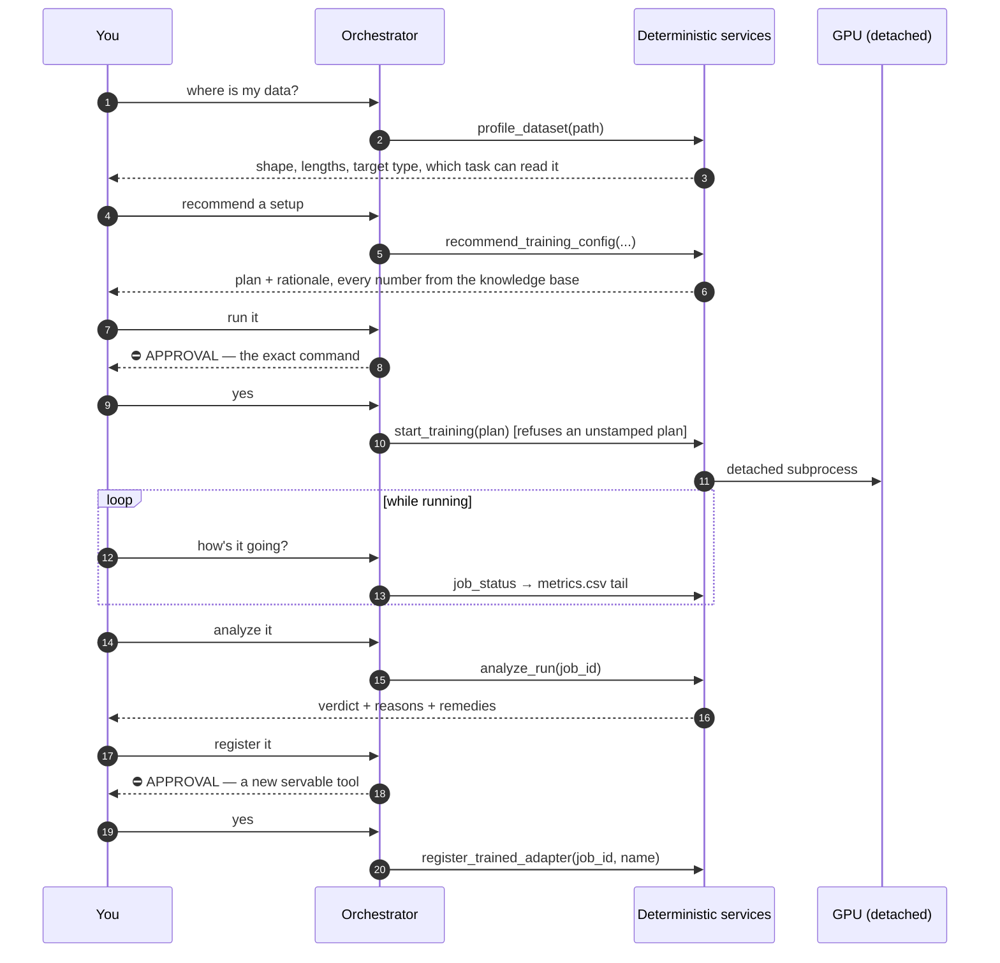

# Fine-tuning a New Adapter Tool (flow C)

Data in → a validated configuration → your approval → a GPU run → an analysed result → your
approval → a servable tool.

This is the platform's headline scenario. Everything in it is deterministic except the
narration.

---

## Contents

1. [The conversation](#the-conversation)
2. [Step 1 — profile](#step-1--profile)
3. [Step 2 — recommend](#step-2--recommend)
4. [Step 3 — the approval gate](#step-3--the-approval-gate)
5. [Step 4 — the run](#step-4--the-run)
6. [Step 5 — analyse](#step-5--analyse)
7. [Step 6 — register](#step-6--register)
8. [Driving it from the browser](#driving-it-from-the-browser)
9. [Doing it without the agent](#doing-it-without-the-agent)
10. [What can go wrong](#what-can-go-wrong)

---

## The conversation

```
you> My Spliceator data is at ~/data/train_data — what's in it?
you> Recommend a fine-tuning setup for the acceptor arm.
you> Run it.                     ← approval gate: shows the exact command, waits for [y/N]
you> How's it going?             ← the job runs detached; the chat stays responsive
you> Analyze the run.
you> Register it as splice_site_acceptor.        ← approval gate
```



---

## Step 1 — profile

`profile_dataset(path)` →
[`profiling/profiler.py`](../modules/profiling-and-knowledge.md#3-profilerpy--describing-a-dataset).

Deterministic and LLM-free. It reports the shape it sees and names the task that can read it:

```json
{
  "path": "/home/you/data/train_data",
  "kind": "directory",
  "folds": ["db_1", "…", "db_10"],
  "ss_types": ["acceptor", "donor"],
  "splits": {"Train_acceptor_400.csv": 19775, "Val_acceptor_400.csv": 4944},
  "length_min": 400, "length_median": 400, "length_max": 400,
  "alphabet": "dna",
  "target_type": "binary",
  "layout_match": "splice_site",
  "layout_reason": "Found ['GS_1'] under '…' — the layout the 'splice_site' task reads…"
}
```

`layout_match` is the branch point: a task name means flow C can proceed; `null` means no
shipped task can read this layout and you want [flow D](new-task-codegen.md) first.

> The profiler will not reshape your file into some upstream layout to make it fit. Silently
> doing that is how you get confidently wrong numbers later.

## Step 2 — recommend

`recommend_training_config(data_path, task=None, arm="lora", quick=False, seed=42,
task_options=None)` →
[`profiling/recommender.py`](../modules/profiling-and-knowledge.md#4-recommenderpy--the-plan).

Every hyperparameter comes from
[`knowledge/hyperparameters.yaml`](../configuration.md#4-the-knowledge-base), **and so does
every rationale line**, so the explanation you read and the config that runs cannot drift
apart.

```python
{"source": "recommend_training_config",
 "task": "splice_site", "arm": "lora",
 "config_path": "engine/configs/tasks/splice_site.yaml",
 "overrides": {"lm_config": "giga",
               "pretrained_weights": "/home/you/.cache/rinalmo_pretrained/giga-v1.pt",
               "data.root": "/home/you/data/train_data",
               "data.test_root": "/home/you/data/test_data",
               "data.ss_type": "acceptor",
               "optim.lr": 0.0003, "optim.name": "adamw",
               "trainer.gradient_clip_val": 1.0, "trainer.precision": "bf16-mixed",
               "lora.r": 16, "lora.alpha": 32, "lora.dropout": 0.05, "lora.layer_stride": 3,
               "trainer.max_epochs": 2},
 "seed": 42,
 "output_dir": "outputs/splice_site_acceptor_lora_20260812_185058",
 "primary_metric": "test/f1_score",
 "reference": {"band": [95.8, 97.5], "tolerance": 1.0, "sources": [...]},
 "estimated_wall_clock": "~7 min",
 "rationale": ["lr 3e-4 with gradient_clip_val 1.0 was stable across tasks…",
               "layer_stride 3 adapts 11 of the 33 giga blocks and matched full fine-tuning…",
               "Not optim.lr = 1e-3: Trains well to loss 0.126 by step ~325, then a gradient
                spike collapses it into a constant-output state… Remedy: use lr 3e-4 …"],
 "warnings": ["Cross-species benchmark: train/validate on the Spliceator folds, test on a
               different organism entirely (data.species)."],
 "command": ["/…/python", "-m", "adaptrna_agentic.jobs.train_entrypoint", "--task", …]}
```

### Useful arguments

| Argument | Effect |
|---|---|
| `task_options={"ss_type": "acceptor"}` | Task-specific `data.*` choices, **validated** against the template's `key_options` — an invalid value is refused with the valid set |
| `quick=True` | `trainer.max_steps=200`, `data.num_workers=8`, plus a warning. **A smoke test, not a result** — the analyzer will refuse to compare it to reference metrics |
| `arm="full_ft"` | Allowed, with the warning that its ~2.6 GB export **cannot become a served tool** |
| `task=` | Override the profile's match |

### Where the backbone comes from

Not from `configs/base.yaml` (whose `weights/giga-v1.pt` default is relative to the working
directory and need not exist) but from **the ToolHub manifest**, because an adapter trained
against a different backbone than the hub serves could not be hosted alongside the existing
tools. A hub with no checkpoint configured produces a warning, not a silent random-weights
run.

## Step 3 — the approval gate

```
  ┌─ approval required ──────────────────────────────────────────
  │ Train splice_site (lora) — ETA ~7 min, output outputs/splice_site_acceptor_lora_…
  │   would run: /home/you/adaptrna/.venv/bin/python -m adaptrna_agentic.jobs.train_entrypoint
  │              --task splice_site --config engine/configs/tasks/splice_site.yaml
  │              --output_dir outputs/splice_site_acceptor_lora_20260812_185058 --seed 42
  │              --use_lora --set lm_config=giga --set pretrained_weights=/… --set …
  │   output:    outputs/splice_site_acceptor_lora_20260812_185058
  │   ! Cross-species benchmark: train/validate on the Spliceator folds, test on a …
  └──────────────────────────────────────────────────────────────
  approve? [y/N]
```

The command is shown **verbatim** — byte for byte what will be executed. Only `y`/`yes`
approves; `EOF` and `Ctrl-C` decline. Declining ends it: the orchestrator is instructed to
report the decline plainly and not retry.

`start_training` then applies the rule that makes all of this meaningful:

```python
if plan.get("source") != "recommend_training_config":
    raise ToolHubError("This plan did not come from recommend_training_config. …")
```

so a model that hand-assembles a plan — which happens when the recommender refuses something
— is rejected rather than trusted.

## Step 4 — the run

[`jobs/runner.py`](../modules/jobs.md) launches it **detached**
(`start_new_session=True`), so it survives the chat exiting. Only one job runs at a time
unless `allow_concurrent` is passed: *two giga runs on one GPU is how you get an
out-of-memory failure forty minutes in*.

```
outputs/<run_name>/
├── resolved_config.yaml     written before training starts
├── metrics/version_0/metrics.csv   appended as it goes — tail -f it
├── train.log                stdout + stderr
├── exit_code                written by the entrypoint in a `finally` block
└── splice_site_adapter.pt   the ~6 MB artifact
```

Follow it from anywhere:

```
you> How's it going?
  → job_status({job_id: "splice_site_acceptor_lora_20260812_185058"})
    = {"state": "running", "progress": {"epoch": 1, "step": 400,
       "latest_metrics": {"train/loss": 0.08, "val/f1_score": 96.4}}}
```

```bash
curl -s localhost:8000/api/jobs/<id>            | jq
curl -s localhost:8000/api/jobs/<id>/logs?tail=100 | jq -r .log
tail -f outputs/<id>/metrics/version_0/metrics.csv
```

The browser's Jobs panel polls every 3 s and updates in place.

Every job is launched through
[`jobs/train_entrypoint.py`](../modules/jobs.md#2-train_entrypointpy--the-seam) rather than
the engine CLI directly, so generated tasks are importable and `exit_code` always gets
written.

To stop one: `POST /api/jobs/{id}/cancel`, or `JobRunner.cancel(id)`. It refuses to signal a
PID it cannot prove is still ours.

## Step 5 — analyse

`analyze_run(job_id)` → [`jobs/analysis.py`](../modules/jobs.md#7-analysispy--the-runanalyzer).

```python
{"task": "splice_site", "arm": "lora", "truncated": False,
 "metrics": {"train/loss": 0.031, "val/f1_score": 96.9, "test/f1_score": 96.71, …},
 "primary_metric": "test/f1_score", "primary_value": 96.71,
 "checks": ["test/f1_score = 96.71",
            "test/f1_score = 96.71 is within the reference band 95.8–97.5 "
            "(±1.0 for run-to-run non-determinism)"],
 "suggestions": [],
 "verdict": "ok"}
```

**Two rules the analyzer exists to enforce:**

1. A run truncated by `trainer.max_steps` is **never** compared to reference metrics — the
   report says so explicitly, and the orchestrator is instructed never to present a truncated
   smoke run as a real result.
2. A difference inside the task's tolerance is **never** called a regression. FlashAttention's
   backward pass is non-deterministic: the same splice-site command and seed produced F1
   95.21 and 95.82.

What it detects, and the remedy it attaches: non-finite loss → *lower the learning rate and
set `gradient_clip_val`*; a degenerate primary metric → the arm's documented failure mode
verbatim; a flatlined `train/loss` → the constant-output collapse signature; below the
reference band → *confirm with a second seed or data split before concluding anything*.

For a task with **no** reference band — a generated one — it compares against this project's
own earlier succeeded, non-truncated runs of the same task and arm, and labels the result a
**baseline**, never a validated reference. The first run of a new task is reported as *"this
run is the baseline for future ones"*.

## Step 6 — register

```
you> Register it as splice_site_acceptor.

  ┌─ approval required ──────────────────────────────────────────
  │ Register job 'splice_site_acceptor_lora_20260812_185058' as the servable tool
  │ 'splice_site_acceptor'
  └──────────────────────────────────────────────────────────────
  approve? [y/N] y
```

`register_trained_adapter(job_id, name=None, description=None)` refuses a job that is not
`succeeded`, and one that produced no adapter file (*"LoRA runs write one; full fine-tuning
runs do not"*). On success it copies the artifact into `toolhub_data/adapters/`, writes the
manifest entry, and stamps `provenance.job_id` and `provenance.training_metrics`.

The tool becomes resident on next use — no restart needed:

```
you> Score this acceptor window with both donor and acceptor tools.
  → splice_site({sequences: […]})            = [0.010]
  → splice_site_acceptor({sequences: […]})   = [0.998]
```

Both answers come from **one** loaded backbone.

## Driving it from the browser

```bash
python -m adaptrna_agentic.cli.serve --open
```

The same flow, with the gate as a modal showing the same exact command, and the Jobs panel
updating in place while the run proceeds. Sessions are shared: start in the terminal,
continue in the browser, and back.

A refresh mid-approval restores the dialog from `GET /api/sessions/{id}/history`'s
`pending_approval` field — the suspended turn is in the checkpointer, not in the tab.

## Doing it without the agent

Every step has a plain-Python equivalent:

```python
from adaptrna_agentic.profiling.profiler import profile_dataset
from adaptrna_agentic.profiling.recommender import recommend
from adaptrna_agentic.jobs.runner import JobRunner
from adaptrna_agentic.jobs.analysis import analyze_run
from adaptrna_agentic.toolhub.registry import Registry

plan   = recommend(profile_dataset("~/data/train_data"), task_options={"ss_type": "acceptor"})
record = JobRunner().start(plan)                       # no gate at this level
report = analyze_run(record.output_path, plan=record.plan)
Registry().register(record.adapter_path, name="splice_site_acceptor")
```

The approval gates live in the **graph**, not in these services — a Python caller is assumed
to have made the decision by calling. The `plan["source"]` check is likewise in
`tool_factory`, not in `JobRunner`.

Or bypass the platform entirely and use the engine directly
([engine README](../../engine/README.md)):

```bash
python -m rinalmo_hub.cli.train --task splice_site --config engine/configs/tasks/splice_site.yaml \
    --use_lora --set optim.lr=3e-4 --set data.ss_type=acceptor --seed 42 \
    --output_dir outputs/manual_acceptor
python -m adaptrna_agentic.cli.toolhub register outputs/manual_acceptor/splice_site_adapter.pt
```

## What can go wrong

| Symptom | Meaning | Fix |
|---|---|---|
| `This plan did not come from recommend_training_config` | Intentional. Hyperparameters must come from the knowledge base. | Call `recommend_training_config` and pass its result through unchanged |
| `Job '…' is still running` | One training job at a time by default | Wait, or cancel it |
| `The ToolHub's backbone checkpoint '…' does not exist` | The manifest points at a missing file | `toolhub config --weights /path/to/giga-v1.pt` |
| Plan warns about random weights | No checkpoint configured at all | Same fix, before training for real |
| Job goes to `failed` with no `exit_code` | SIGKILL, OOM, or a hard crash | `job logs` / `train.log` — the last lines usually name it |
| `PID … may since have been reused — refusing to signal it` | The process is gone; the record was closed out and **nothing was killed** | None needed |
| Verdict `suspicious`, below the band | Could be real, could be variance | Repeat with another seed or `data.dataset_id` fold before concluding anything |
| Verdict `failed`, primary metric ≈ 0 | Degenerate output | The report carries the arm's documented failure mode and its remedy |
| `is a full fine-tuning export` at registration | Only LoRA adapters can be served | Evaluate it with `rinalmo_hub.cli.evaluate --init_params` instead |
| A crashed run | **Cannot be resumed mid-flight** | Start it again |
