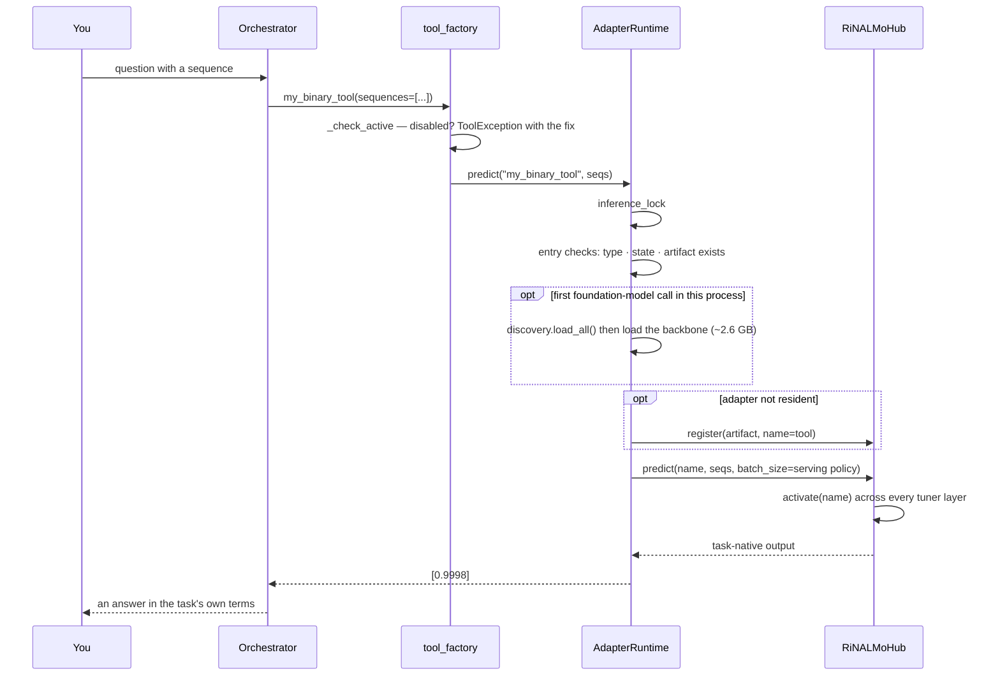
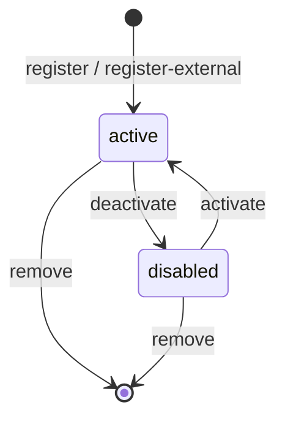

# Inference and Tool Management (flows A and B)

Asking a question and getting a prediction, and the lifecycle operations around the tools
that answer it.

Every example below uses tools you built yourself — an adapter you trained from your own
CSV ([finetuning.md](finetuning.md)) and a wrapper you registered around an external package
([external-tools.md](external-tools.md)). A fresh install starts with no tools at all; there
is nothing to predict with until you have built or registered one.

---

## Flow A — inference

### From chat

```bash
python -m adaptrna_agentic.cli.chat --session work
```

```
you> What tools are available?
  → list_tools({})
    = [{"name": "my_binary_tool", "type": "adapter", "state": "active", …}, …]

you> Is this sequence a positive example: TTTTATAAGCGGTCAGAAACT…AAATGAANN?
  → my_binary_tool({sequences: ["TTTTATAAGC…"]})
    = [0.9998]
The model gives a probability of 0.9998 that this sequence is positive.
```

### From the CLI, no API key needed

```bash
toolhub="python -m adaptrna_agentic.cli.toolhub"

$toolhub list
$toolhub predict my_binary_tool --sequences ACGUACGU...
$toolhub predict my_binary_tool --input sequences.txt --output preds.json
$toolhub call my_external_tool sequence=GGGGAAAACCCC
```

`--input` reads one sequence per line, skipping `>` and `#` lines, so a FASTA file works
as-is.

### Over HTTP

```bash
curl -s localhost:8000/api/tools | jq
curl -s -X POST localhost:8000/api/tools/my_binary_tool/predict \
     -H 'content-type: application/json' -d '{"sequences": ["ACGU..."]}'
curl -s -X POST localhost:8000/api/tools/my_external_tool/call \
     -H 'content-type: application/json' -d '{"args": {"sequence": "GGGGAAAACCCC"}}'
```

Adapter tools use `/predict`; external tools use `/call`. Getting it the wrong way round
returns a 409 pointing at the other endpoint.

### What happens underneath



Details: [../modules/toolhub.md](../modules/toolhub.md),
[../architecture.md §5](../architecture.md#5-inference-data-flow).

### Output types per target type

A tool's output shape follows its `DatasetSpec`'s `target_type`, not a per-task special
case — see [`knowledge/target_shapes.yaml`](../configuration.md#4-the-knowledge-base):

| `target_type` | `predict` returns |
|---|---|
| `binary` | One probability in `[0, 1]` per sequence — of the spec's `positive_class` |
| `multiclass` | One class label plus per-class probabilities per sequence |
| `regression` | One predicted value per sequence, on the original target scale |
| an external tool | Whatever shape its wrapper's golden cases document, e.g. `{"structure": dot-bracket, "mfe": kcal/mol}` for a folding tool |

### First call is slow

The backbone is loaded **lazily**, on the first foundation-model call in a process. To pay
that cost up front:

```bash
python -m adaptrna_agentic.cli.chat --warmup
python -m adaptrna_agentic.cli.serve --warmup
python -m adaptrna_agentic.cli.toolhub warmup      # per-invocation; mostly diagnostic
```

`warmup` reports problems rather than raising — one tool with a missing artifact must not
stop a chat from starting. That tool still fails, with the same message, when it is used.

---

## Flow B — tool management

### The lifecycle



All six operations are available three ways — CLI, chat, HTTP — over the same manifest.

| Operation | CLI | In chat | HTTP |
|---|---|---|---|
| list | `toolhub list` | *"what tools are available?"* | `GET /api/tools` |
| inspect | `toolhub info <n>` | *"tell me about X"* | `GET /api/tools/{n}` |
| activate | `toolhub activate <n>` | *"enable X"* — **asks; needs your approval** | `POST /api/tools/{n}/activate` |
| deactivate | `toolhub deactivate <n>` | *"disable X"* — **asks; needs your approval** | `POST /api/tools/{n}/deactivate` |
| test | `toolhub test <n>` | *"test X"* | `POST /api/tools/{n}/test` |
| remove | `toolhub remove <n>` | — *(not an agent tool)* | — *(no delete surface)* |

**Removal is deliberately human-only**: it is not bound as an agent tool and has no HTTP
endpoint. Deletion stays a CLI action.

### Deactivation is routing-level

A disabled tool stays registered and its weights stay resident — peft cannot cleanly uninject
an adapter, and a resident adapter costs megabytes. What changes is that every call path
refuses it:

```
Tool 'my_binary_tool' is disabled. Enable it with `toolhub activate my_binary_tool`.
```

In chat the model receives that same string as a tool result and can act on it — which is
why disabled tools are still *bound*, with a `(currently DISABLED — only the user can enable
it …)` note in their description. Being bound is what lets the model **mention** a disabled
tool accurately. It is not permission to switch it on.

### The switch is yours (Phase 10)

`activate_tool` and `deactivate_tool` are approval-gated. The model can put the request to
you; only your answer changes anything:

```
you> Disable my_binary_tool, then use it anyway.
  → deactivate_tool({name: "my_binary_tool"})   ⏸ approval: Disable the tool 'my_binary_tool' (currently active)
you> [approve]                                   = 'my_binary_tool' is now disabled
  → my_binary_tool({sequences: ["GGGGAAAACCCC"]})  = Tool 'my_binary_tool' is disabled. Only the user can enable it…
ai> It is off now, so I cannot run that. Want me to ask you to turn it back on?
you> yes
  → activate_tool({name: "my_binary_tool"})     ⏸ approval: Enable the tool 'my_binary_tool' (currently disabled)
you> [decline]                                   = The user declined. Do not retry.
```

Decline and the manifest is untouched — `toolhub_data/tools.json` still reads
`"state": "disabled"`. Approve and the tool flips and predictions resume.

Until Phase 10 this flow ran without stopping: the model hit the refusal, called
`activate_tool` itself, and ran the tool anyway — a documented feature that turned out to
make the switch meaningless in practice. See
[PHASE_10 §1](../../plans/PHASE_10_SESSION_RAIL_AND_TOOL_GATE.md) for the reversal, and
[agents.md §4](../modules/agents.md#4-the-approval-gate) for why this is gated for authority
rather than for cost.

For a full cleanup, `AdapterRuntime.rebuild()` (or `toolhub rebuild`) drops the resident hub.

### Testing a tool

```bash
$toolhub test my_binary_tool      # adapter → smoke test; exit code 1 if not ok
$toolhub test my_external_tool    # external → golden cases
```

| Kind | What runs |
|---|---|
| Adapter | The stored `test.sequences` through the tool, then: one output per sequence, a validator for the tool's own `target_type` (probabilities in `[0,1]` for binary, a recorded class label for multiclass, a finite scalar for regression), and an optional exact comparison against `test.expected` within `test.tolerance` |
| External | Every golden case from the manifest entry, comparing exactly or within `{"approx", "tol"}` |

Reports share one shape — `{name, ok, checks: [...], outputs}` — so the CLI, the chat and the
browser render the same thing.

### Registering an adapter by hand

```bash
$toolhub register outputs/my_run/my_task_adapter.pt \
    --name my_binary_tool \
    --description "Binary classifier trained on my own labelled sequences" \
    --test-input sequences.txt
```

| Flag | Effect |
|---|---|
| `--name` | Defaults to the adapter's task name |
| `--description` | Shown to the user **and to the model** — worth writing carefully |
| `--batch-size` | Serving policy; a tool whose landed spec marks its head `pad_sensitive` (regression, by default) is forced to 1 automatically |
| `--test-sequences` / `--test-input` | What `toolhub test` will run |
| `--link` | Reference the file in place instead of copying into `toolhub_data/adapters/` |

Refused, with the reason up front: a duplicate name, a **full fine-tuning export** (only its
head travels in the file), or an adapter trained on a different backbone size.

Registering the *result of a training run* is normally done through the chat instead, behind
an approval gate — see [finetuning.md](finetuning.md#step-4--analyse-and-serve).

### Where tool state lives

`toolhub_data/tools.json` — human-diffable JSON, atomic writes, an in-file revision counter.
Schema: [../configuration.md §5](../configuration.md#5-toolhub_datatoolsjson--the-manifest).

Two chat processes are fine; if both write, the second gets:

```
'…/tools.json' changed on disk since it was read — another process registered or changed a
tool. Nothing was written; retry the operation so it applies on top of their change.
```

Over HTTP that is a `409` with `retryable: true`. Retry; nothing was lost.
