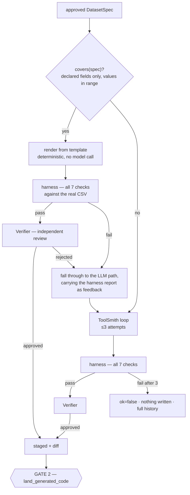
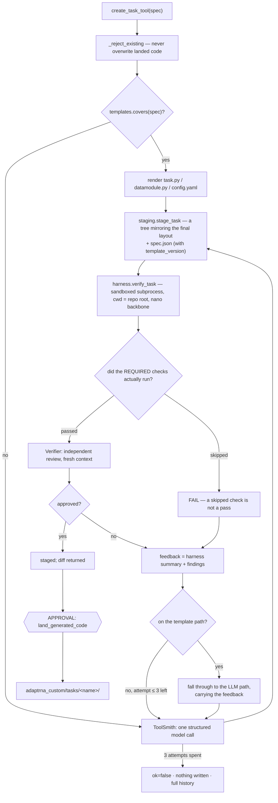

# Building a Task from an Approved Spec (flow D)

Step 2 of [finetuning.md](finetuning.md): an approved `DatasetSpec` in, three files out —
verified against your actual data, independently reviewed, and landed only after you approve
the diff. **The common case never calls a model at all.**

---

## Contents

1. [When this runs](#when-this-runs)
2. [The two paths](#the-two-paths)
3. [The conversation](#the-conversation)
4. [What runs, in order](#what-runs-in-order)
5. [The seven checks](#the-seven-checks)
6. [Reuse: skipping this flow entirely](#6-reuse-skipping-this-flow-entirely)
7. [The independent review](#the-independent-review)
8. [The approval gate](#the-approval-gate)
9. [What lands, and what happens next](#what-lands-and-what-happens-next)
10. [Editing generated code afterwards](#editing-generated-code-afterwards)
11. [What can go wrong](#what-can-go-wrong)

---

## When this runs

Every task this build ever trains goes through this step — there is no shipped task for a
CSV to already match, because the platform ships none. The entry condition is simply
**"you have an approved spec"**: `confirm_data_profile` (gate 1, see
[finetuning.md](finetuning.md#step-1--profile)) has already turned your file into a
`DatasetSpec` — columns, target type, split, task name — and you approved it. `create_task_tool`
takes that spec, not a raw profile and not a `(name, description, data_path)` triple.

## The two paths



**The declared case is rendered, not generated.** `codegen/templates/render.py::covers(spec)`
is a whitelist predicate over the approved spec — the target type is one of the three
supported, the split mode is `random`, `column` with a coherent mapping, or `file` with a
readable `validation_path`, the separator is comma or tab, binary carries exactly two
classes and a valid `positive_class`, every field the templates read is present and in
range. When it holds, `codegen/templates/*.j2` render
`task.py`, `datamodule.py` and `config.yaml` **deterministically, with zero model calls** —
the same spec always produces byte-identical code.

Only when the spec is not covered, or the rendered code fails the harness or the review,
does the pipeline fall through to the ToolSmith/Verifier loop — the same generation
mechanism this flow always had, now reserved for what the templates cannot express. A
**harness failure or a review rejection on the template path is not treated as an error**:
it is the signal that this spec sits outside the template's declared space, so the pipeline
falls through carrying the harness report and the review's findings as the fallback's
opening feedback. A deterministic renderer cannot usefully be retried — identical spec in,
identical code and identical failure out — so the template path gets exactly **one**
attempt (`MAX_ITERATIONS = 1` there), while the fallback keeps its usual three.

The tool result and the gate both say which path ran:

```python
{"ok": True, "path": "template", "iterations": 1, ...}
# or, after a fall-through:
{"ok": True, "path": "generated", "fell_back_from_template": True,
 "fallback_reason": "the rendered code failed the verification harness", ...}
```

A landed task's `spec.json` records the same fact after the fact: `template_version` present
means the code was rendered by that version of the template; absent means the LLM fallback
wrote it. `toolhub doctor`'s `template_version` check separately flags a landed task rendered
by a **superseded** template version — a template fix does not reach already-landed code by
design (it is yours now), so that check makes *stale* visible rather than invisible.

## The conversation

```
you> Build the task.
  → create_task_tool({spec: {...}})           # the spec confirm_data_profile approved
    = {"ok": true, "path": "template", "iterations": 1,
       "harness": "task 'my_task': PASS\n  [ok  ] import: …",
       "stage_id": "my_task-ab12cd34", "files": [...]}

you> Land it.                     ← approval gate: file list, line counts, staging path, diff
```

## What runs, in order



**Nothing is written into the repository until you approve.** A failed run leaves only a
staging directory, and even a successful one only stages.

Modules: [../modules/codegen.md](../modules/codegen.md),
[../modules/agents.md](../modules/agents.md#6-toolsmithpy).

## The seven checks

Run by [`_harness_runner.py`](../modules/codegen.md#3-harnesspy-and-_harness_runnerpy--the-seven-checks)
inside a bounded subprocess, on a **`nano`** backbone (6 blocks, random init — instant on
CPU, no weights needed), **from the repository root** — identically for rendered and
generated code (plan D15): a template gets no shortcut through the data-dependent checks,
because the checks prove properties of *code plus data*, not of the code in isolation.

| # | Check | Proves |
|---|---|---|
| 1 | `import` | The module imports and `@register_task` registered the expected name |
| 2 | `config_head` | The config resolves through the engine's own resolver, its `task:` matches, and its `head:` block actually builds a head |
| 3 | `datamodule` | **Your real data** loads: `build_datamodule` → `prepare_data` → `setup("fit")` → a batch is drawn |
| 4 | `forward_backward` | Forward runs, loss is finite, gradients reach every trainable tensor, and no frozen parameter got one |
| 5 | `metrics` | `update_metrics` + `compute_metrics` reduce to finite scalars, **and the task's `PRIMARY_METRIC` is among the keys they return** |
| 6 | `adapter_roundtrip` | **Predictions are identical across save → load** |
| 7 | `serving` | The adapter registers into a real `RiNALMoHub` and predicts, exactly as a registered tool does |

### Why "the harness ran from the repo root" matters

Checks 3–5 need your data, and your `config.yaml` points at it with a repo-relative path.
A harness that ran anywhere else would find nothing, **skip** those checks, and report green
for code that had never touched your data. So:

```python
REQUIRED_FOR_GENERATED = ("datamodule", "forward_backward", "metrics")
# a status of "skip" is treated exactly like "fail"
```

and the feedback given to the next attempt says so:

> `[FAIL] required checks did not run: ['datamodule', …]. The datamodule must read the
> user's data from the paths in config.yaml (paths are resolved from the repository root).`

### Why check 5's primary-metric assertion exists

A task can register a primary metric nothing computes, and until this check existed the
failure would surface hours later as an analyzer reporting `primary_value: null` on a
finished run — the metric key the spec's `head.primary_metric` names has to actually be one
`compute_metrics` produces, or the mismatch is caught here, on the first attempt, not after
a training run.

### Why check 6 is the important one

This project's number-one silent failure is task state that predictions depend on but that
never reaches the adapter file — it loads without error and returns plausible-looking wrong
numbers. Rather than asking a reviewer *"did you remember `ADAPTER_EXTRA_PREFIXES`?"*, the
harness proves it: randomise everything the adapter is supposed to carry, predict, save,
reload into a fresh module built from the same seed, predict again, require **identical**
outputs.

The failure message names both remedies — tensors go in `ADAPTER_EXTRA_PREFIXES`, plain
Python values go in `adapter_extra_payload()`/`load_adapter_extra()`. This is exactly the
trap each entry in `knowledge/target_shapes.yaml`'s `adapter_state` field states for its
shape, whether a template author read it once or a generator reads it on every attempt.

### Bounds on the subprocess

Wall clock 600 s, `RLIMIT_CPU` 900 s, `RLIMIT_AS` 32 GiB, `RLIMIT_FSIZE` 512 MB, own process
group, no CUDA, no core dumps. **This is accident-isolation, not adversarial sandboxing** —
it stops infinite loops, runaway memory and stray writes. The human diff gate is the real
boundary.

## 6. Reuse: skipping this flow entirely

If gate 1 (`confirm_data_profile`) surfaced `spec["similar_tasks"]`, this whole step can be
skipped: an existing task's datamodule already reads the columns your new file has, and
[`recommend_training_config`](finetuning.md#step-3--recommend-and-train) accepts an explicit
`spec` argument to point that task at the new file without regenerating any code —

```
you> This looks like the same shape as my_task — train on the new file directly.
  → recommend_training_config({task: "my_task", spec: {...the new file's approved spec...}})
```

The matcher requires columns **and** target type to agree; a spec below that floor is never
suggested at all, so this is a suggestion worth reading, never a silent substitution. See
[profiling-and-knowledge.md §6](../modules/profiling-and-knowledge.md#6-reuse-_similar_tasks).

## The independent review

Only if the harness passes. The Verifier runs in a **fresh context** — an auditor that
inherits the writer's context inherits the writer's blind spots — and is told explicitly not
to re-litigate what the harness already proved.

| Field | Question |
|---|---|
| `approved` | *Would you be comfortable with these numbers in a paper?* |
| `findings` | Specific, actionable problems |
| `owns_unsaved_state` | **Silent-failure question 1**, the *non-tensor* half — is there state predictions depend on that is not carried in the adapter file? |
| `boundary_tokens` | **Silent-failure question 2** — how are CLS/EOS/padding handled in `extract_features`, and is that right for this head? |

Plus: does the datamodule read the columns the spec names? Does the loss match the target
type? Do the metrics suit the task? Is the config's `task:` the registered name?

**The question changes on the template path**, and the plan is explicit about it: there is
no author to review, so the Verifier is told the code was rendered deterministically from an
approved spec, and asked the narrower question — *does this code do what this spec says, for
this data?* — instead of the open-ended authorship question. A rejection on the template
path is logged as a **template fitness bug** carrying the triggering spec, not as feedback on
a careless author, and it routes to the LLM fallback rather than to a retry (a deterministic
renderer producing the same rejected code again would prove nothing).

On the fallback path a rejection becomes structured feedback for the next attempt, along
with the harness summary — *"Fix these specific problems. Keep everything that worked."*

## The approval gate

```
  ┌─ approval required ──────────────────────────────────────────
  │ Write generated task 'my_task' into the project:
  │ adaptrna_custom/tasks/my_task/task.py,
  │ adaptrna_custom/tasks/my_task/datamodule.py,
  │ adaptrna_custom/tasks/my_task/config.yaml
  │   write:     adaptrna_custom/tasks/my_task/task.py  (166 lines)
  │   write:     adaptrna_custom/tasks/my_task/datamodule.py  (145 lines)
  │   write:     adaptrna_custom/tasks/my_task/config.yaml  (41 lines)
  │   staged in: /…/toolhub_data/staging/my_task-ab12cd34
  │   (open it in your editor to read the code before approving)
  └──────────────────────────────────────────────────────────────
  approve? [y/N]
```

The payload also carries the **full diff** (`Stage.diff()`), which the browser modal renders,
and the tool result's `"path"` field, which the orchestrator is expected to mention when it
reports what happened.

You are invited to read the staged files in an editor first, and that is not a figure of
speech: **staging directories outlive the session**, so you can approve in a later one:

```
you> What code is waiting for approval?
  → list_staged_code({})
    = [{"stage_id": "my_task-ab12cd34", "kind": "task", "name": "my_task",
        "files": [...], "staging_path": "/…/toolhub_data/staging/my_task-ab12cd34"}]
```

`staged(stage_id)` falls back to disk for exactly this reason.

## What lands, and what happens next

```
adaptrna_custom/tasks/my_task/
├── __init__.py        created if new
├── task.py            @register_task("my_task")
├── datamodule.py       LightningDataModule producing (tokens, labels)
├── config.yaml         task: my_task; data.root: /home/you/data/my_data.csv
└── spec.json           the approved DatasetSpec this task was built from
                         (carries template_version if the template rendered it)
```

Git-tracked source code, yours to edit. It is discovered automatically —
[`discovery.load_all()`](../modules/codegen.md#6-discoverypy) imports every
`adaptrna_custom/tasks/*/task.py` before training, serving or verification — so no
registration step and no restart are needed.

The tool result says what to do next:

> *"The task is registered on next use — recommend_training_config can now target it."*

Which means [step 3 of finetuning.md](finetuning.md#step-3--recommend-and-train) proceeds
normally, and — because the knowledge base carries no reference band for a task that did not
exist before your data — the analyzer will treat the first run as a **baseline** and say so.

## Editing generated code afterwards

It is ordinary source code, template-rendered or generated alike. Edit it, commit it,
refactor it. Two guarantees:

* **Nothing regenerates it behind your back.** `pipeline._reject_existing` refuses to
  generate a task whose name already exists — *"Landed code is yours: edit it directly, or
  choose another name."* This holds even for a task the template rendered: a later template
  fix will not silently reach it (the `template_version` doctor check is how you find out one
  exists).
* **A broken one does not break the others.** `discovery.load_all()` returns
  `(name, exception)` pairs rather than raising; `doctor` reports the failure by name.

To re-verify after an edit:

```python
from adaptrna_agentic.codegen.harness import verify_task, summarize
print(summarize(verify_task(
    "my_task",
    task_module="adaptrna_custom.tasks.my_task.task",
    config_path="adaptrna_custom/tasks/my_task/config.yaml")))
```

## What can go wrong

| Symptom | Meaning | Fix |
|---|---|---|
| `path: "generated"` with `fell_back_from_template: true` | The spec was outside the template's declared space, or the rendered code failed the harness/review | Not necessarily an error — read `fallback_reason`. If it recurs for a whole shape of spec, it is worth reporting as a template gap |
| `ok: false` after the fallback's 3 attempts | The loop gave up. **Nothing was written.** | Read `history` and the final `harness` summary — they name the specific check that kept failing |
| `required checks did not run: ['datamodule']` | The datamodule could not find your data | Confirm `spec["path"]` resolves from the repo root, and that the file is still where the spec says |
| `A task named 'x' already exists in adaptrna_custom/tasks/` | Deliberate | Edit the existing one, or choose another name |
| `the script exceeded its time limit (possible infinite loop)` | The sandbox timed out at 600 s | Usually a datamodule that reads everything eagerly |
| Harness passes but the reviewer rejects | The code works but does not do what the spec says, or trips a silent-failure question | The findings are specific; they become the next attempt's feedback automatically |
| `doctor` reports `custom_tasks` FAIL | A landed task no longer imports | Fix the code in `adaptrna_custom/tasks/`, or delete the package |
| `doctor` reports `template_version` WARN | A landed task was rendered by a superseded template | Not automatic by design — review the current template's diff and re-render by hand if you want the fix |
| Staging directories accumulate | Stages that were never landed | `toolhub prune staging` (dry run; `--yes` to apply) |
