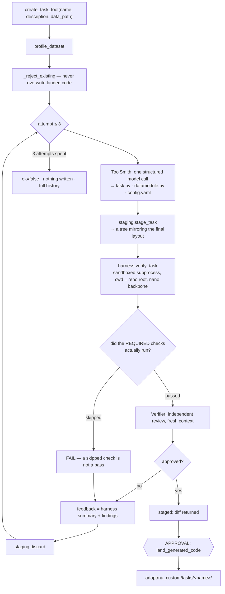

# Generating a New Task (flow D)

When no shipped task can even *read* your data, the platform writes one: three files, no
engine change, verified against your actual data, independently reviewed, and landed only
after you approve the diff.

---

## Contents

1. [When you need this](#when-you-need-this)
2. [The conversation](#the-conversation)
3. [What runs, in order](#what-runs-in-order)
4. [The seven checks](#the-seven-checks)
5. [The independent review](#the-independent-review)
6. [The approval gate](#the-approval-gate)
7. [What lands, and what happens next](#what-lands-and-what-happens-next)
8. [A worked example: `splice_simple`](#a-worked-example-splice_simple)
9. [Editing generated code afterwards](#editing-generated-code-afterwards)
10. [What can go wrong](#what-can-go-wrong)

---

## When you need this

`profile_dataset` tells you:

```json
{"layout_match": null,
 "layout_reason": "No shipped task reads this layout. The closest shape is 'splice_site'
                   (Binary sequence classification (CLS token)), which expects: Spliceator
                   layout: <root>/GS_1/db_N/{Train,Val}_{donor,acceptor}_400.csv …",
 "guidance": "No shipped task reads this layout. …"}
```

`layout_match: null` is the signal. `recommend_training_config` will refuse with the same
reason — *"This data does not match any shipped task's layout, so there is nothing to train
yet."*

> ⚠️ The `guidance` text still says the new-task flow is one "which this build does not yet
> automate". That is stale — it *is* automated, and this document describes it. See
> [../README.md gap #3](../README.md#known-documentation-gaps).

## The conversation

```
you> I have labelled sequences in dod_data/. Can anything train on this?
  → profile_dataset({path: "dod_data"})
    = {"columns": ["sequence", "label"], "target_type": "binary",
       "length_median": 400, "layout_match": null, …}
No shipped task reads this layout — flat CSVs with sequence/label columns.

you> Then build me a task for it, called splice_simple.
  → create_task_tool({name: "splice_simple",
                      description: "binary donor splice-site classification from flat CSVs",
                      data_path: "dod_data"})
    = {"ok": true, "iterations": 1, "history": ["attempt 1: passed"],
       "harness": "task 'splice_simple': PASS\n  [ok  ] import: …",
       "stage_id": "splice_simple-ab12cd34", "files": [...]}

you> Land it.                     ← approval gate: file list, line counts, staging path, diff
```

## What runs, in order



**Nothing is written into the repository until you approve.** A failed run leaves only a
staging directory, and even a successful one only stages.

Modules: [../modules/codegen.md](../modules/codegen.md),
[../modules/agents.md](../modules/agents.md#6-toolsmithpy).

## The seven checks

Run by [`_harness_runner.py`](../modules/codegen.md#3-harnesspy-and-_harness_runnerpy--the-seven-checks)
inside a bounded subprocess, on a **`nano`** backbone (6 blocks, random init — instant on
CPU, no weights needed), **from the repository root**.

| # | Check | Proves |
|---|---|---|
| 1 | `import` | The module imports and `@register_task` registered the expected name |
| 2 | `config_head` | The config resolves through the engine's own resolver, its `task:` matches, and its `head:` block actually builds a head |
| 3 | `datamodule` | **Your real data** loads: `build_datamodule` → `prepare_data` → `setup("fit")` → a batch is drawn |
| 4 | `forward_backward` | Forward runs, loss is finite, gradients reach every trainable tensor, and no frozen parameter got one |
| 5 | `metrics` | `update_metrics` + `compute_metrics` reduce to finite scalars |
| 6 | `adapter_roundtrip` | **Predictions are identical across save → load** |
| 7 | `serving` | The adapter registers into a real `RiNALMoHub` and predicts, exactly as a registered tool does |

### Why "the harness ran from the repo root" matters

Checks 3–5 need your data, and your `config.yaml` points at it with a repo-relative path.
A harness that ran anywhere else would find nothing, **skip** those checks, and report green
for code that had never touched your data. So:

```python
REQUIRED_FOR_GENERATED = ("datamodule", "forward_backward", "metrics")
# a status of "skip" is treated exactly like "fail"
```

and the feedback given to the next attempt says so:

> `[FAIL] required checks did not run: ['datamodule', …]. The datamodule must read the
> user's data from the paths in config.yaml (paths are resolved from the repository root).`

### Why check 6 is the important one

This project's number-one silent failure is task state that predictions depend on but that
never reaches the adapter file — it loads without error and returns plausible-looking wrong
numbers. Rather than asking a reviewer *"did you remember `ADAPTER_EXTRA_PREFIXES`?"*, the
harness proves it: randomise everything the adapter is supposed to carry, predict, save,
reload into a fresh module built from the same seed, predict again, require **identical**
outputs.

The failure message names both remedies — tensors go in `ADAPTER_EXTRA_PREFIXES`, plain
Python values go in `adapter_extra_payload()`/`load_adapter_extra()`.

### Bounds on the subprocess

Wall clock 600 s, `RLIMIT_CPU` 900 s, `RLIMIT_AS` 32 GiB, `RLIMIT_FSIZE` 512 MB, own process
group, no CUDA, no core dumps. **This is accident-isolation, not adversarial sandboxing** —
it stops infinite loops, runaway memory and stray writes. The human diff gate is the real
boundary.

## The independent review

Only if the harness passes. The Verifier runs in a **fresh context** — an auditor that
inherits the writer's context inherits the writer's blind spots — and is told explicitly not
to re-litigate what the harness already proved. Its job is what a test cannot check:

| Field | Question |
|---|---|
| `approved` | *Would you be comfortable with these numbers in a paper?* |
| `findings` | Specific, actionable problems |
| `owns_unsaved_state` | **Silent-failure question 1**, the *non-tensor* half — is there state predictions depend on that is not carried in the adapter file? |
| `boundary_tokens` | **Silent-failure question 2** — how are CLS/EOS/padding handled in `extract_features`, and is that right for this head? |

Plus: does the datamodule read the columns the data actually has? Does the loss match the
target type? Do the metrics suit the task? Is the config's `task:` the registered name?

A rejection becomes structured feedback for the next attempt, along with the harness summary
— *"Fix these specific problems. Keep everything that worked."*

## The approval gate

```
  ┌─ approval required ──────────────────────────────────────────
  │ Write generated task 'splice_simple' into the project:
  │ adaptrna_custom/tasks/splice_simple/task.py,
  │ adaptrna_custom/tasks/splice_simple/datamodule.py,
  │ adaptrna_custom/tasks/splice_simple/config.yaml
  │   write:     adaptrna_custom/tasks/splice_simple/task.py  (166 lines)
  │   write:     adaptrna_custom/tasks/splice_simple/datamodule.py  (145 lines)
  │   write:     adaptrna_custom/tasks/splice_simple/config.yaml  (41 lines)
  │   staged in: /…/toolhub_data/staging/splice_simple-ab12cd34
  │   (open it in your editor to read the code before approving)
  └──────────────────────────────────────────────────────────────
  approve? [y/N]
```

The payload also carries the **full diff** (`Stage.diff()`), which the browser modal renders.

You are invited to read the staged files in an editor first, and that is not a figure of
speech: **staging directories outlive the session**, so you can approve in a later one:

```
you> What code is waiting for approval?
  → list_staged_code({})
    = [{"stage_id": "splice_simple-ab12cd34", "kind": "task", "name": "splice_simple",
        "files": [...], "staging_path": "/…/toolhub_data/staging/splice_simple-ab12cd34"}]
```

`staged(stage_id)` falls back to disk for exactly this reason.

## What lands, and what happens next

```
adaptrna_custom/tasks/splice_simple/
├── __init__.py        created if new
├── task.py            @register_task("splice_simple")
├── datamodule.py      LightningDataModule producing (tokens, labels)
└── config.yaml        task: splice_simple; data.root: dod_data
```

Git-tracked source code, yours to edit. It is discovered automatically —
[`discovery.load_all()`](../modules/codegen.md#6-discoverypy) imports every
`adaptrna_custom/tasks/*/task.py` before training, serving or verification — so no
registration step and no restart are needed.

The tool result says what to do next:

> *"The task is registered on next use — recommend_training_config can now target it."*

Which means [flow C](finetuning.md) proceeds normally:

```
you> Now recommend a training config for it and run it.
```

`recommender._config_path` prefers `adaptrna_custom/tasks/<task>/config.yaml` over
`engine/configs/tasks/<task>.yaml`, and the run goes through
`jobs/train_entrypoint`, which imports the generated task before delegating to the engine
CLI. Since the knowledge base has no band for a new task, the analyzer will treat the first
run as a **baseline** and say so.

## A worked example: `splice_simple`

`adaptrna_custom/tasks/splice_simple/` is a real generated task that passed 7/7 harness
checks on the first attempt, was reviewed, landed and trained. Read it as the reference for
what good generated code looks like:

```python
@register_task("splice_simple")
class SpliceSimpleModule(BaseDownstreamModule):
    # Question 1: the task owns a decision threshold that predictions depend on and
    # that is NOT a head weight. It is a plain Python float, so it travels in the
    # adapter via adapter_extra_payload()/load_adapter_extra(). No extra tensors or
    # buffers exist, so ADAPTER_EXTRA_PREFIXES stays empty.
    ADAPTER_EXTRA_PREFIXES = ()
    PRIMARY_METRIC = "test/f1_score"

    def extract_features(self, representation, tokens):
        # Question 2: the head is a per-sequence classifier, so it consumes the CLS
        # token only -- EOS and padded positions never reach it.
        return representation[:, 0]

    def adapter_extra_payload(self):  return {"threshold": float(self.threshold)}
    def load_adapter_extra(self, extra):
        self.threshold = float(extra.get("threshold", …))
        # …and push it back into every metric that has a threshold
```

Both silent-failure questions answered **in comments, at the point of the answer** — and
check 6 proved the answer to question 1 was implemented, not just claimed.

The demo data it reads (`dod_data/`) is regenerable:

```bash
python agentic/scripts/make_demo_data.py --source <spliceator-fold-dir> --out dod_data
```

It derives flat `sequence,label` CSVs from the Spliceator donor folds — the same 400 nt
windows the shipped task trains on, in a schema **no shipped task can read**. That is the
point: it is what makes this flow necessary.

## Editing generated code afterwards

It is ordinary source code. Edit it, commit it, refactor it. Two guarantees:

* **Nothing regenerates it behind your back.** `pipeline._reject_existing` refuses to
  generate a task whose name already exists — *"Landed code is yours: edit it directly, or
  choose another name."*
* **A broken one does not break the others.** `discovery.load_all()` returns
  `(name, exception)` pairs rather than raising; `doctor` reports the failure by name.

To re-verify after an edit:

```python
from adaptrna_agentic.codegen.harness import verify_task, summarize
print(summarize(verify_task(
    "splice_simple",
    task_module="adaptrna_custom.tasks.splice_simple.task",
    config_path="adaptrna_custom/tasks/splice_simple/config.yaml")))
```

## What can go wrong

| Symptom | Meaning | Fix |
|---|---|---|
| `ok: false` after 3 attempts | The loop gave up. **Nothing was written.** | Read `history` and the final `harness` summary — they name the specific check that kept failing. Often the description or the data layout needs to be clearer. |
| `required checks did not run: ['datamodule']` | The generated datamodule could not find your data | Confirm `data.root` in the generated config resolves from the repo root, and that the files are where the profile said |
| `A task named 'x' already exists in adaptrna_custom/tasks/` | Deliberate | Edit the existing one, or choose another name |
| `the script exceeded its time limit (possible infinite loop)` | The sandbox timed out at 600 s | Usually a datamodule that reads everything eagerly |
| Harness passes but the reviewer rejects | The code works but does not do what you asked, or trips a silent-failure question | The findings are specific; they become the next attempt's feedback automatically |
| `doctor` reports `custom_tasks` FAIL | A landed task no longer imports | Fix the code in `adaptrna_custom/tasks/`, or delete the package |
| Staging directories accumulate | Stages that were never landed | `toolhub prune staging` (dry run; `--yes` to apply) |
