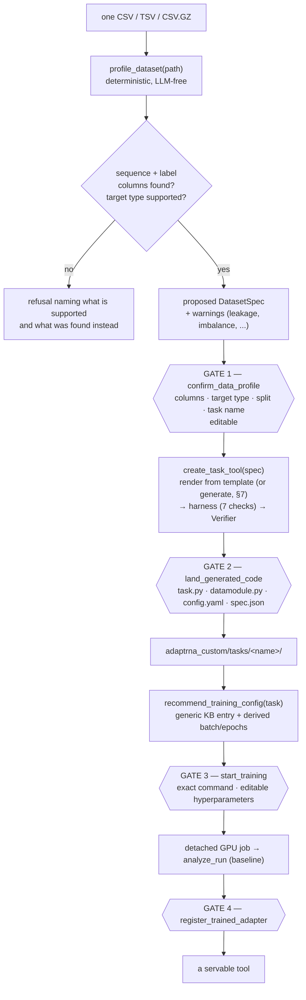
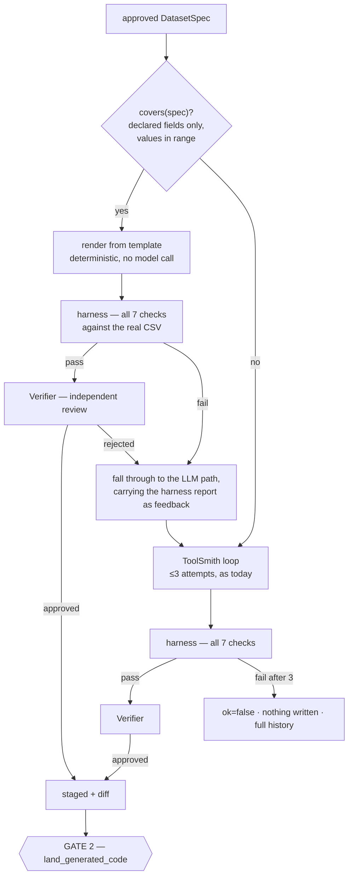

# Phase 13 — Cold start: no shipped tasks, one CSV, four gates

## Context

The platform was built on an assumption that is now being removed: **that downstream task
code already exists**. Today `engine/rinalmo_hub/tasks/__init__.py` registers three tasks on
import, `knowledge/task_templates.yaml` describes their on-disk layouts, and
`profile_dataset` answers the question *"which shipped task can read this?"* by matching
against them. The whole finetuning flow (flow C) is downstream of that match: no
`layout_match`, no plan, no training.

From this phase on the system starts **empty**. It ships no task definitions, no adapter
definitions, no registered tools, and — importantly — **no knowledge that the shipped
example tasks exist at all**. It cannot name them, match against them, recommend them, or
show them to a code generator as a reference shape.

What it accepts instead is deliberately narrow: **one delimited table** (`.csv`, `.tsv`,
`.csv.gz`) with, among its columns, **one sequence column and one label column**. From that
one file the system walks four steps, each ending in a human decision:

```
one CSV → [1] profile → ⛔ approve the interpretation
                      → [2] generate data loader + head → ⛔ approve the code
                      → [3] recommend hyperparameters → ⛔ approve the run
                      → training, analysis → ⛔ approve registration   (unchanged)
```

Steps 3 and 4 already exist; step 2 exists as flow D and needs re-pointing; step 1 and its
gate are new. Nothing downstream of `start_training` changes.

### Decisions made with the user (2026-08-18)

| # | Decision | Consequence |
|---|---|---|
| D1 | The three engine tasks (`splice_site`, `mrl`, `sec_struct`) **stay on disk** so they can still be driven from the engine CLI for LoRA-vs-full-FT experiments — but the agentic layer must have **no idea they exist, not even as a reference** | Delete every agent-facing mention; keep `engine/` untouched |
| D2 | The ViennaRNA wrapper is **deleted**, not merely unregistered. It played the same role for flow E that the worked example played for flow D — a shipped implementation shown to a generator as the thing to imitate — so it goes for the same reason (see §1.1) | `external/vienna.py` deleted; `external_tool_prompt` carries `contract.py` only |
| D3 | The profiling result is approved through a **real gated tool** on the interpretation, not a conversational "shall I proceed?" | New `confirm_data_profile` in `GATED_TOOLS` |
| D4 | Hyperparameters come from a **generic knowledge-base entry**, and **the human may edit them in the gate** before approving | New `generic:` section; approval decisions must be able to carry edits |
| D5 | Splits are either **random with user-specified fractions** or **taken from a column** (values naming the splits, or a user-supplied value→split mapping) | The split policy is part of the approved spec |
| D6 | The ToolSmith prompt loses **both** the knowledge-base task shapes **and** the worked example; it keeps the engine's subclass contract, the silent-failure rules — plus **generic head recipes keyed on target type**, carrying no task identity | `prompts.py` rewritten |
| D7 | Supported label types: **binary, multiclass, regression**. Anything else is **refused** at the profile gate with a statement of what is supported | Three recipes, one refusal path |
| D8 | Input is **one table**; `.tsv` and `.csv.gz` are accepted because they are the same read. Directories and FASTA are refused | The directory/FASTA/Spliceator/MRL branches are deleted |
| D9 | A landed task **records its spec**; profiling a later CSV compares against landed specs and *offers* reuse. This replaces `layout_match` — built from the user's own landed code, never from shipped templates | New spec sidecar + matcher |
| D10 | The four steps are **user-driven, one per turn**. No auto-chaining | Matches today's orchestrator; approval in one step never implies the next |
| D11 | The forbidden-string rule applies to **docstrings and help text too**, not just executable code | Two existing usage examples (`--task splice_site`) become neutral placeholders |
| D12 | Phase 13 ships an explicit **clean-slate step** so a first boot genuinely shows zero tools, matching the documentation | §15 |
| D13 | Step 2 is **template-first**: a deterministic renderer produces the code for any spec the template covers; the ToolSmith/Verifier loop remains as the **fallback** for anything it cannot express | §7 |
| D14 | The renderer emits **complete, self-contained files**, version-stamped — not a thin subclass over a shipped base class | Landed code stays readable and editable with nothing hidden behind it |
| D15 | Rendered code runs **all 7 harness checks *and* the independent review** — the same verification as generated code | §7.4; the review's findings become template bugs, not per-task feedback |

---

## Contents

1. [What "the system knows nothing" means — deletion inventory](#1-what-the-system-knows-nothing-means--deletion-inventory)
2. [The new flow](#2-the-new-flow)
3. [`DatasetSpec` — the object the whole phase turns on](#3-datasetspec--the-object-the-whole-phase-turns-on)
4. [Step 1 — profiling, and gate 1](#4-step-1--profiling-and-gate-1)
5. [Approval decisions that carry edits](#5-approval-decisions-that-carry-edits)
6. [The knowledge base, rewritten](#6-the-knowledge-base-rewritten)
7. [Step 2 — building the data loader and head](#7-step-2--building-the-data-loader-and-head)
8. [Step 3 — hyperparameters, and gate 3](#8-step-3--hyperparameters-and-gate-3)
9. [Reuse: the replacement for `layout_match`](#9-reuse-the-replacement-for-layout_match)
10. [Serving: what a registered tool knows about itself](#10-serving-what-a-registered-tool-knows-about-itself)
11. [The orchestrator prompt](#11-the-orchestrator-prompt)
12. [Files to change](#12-files-to-change)
13. [Tests](#13-tests)
14. [Documentation to update](#14-documentation-to-update)
15. [Migration and existing state](#15-migration-and-existing-state)
16. [Risks and things deliberately not done](#16-risks-and-things-deliberately-not-done)
17. [Implementation order](#17-implementation-order)
18. [Verification — how we know the phase landed](#18-verification--how-we-know-the-phase-landed)

---

## 1. What "the system knows nothing" means — deletion inventory

The rule for this phase: **no file under `agentic/` may contain the string `splice_site`,
`mrl`, `sec_struct`, `ncrna_classification`, `Spliceator`, `GS_1`, `bpRNA`, `vienna` or
`RNAfold`** — in code, in a docstring, in help text or in a comment. The `engine/` tree is
out of scope (D1). A test enforces it (§13), and it is checked against *files*, not just
executable lines (D11), because a `--task splice_site` example in a CLI docstring is a
capability claim to whoever reads `--help`.

There are no exemptions. That is a change from the first draft of this plan, which
exempted `toolhub/external/vienna.py` — see §1.1.

Two occurrences are easy to miss because they are documentation rather than logic:
[`jobs/train_entrypoint.py:8`](../agentic/adaptrna_agentic/jobs/train_entrypoint.py#L8) and
[`cli/toolhub.py:5`](../agentic/adaptrna_agentic/cli/toolhub.py#L5) both use `splice_site`
as their usage example. Both become a neutral placeholder (`--task <your_task>`).

| Where | Today | After |
|---|---|---|
| [`knowledge/task_templates.yaml`](../agentic/adaptrna_agentic/knowledge/task_templates.yaml) | 3 task templates + `no_match_guidance` | **File deleted.** Replaced by `target_shapes.yaml` (§6) |
| [`knowledge/hyperparameters.yaml`](../agentic/adaptrna_agentic/knowledge/hyperparameters.yaml) | `arms:`, `universal:`, `tasks:` (3 entries with reference bands, epochs, caveats) | `arms:` and `universal:` **unchanged**; `tasks:` **deleted**; new `generic:` section (§6) |
| [`profiling/profiler.py`](../agentic/adaptrna_agentic/profiling/profiler.py) | directory profiling, Spliceator fold sniffing, MRL `.csv.gz` detection, FASTA reader, `_match_layout`, `_nearest_template` | One-table reader only; **new** split-column detection, leakage and quality checks; no layout matching |
| [`profiling/recommender.py:96`](../agentic/adaptrna_agentic/profiling/recommender.py#L96) | `if task == "splice_site": overrides["data.test_root"] = …` | Deleted with `_splice_test_root` |
| [`profiling/recommender.py:54`](../agentic/adaptrna_agentic/profiling/recommender.py#L54) | `task = task or profile["layout_match"]` | `task` comes from the approved spec or an explicit argument |
| [`codegen/prompts.py`](../agentic/adaptrna_agentic/codegen/prompts.py) | `worked_example()` reads `engine/examples/ncrna_classification/`; `template_for_profile()` scores KB templates | Both deleted; `recipe_for(spec)` supplies one generic head recipe |
| [`agents/tool_factory.py:67`](../agentic/adaptrna_agentic/agents/tool_factory.py#L67) | `_TASK_OUTPUT_NOTES = {"splice_site": …, "mrl": …, "sec_struct": …}` | Notes derived from the tool's own recorded spec (§10) |
| [`toolhub/runtime.py:290`](../agentic/adaptrna_agentic/toolhub/runtime.py#L290) | `_VALIDATORS` keyed by task name | Keyed by **target type**, chosen from the tool's recorded spec |
| [`toolhub/registry.py:25`](../agentic/adaptrna_agentic/toolhub/registry.py#L25) | `PAD_SENSITIVE_TASKS = {"mrl"}` | Read from the spec's `pad_sensitive` flag, set when the recipe pools over the sequence |
| [`knowledge/__init__.py`](../agentic/adaptrna_agentic/knowledge/__init__.py) | `templates()`, `template_for()`, `task_knowledge()`, `primary_metric_of()` imports `rinalmo_hub.tasks` | `templates`/`template_for`/`task_knowledge` deleted; `primary_metric_of` **must stop importing `rinalmo_hub.tasks`** — that import is precisely how a shipped task would leak back in |
| [`agents/orchestrator.py`](../agentic/adaptrna_agentic/agents/orchestrator.py) `SYSTEM_PROMPT` | describes a tool-rich platform | rewritten for a system that starts empty (§11) |
| [`jobs/train_entrypoint.py:8`](../agentic/adaptrna_agentic/jobs/train_entrypoint.py#L8) | docstring: `--task splice_site --use_lora ...` | `--task <your_task> --use_lora ...` |
| [`cli/toolhub.py:5`](../agentic/adaptrna_agentic/cli/toolhub.py#L5) | docstring: `predict splice_site --sequences ACGU...` | `predict <your_tool> --sequences ACGU...` |
| `toolhub/external/*`, [`codegen/prompts.py:212`](../agentic/adaptrna_agentic/codegen/prompts.py#L212) | the ViennaRNA wrapper and every pointer to it | see §1.1 |

**What stays untouched:** everything under `engine/` — the three task modules, their configs,
their tests, `engine/examples/`. They remain reachable exactly one way, `python -m
rinalmo_hub.cli.train --task …`, which is what D1 preserves them for. `engine/README.md`
keeps documenting them; `documents/` stops presenting them as platform capabilities (§14).

> **One consequence worth stating up front.** Because the rule covers `agentic/tests/` too,
> `test_harness.py` can no longer use the shipped tasks as its known-good PASS controls —
> and without a control, a green harness report proves nothing. The controls move to
> **fixture tasks** under `tests/fixtures/`, one per supported target type, shared with the
> codegen regression test. The engine's own suite keeps testing the shipped tasks from
> inside `engine/tests/`, where they still belong. See §13.

### 1.1 The ViennaRNA wrapper (D2)

`vienna.py` is an external *tool*, not a task, so D1 does not obviously reach it. It is
removed anyway, because of what it is used **for**:

```python
# codegen/prompts.py — external_tool_prompt()
"# The hand-written reference implementation\n\n```python\n"
+ _read(REPO_ROOT / "agentic" / "adaptrna_agentic" / "toolhub" / "external" / "vienna.py")
```

Flow E hands the generator the full source of a shipped wrapper and tells it to imitate
that file. This is precisely the arrangement D6 removes for tasks. Keeping one and deleting
the other would mean the platform ships no reference implementation for the code it writes
— except for the one kind of code where it still does.

| Path | Occurrence | After |
|---|---|---|
| `toolhub/external/vienna.py` | the wrapper itself (101 lines, `SPEC`, `fold`, `cofold`, golden cases) | **deleted** |
| [`codegen/prompts.py:212`](../agentic/adaptrna_agentic/codegen/prompts.py#L212) | reads that file into `external_tool_prompt` | the reference block is deleted; the prompt keeps the full source of `contract.py` |
| [`external/__init__.py:2`](../agentic/adaptrna_agentic/toolhub/external/__init__.py#L2) | *"`vienna.py` is the hand-written…"* | docstring rewritten |
| [`external/contract.py:16`](../agentic/adaptrna_agentic/toolhub/external/contract.py#L16) | *"…is the reference implementation of all of this"* | docstring rewritten to describe the contract on its own terms |
| [`cli/toolhub.py:53`](../agentic/adaptrna_agentic/cli/toolhub.py#L53) | `help="Import path, e.g. adaptrna_agentic.toolhub.external.vienna"` | `e.g. adaptrna_custom.tools.<your_tool>` — which is where a wrapper actually lives now |
| `tests/test_vienna_wrapper.py` | imports `SPEC, _clean, cofold, fold` | replaced by `test_external_fixture_wrapper.py` against a fixture wrapper (§13) |
| `tests/test_ui_contract.py:276` | uses `"vienna_fold"` as a sample tool name | neutral name |

What flow E keeps is `contract.py` — 200 lines of typed specification with `ExternalToolSpec`,
`FunctionSpec`, `GoldenCase` and `PackageSpec`, plus the loader that refuses a module
declaring a function it does not define. That loader is the actual gate on generated
wrappers, and it is unchanged. The cost is the same as D6's and is tracked the same way
(§16).

## 2. The new flow



Each arrow out of a gate is a **separate user turn** (D10). The system never walks two gates
in one instruction.

## 3. `DatasetSpec` — the object the whole phase turns on

One structure carries the user's approved interpretation from gate 1 all the way to the
registered tool. It is produced by the profiler as a *proposal*, edited and approved at gate
1, consumed by codegen, written beside the landed code as `spec.json`, and copied into the
tool's manifest `provenance` at registration.

```jsonc
{
  "spec_version": 1,
  "source": "confirm_data_profile",          // stamped, like the training plan
  "path": "/abs/path/to/data.csv",
  "format": {"separator": ",", "compression": null, "rows": 24188, "header": true},

  "sequence_column": "sequence",
  "label_column": "label",
  "ignored_columns": ["gene_id", "source"],   // present in the file, not used

  "target_type": "binary",                    // binary | multiclass | regression
  "classes": ["0", "1"],                      // classification only, ordered → class index
  "class_counts": {"0": 12094, "1": 12094},
  "target_summary": {"min": 0.0, "max": 1.0}, // regression only

  "alphabet": "dna",                          // dna | rna
  "length": {"min": 400, "median": 400, "max": 400},

  "split": {
    "mode": "random",                         // random | column
    "fractions": {"train": 0.8, "val": 0.1, "test": 0.1},
    "seed": 42,
    "stratify": true,                         // classification only
    "column": null,                           // mode=column
    "mapping": null,                          // mode=column: {"train": ["train"], ...}
    "row_counts": {"train": 19350, "val": 2419, "test": 2419},
    "dropped_rows": 0
  },

  "task_name": "donor_sites",
  "tool_description": "binary donor splice-site classification from flat CSVs",
  "head": {                                   // from the target-type recipe, §6
    "kind": "cls_classifier",
    "loss": "binary_cross_entropy_with_logits",
    "metrics": ["acc", "precision", "recall", "f1_score"],
    "primary_metric": "test/f1_score",
    "pad_sensitive": false
  },

  "warnings": [
    "1,204 sequences (5.0%) appear more than once in the file; duplicates are split "
    "independently, so the same sequence can land in both train and test."
  ]
}
```

Three properties matter:

* **It is the single source of truth downstream.** The datamodule's columns, the head's
  shape, the primary metric, the split, the pad-sensitivity of serving, and the reuse
  matcher all read this one object. Nothing re-derives them from the CSV a second time.
* **It is stamped** (`source: "confirm_data_profile"`), the same mechanism the training plan
  uses. `create_task_tool` refuses a spec that is not stamped, so a model cannot hand-write
  a spec and skip gate 1.
* **`head` is filled from the recipe table, not by the model.** The user may change
  `target_type` at gate 1 (and thus the recipe), but neither the model nor the generator
  chooses the loss and metrics.

**Where it lives:** in-memory during the turn; persisted by `staging.stage_task` as a fourth
file `spec.json` inside the stage, landed with the other three into
`adaptrna_custom/tasks/<name>/spec.json`, and copied into `provenance["spec"]` at
registration.

## 4. Step 1 — profiling, and gate 1

### `profiler.profile_dataset(path)` — rewritten

Accepts `.csv`, `.tsv`, `.csv.gz`, `.tsv.gz`. Anything else — a directory, `.fa`, `.pt`, an
unknown suffix — raises `ToolHubError` with:

> `This build trains from a single table (.csv/.tsv, optionally gzipped) containing one
> sequence column and one label column. '<path>' is a directory.`

What it computes (all deterministic, `pandas`, capped at `_SAMPLE_ROWS` for column sniffing
but **full-file** for row counts, class counts and duplicate detection — a sampled class
count is how you get a stratified split that is not):

| Field | How |
|---|---|
| `sequence_column` | name hints, then content sniffing (`_SEQUENCE_PURITY = 0.9`) — unchanged logic |
| `label_column` | name hints, then first numeric non-sequence column — unchanged logic |
| `target_type` | unchanged thresholds: 2 uniques → `binary`; ≤20 integer uniques → `multiclass`; numeric otherwise → `regression`; non-numeric ≤20 uniques → `multiclass` (values become `classes`) |
| `split_candidates` | every non-sequence, non-label column with ≤10 distinct values, with its value counts — this is what makes `mode: "column"` offerable |
| `warnings` | the quality checks below |

**Quality checks, each a warning string on the spec** (they are the reason profiling is a
gate rather than a print-out):

1. **Duplicate sequences** — count and percentage. Named explicitly because with a random
   split the same sequence lands on both sides of the evaluation.
2. **Duplicates spanning splits** — for `mode: "column"`, computed exactly: *"318 sequences
   appear in both the train and test groups"*. This is the leakage check.
3. **Class imbalance** — minority class below 10%.
4. **Non-nucleotide characters** — rows whose sequence contains anything outside `ACGTUN`,
   with the offending characters and a row count. These rows are not silently dropped; the
   gate says whether the datamodule will drop or fail on them (the spec records
   `on_invalid: "fail"` by default).
5. **Missing values** in either chosen column, with counts.
6. **Length spread** — max/median ratio > 4, since batch size is derived from the median and
   memory is driven by the max.
7. **Tiny data** — under 200 usable rows after splitting, the run will not mean much.

**Unsupported target types (D7).** If the label column is free text, has >20 distinct
non-numeric values, or looks per-position (a string as long as the sequence), the profiler
refuses:

> `The label column 'annotation' holds per-position strings the same length as the
> sequences. This build trains three head shapes from one sequence+label table: binary
> classification, multiclass classification (≤20 classes), and regression on a continuous
> target. Per-position and structure targets are not supported here.`

No conversion is offered and none is improvised.

### The split (D5)

`profile_dataset` proposes `mode: "random"` with `{train: 0.8, val: 0.1, test: 0.1}`,
`seed: 42`, `stratify: true` for classification. If it finds a split candidate column whose
values look like split names (`train`, `val`, `valid`, `validation`, `test`, `dev`,
case-insensitive), it proposes `mode: "column"` with the obvious mapping instead and reports
the row counts.

At gate 1 the user may switch modes, change fractions or seed, or supply a mapping for
arbitrary values (`{"train": ["human", "mouse"], "test": ["fly"]}`). Rules enforced when the
edit is validated:

* fractions must be positive and sum to 1.0 (±1e-6);
* `test` may be set to 0, in which case the primary metric becomes `val/*` and the spec
  carries a warning that there is no held-out number;
* in `column` mode, values not named in the mapping are **dropped**, and the dropped row
  count is shown in the gate before approval — never silently;
* every mode produces `row_counts`, recomputed by the validator, so the user approves actual
  numbers rather than ratios.

### `confirm_data_profile` — the new gated tool

```python
def confirm_data_profile(spec: dict) -> dict:
    """Put the profiler's interpretation of a dataset to the user for approval.

    Pass the spec returned by profile_dataset unchanged. The user may correct the column
    choice, the target type, the split policy and the task name before approving. The
    approved spec is what create_task_tool consumes; nothing is generated without it.
    Requires user approval.
    """
```

* Added to `MANAGEMENT_TOOL_NAMES` and to `GATED_TOOLS`.
* Refuses a spec whose `source` is not `"profile_dataset"` (the profiler's own stamp),
  with the same wording pattern as the training-plan refusal — *"call profile_dataset and
  pass its result through unchanged"*.
* On approval it re-validates the (possibly edited) spec — columns exist in the file, the
  target type is one of the three, the split is coherent, `task_name` is a valid Python
  identifier not already present in `adaptrna_custom/tasks/` — recomputes `classes`,
  `class_counts`, `row_counts` and `head` from the **file**, re-stamps it
  `source: "confirm_data_profile"`, and returns it.
* Recomputation on approval is the load-bearing part: a user who switches `target_type` from
  `regression` to `multiclass` gets a spec whose head, metrics and stratification all follow,
  rather than a spec that says one thing and trains another.

`orchestrator._summarize`:

> `Use column 'sequence' as the sequence and 'label' as a binary target from data.csv
> (24,188 rows → 19,350/2,419/2,419 train/val/test), and build task 'donor_sites'`

`orchestrator._details` adds a `spec` block the CLI and UI render field by field:

```
  ┌─ approval required ──────────────────────────────────────────
  │ Use column 'sequence' as the sequence and 'label' as a binary target …
  │   file:      /home/mh/data/donors.csv  (24,188 rows, 5 columns)
  │   sequence:  sequence          400 nt (min 400, max 400), dna
  │   label:     label             binary — 0: 12,094 · 1: 12,094
  │   ignored:   gene_id, source, chrom
  │   split:     random 80/10/10, seed 42, stratified → 19,350 / 2,419 / 2,419
  │   head:      linear classifier on the CLS token · BCE-with-logits · f1_score
  │   task:      donor_sites
  │   ! 1,204 sequences (5.0%) appear more than once in the file; …
  └──────────────────────────────────────────────────────────────
  edit a field, or approve? [field=value … | y/N]
```

## 5. Approval decisions that carry edits

D4 and gate 1 both need the human to **change** something at the gate, and the current
round trip cannot express that: `interrupt()` resumes with `{approved, note}` and
`run_tools` invokes the tool with the model's original `call["args"]`. The Monaco editor
added in Phase 12 has the same limitation — it renders code and discards any typing.

The change, kept as small as it can be:

1. **Decision schema** grows one optional field:
   ```python
   {"approved": true, "note": null, "edits": {"split.fractions.train": 0.7, ...}}
   ```
   Dotted paths into the gated call's argument object. Absent or `{}` means "as proposed",
   which is what every existing gate sends today — so all four existing gates keep working
   unchanged.
2. **`orchestrator.run_tools`** applies them before invoking:
   ```python
   args = _apply_edits(call["args"], decision.get("edits"), call["name"])
   ```
   `_apply_edits` refuses any path not on that tool's whitelist, refuses a type change, and
   raises a `ToolException` naming the offending path — an edit that cannot be validated must
   fail loudly, because it is a training configuration.
3. **Whitelists**, defined next to `GATED_TOOLS`:
   ```python
   EDITABLE_ARGS = {
       "confirm_data_profile": ("spec.sequence_column", "spec.label_column",
                                "spec.target_type", "spec.task_name",
                                "spec.tool_description", "spec.split.*"),
       "start_training":       ("plan.overrides.*", "plan.seed", "plan.arm",
                                "plan.quick_run"),
   }
   ```
   `land_generated_code` is deliberately **not** editable in this phase: editing generated
   code at the gate means re-running the harness on the edited version, and shipping code
   that was verified in one form and landed in another is exactly the failure the staging
   design exists to prevent. Phase 12's editor stays read-only, and the plan says so.
4. **Transport.** `cli/chat.py::_prompt_approval` accepts `field=value` lines before `y`;
   `api/schemas.py::ResumeRequest` gains `edits: dict | None`; `api/routers/sessions.py`
   passes it into the `Command(resume=…)`; `ui/app.js::decide()` collects edited inputs from
   the new spec/plan form in the modal and sends them.
5. **Recording.** Whatever the human changed is recorded on the object the tool returns —
   `spec["human_edits"]` and `plan["human_overrides"] = {field: {"recommended": x,
   "chosen": y}}` — and every later surface prints it. §8 covers why that matters for the
   plan stamp.

## 6. The knowledge base, rewritten

### `hyperparameters.yaml`

* `arms:` — **unchanged**. LoRA lr 3e-4, clip 1.0, r 16 / alpha 32 / dropout 0.05 / stride 3;
  full_ft lr 1e-5; both with their `why` and `failure_modes`. These were validated across
  tasks and transfer, which is the entire justification for keeping them in a system that
  now knows no tasks.
* `universal:` — **unchanged** (bf16-mixed, and the FlashAttention non-determinism note that
  the analyzer's tolerance logic reads).
* `tasks:` — **deleted**. Every reference band, per-task epoch default and caveat goes with
  it. There are no known tasks any more; a band is a property of a task and a dataset and
  cannot be invented.
* `generic:` — **new**, and this is where the "derived, not invented" values live:

```yaml
generic:
  label: An unseen task trained from a single sequence+label table
  # There is no reference band, and saying so is the point.
  reference:
    band: null
    tolerance: 0.0
    sources: ["No validated reference run: this task did not exist before your data."]
  # Values that cannot transfer across datasets are DERIVED from the approved spec by
  # rules stated here, so the recommender still invents nothing.
  derived:
    batch_size:
      rule: piecewise_on_median_length
      table: [[128, 64], [512, 32], [1024, 16], [2048, 8]]     # median nt → batch
      fallback: 4
      why: "Activation memory on the giga backbone scales with sequence length; measured
             on this machine (H200 80 GB), 400 nt trains comfortably at batch 32 and
             25-100 nt at batch 64."
    max_epochs:
      rule: step_budget
      target_steps: [1000, 10000]
      clamp: [1, 20]
      why: "Epoch count is meaningless without a dataset size. Choosing epochs so the run
             lands inside a 1k-10k optimiser-step budget gives a comparable amount of
             learning per run whether the table has 2,000 rows or 200,000."
    num_workers:
      value: 8
      why: "The engine's base default of 0 loads data on the training process; 8 keeps a
             single GPU fed without oversubscribing a workstation."
  wall_clock:
    reference: "unknown — no run of this task exists yet"
    estimate_rule: "derived_steps × measured_step_time, when a previous run of the same
                    backbone and batch size exists; otherwise reported as unknown."
  caveats:
    - "This task has no reference band. The first successful run becomes the baseline that
       later runs of the same task are compared against."
```

Two things to be exact about. `derived` rules are **executed by `recommender.py`**, not
copy-pasted values, and the rationale strings shown to the user are generated from the same
`why:` lines — the property the phase must not lose. And a `band: null` means the analyzer
takes the path it already has for unknown tasks (`analysis.previous_best` → *baseline*), so
no analyzer change is needed at all.

### `target_shapes.yaml` — replaces `task_templates.yaml`

Three entries, keyed by target type, carrying no task identity, no dataset layout and no
`required_paths` (there is nothing left to match against):

```yaml
target_shapes:
  binary:
    label: Binary sequence classification
    head: "one linear layer on the CLS-token representation → a single logit"
    extract_features: "representation[:, 0]   # CLS only; EOS and padding never reach the head"
    loss: binary_cross_entropy_with_logits
    metrics: [acc, precision, recall, f1_score]
    primary_metric: test/f1_score
    predict_output: "one probability per sequence"
    pad_sensitive: false
    adapter_state: "If the task keeps a decision threshold, it is a plain Python value and
                    MUST travel via adapter_extra_payload()/load_adapter_extra()."

  multiclass:
    label: Multiclass sequence classification
    head: "one linear layer on the CLS-token representation → n_classes logits"
    extract_features: "representation[:, 0]"
    loss: cross_entropy
    metrics: [acc, macro_f1]
    primary_metric: test/macro_f1
    predict_output: "one class label plus per-class probabilities per sequence"
    pad_sensitive: false
    adapter_state: "The class-index → class-label mapping decides what a prediction MEANS
                    and MUST travel via adapter_extra_payload()/load_adapter_extra(), or a
                    reloaded adapter silently relabels every prediction."

  regression:
    label: Sequence regression
    head: "pooled representation → an MLP producing one scalar"
    extract_features: "mask padded positions, then mean-pool; pass (representation, pad_mask)"
    loss: mse
    metrics: [r2, mse, mae]
    primary_metric: test/r2
    predict_output: "one predicted value per sequence, in the original target scale"
    pad_sensitive: true
    adapter_state: "A target scaler fitted on the training split MUST be registered as a
                    buffer whose prefix is in ADAPTER_EXTRA_PREFIXES; predictions depend
                    on it and it is not a head weight."
```

`adapter_state` is written per shape because it is the concrete instance of silent-failure
question 1 for that shape — the trap check 6 exists to catch, stated where the generator
will read it.

### `knowledge/__init__.py`

```python
arm(name)                     # unchanged
universal()                   # unchanged
generic_knowledge()           # the generic: section, replacing task_knowledge_or_generic
derived(rule_name)            # the derivation rules, for recommender.py
target_shape(target_type)     # KeyError names the three supported types
```

`task_knowledge`, `task_knowledge_or_generic`, `generic_task_knowledge`, `templates` and
`template_for` are deleted. `primary_metric_of` is deleted outright: its body imports
`rinalmo_hub.tasks`, and the primary metric now comes from the spec's `head.primary_metric`,
which the user approved.

## 7. Step 2 — building the data loader and head

### 7.1 Why this step stops being a generation problem

Under the constraints this phase introduces, look at what actually varies between two
tasks: the sequence column, the label column, the file path and separator, the target type,
the class list, the split policy, the invalid-row policy. That list **is** the `DatasetSpec`
of §3 — and the human approved every field of it at gate 1.

So the three files are a *pure function of the approved spec*. Nothing is left for a
language model to decide. Generation was necessary when the input space was "any dataset on
disk"; gate 1 removed the judgment from the problem, and the mechanism should follow.

This is [documents/README.md](../documents/README.md)'s own principle — *"agents thin, logic
deterministic; the LLM is used only where judgment is genuinely required"* — applied one
level further than it was before.

What the change buys, beyond the retry cost of §16:

* **The silent-failure traps stop being per-dataset risks.** The regression target scaler in
  `ADAPTER_EXTRA_PREFIXES`, the multiclass label mapping in `adapter_extra_payload()`,
  `representation[:, 0]` versus masked pooling — solved once by a human in the template, then
  inherited by every task. Today each generated task re-derives them and check 6 hopes to
  catch the misses.
* **Determinism.** The same spec renders byte-identical code, so the output is reviewable
  once rather than per task.
* **No API key is needed for step 2** on the template path.

### 7.2 The two paths (D13)



`covers(spec)` is a plain predicate over the spec: every field is one the template knows,
the target type is one of the three, the split mode is one of the two, and no field carries a
value outside its declared range. It is cheap and it is honest about being incomplete — which
is why the **real** boundary is reactive rather than predictive:

> **A harness failure or a review rejection on the template path is not an error — it is the
> signal that this data is outside the declared space.** The pipeline falls through to the
> LLM path, carrying the harness report and the findings as its opening feedback.

That matters because a deterministic renderer cannot be retried. Identical spec in, identical
code out, identical failure. So on the template path `MAX_ITERATIONS = 1`, and the fallback
is the only meaningful response to a failure. Writing this down prevents the obvious bug: a
render → fail → render loop that burns three identical attempts.

The tool result names which path produced the code (`"path": "template"` /
`"path": "generated"`, with `"fell_back_from_template": true` and the reason when it
switched), and the gate-2 payload says so too. A user must never be unsure whether a human
wrote the logic they are approving.

### 7.3 The templates (D14)

```
agentic/adaptrna_agentic/codegen/templates/
├── __init__.py
├── render.py               covers(spec) · render(spec) -> {task.py, datamodule.py, config.yaml}
├── TEMPLATE_VERSION        a single integer, bumped on any change to the files below
├── task.py.j2
├── datamodule.py.j2
└── config.yaml.j2
```

* **Complete, self-contained output.** The rendered `task.py` is a full
  `BaseDownstreamModule` subclass — head, `extract_features`, loss, metrics, adapter state,
  all written out. No shipped base class stands behind it. This preserves the property the
  project documents as a feature: *landed code is git-tracked source, yours to read and
  edit, with nothing regenerating it behind your back.*
* **Version-stamped.** Every rendered file carries
  `# rendered by adaptrna template v<N> from spec.json` in its header, and `spec.json`
  records `template_version`. A template fix does not reach already-landed tasks — by design,
  since they are the user's code now — but `toolhub doctor` gains a check listing landed
  tasks rendered from a superseded version, so *stale* is a visible state rather than an
  invisible one.
* **Conditionals stay shallow.** Three target types × two split modes is handled by branching
  on `spec.target_type` and `spec.split.mode` inside the templates, not by a matrix of
  template files. If a fourth axis ever appears, that is the signal to reconsider the
  mechanism rather than to nest further.
* **The templates are ordinary reviewed code.** They are written by a human, live in the
  repository, and are covered by the golden tests of §13. The review that used to happen per
  generated task happens here, once, in a pull request.

### 7.4 Verification is identical on both paths (D15)

Rendered code runs the **full harness — all 7 checks, against the real CSV** — and then the
**independent review**. No shortcuts, and in particular no "the template is known good, skip
the data-dependent checks": the checks prove properties of *template-plus-data*, not of the
template alone, and the "a skipped check is not a pass" rule exists because that exact
shortcut once produced a green report for code that had never touched the user's file.

The review's role does change, and the plan should be honest about it. On the template path
the Verifier is not reviewing an author's judgment — there is no author. It is reviewing
**the template's fitness for this spec**, which is why its rejection routes to the fallback
rather than to a retry. Two consequences worth building in:

* A rejection on the template path is logged as a **template bug report**, with the spec that
  triggered it, so a pattern of rejections becomes a template fix rather than a slow drip of
  fallbacks nobody looks at.
* The Verifier prompt on this path states that the code was rendered deterministically from
  an approved spec, and asks the narrower question — *does this code do what this spec says,
  for this data?* — rather than the open-ended authorship question. Asking a reviewer to
  hunt for a careless author's mistakes in machine-rendered output produces noise.

### 7.5 `create_task_tool(spec)` replaces `create_task_tool(name, description, data_path)`

```python
def create_task_tool(spec: dict) -> dict:
    """Generate the data loader and head for an approved dataset spec. …"""
```

* Refuses a spec whose `source` is not `"confirm_data_profile"`, naming the fix — the same
  mechanical guard as the training plan's, and for the same reason: without it a model that
  finds gate 1 inconvenient will assemble a spec itself.
* `name` and `description` come from `spec["task_name"]` / `spec["tool_description"]`; the
  profile argument disappears.
* `_reject_existing(name)` is unchanged.

### 7.6 The LLM fallback path, and `prompts.py` after D6

The pipeline (ToolSmith → stage → harness → Verifier, ≤3 attempts) is otherwise
**structurally unchanged**. What changes is what goes into the prompt, and when the path
runs at all.

| Removed | Kept | Added |
|---|---|---|
| `worked_example()` reading `engine/examples/` | `SUBCLASS_CONTRACT` | `spec_section(spec)` — the approved spec as JSON, described as *the contract with the user, already agreed* |
| `template_for_profile()` | `SILENT_FAILURE_RULES` | `recipe_section(spec)` — **only** the one `target_shapes.yaml` entry matching the approved target type |
| the KB "closest known task shape" block | `HARD_REQUIREMENTS` | `worked_example()` **re-pointed**: the template rendered against a synthetic fixture spec (see below) |
| — | — | split instructions generated from `spec["split"]` (exact fractions/seed/stratification, or the column and mapping) |

**The worked example question answers itself now.** The neutral example the generator sees is
the **template's own rendered output** against a tiny synthetic `sequence,label` fixture CSV
in `tests/fixtures/`. Nothing extra to write or maintain; guaranteed consistent with the
engine contract; guaranteed correct, because it is the same reviewed template that produces
production code; and carrying no RNA task identity at all. `worked_example()` calls
`templates.render()` rather than reading a directory.

This also removes most of the D6 risk (§16): the fallback path regains a worked example,
and it is a better one than `ncrna_classification` was, because it is rendered for the same
three target types the fallback will be asked to write.

`HARD_REQUIREMENTS` grows four lines that the spec makes checkable:

* the datamodule reads **exactly** `spec["sequence_column"]` and `spec["label_column"]` from
  `spec["path"]`, and ignores the rest;
* it implements **the approved split** and nothing else — no re-shuffling, no second seed;
* `PRIMARY_METRIC` **must equal** `spec["head"]["primary_metric"]`;
* rows whose sequence contains characters outside `ACGTUN` are handled per
  `spec["on_invalid"]` (fail loudly by default).

The generator loses its worked example (D6), which is a real quality cost: `test_prompts.py`
exists on the finding that a generator with less context writes code that fails check 1.
Two mitigations are part of this phase rather than left to chance — the recipe is far more
prescriptive than the old template was (it names the loss, the metric keys, the
`extract_features` expression and the adapter-state trap), and §13 adds a generation
regression test that runs the loop against a fixture CSV for each of the three target types.
If iterations-to-pass regresses, restoring a **neutral** minimal example (a synthetic
`sequence,label` CSV task written for this purpose, never registered, no RNA-domain content)
is the pre-agreed remedy.

### 7.7 Harness

Unchanged except one addition, which the spec makes possible:

* **Check 5 (`metrics`) also asserts the task's `PRIMARY_METRIC` is among the keys
  `compute_metrics` returns** (stage-suffix aware). Today a task can register a primary
  metric nothing computes, and the failure surfaces hours later as an analyzer that reports
  `primary_value: null` on a finished run.
* A matching broken fixture goes into `tests/fixtures/broken_task_sources.py`, per the rule
  in [extending.md](../documents/extending.md#add-a-harness-check) that a check with no catch
  test is a check nobody knows works.

### 7.8 Staging and landing

`stage_task` accepts a fourth file, `spec.json`, written by the pipeline rather than the
model. `land()` copies it with the rest, so `adaptrna_custom/tasks/<name>/` becomes:

```
__init__.py   task.py   datamodule.py   config.yaml   spec.json
```

`spec.json` is what makes reuse (§9) and serving (§10) possible after the session ends. It
is also the file a human reads to know what the landed code was supposed to do.

## 8. Step 3 — hyperparameters, and gate 3

`recommend(spec_or_task, arm="lora", quick=False, seed=42)`:

1. `task` comes from the argument or the spec; **`layout_match` is gone**, and the refusal
   for a missing task is reworded: *"There is no task to train yet. Approve a dataset spec
   with confirm_data_profile and build one with create_task_tool."*
2. Backbone from the ToolHub manifest — **unchanged**, including the
   no-checkpoint warning and the configured-but-missing refusal.
3. `data.root` → the CSV's **file path** (not its parent). With a single-table input, the
   directory is not the unit any more; the generated config points at the file the spec
   names. `_data_root` and `_splice_test_root` are deleted.
4. Arm settings from `arms.lora` — **unchanged**, with their rationale lines.
5. **Derived values** from `generic.derived`, computed against the spec:
   `data.batch_size` from the median length table, `trainer.max_epochs` from the step
   budget (`rows_train / batch_size` steps per epoch → epochs putting the total inside
   1k–10k, clamped 1–20), `data.num_workers` = 8. Each contributes a rationale line
   generated from its `why:` — *"trainer.max_epochs 6: 19,350 training rows at batch 32 is
   605 steps per epoch; 6 epochs ≈ 3,630 optimiser steps, inside the 1k–10k budget."*
6. `primary_metric` and `reference` from the spec's head and `generic.reference` (band
   `null`). `estimated_wall_clock` is `"unknown — no run of this task exists yet"` unless a
   previous job of the same task and batch size supplies a measured step time.
7. The plan keeps its `source: "recommend_training_config"` stamp and its exact `command`.

### The human override, and why the stamp survives it (D4)

`start_training` still refuses any plan not stamped by the recommender. That rule was written
against **the model** routing around a refusal, and it is unchanged. What is new is that the
**human** may change values at the gate, which is a different actor with different authority
— the gates exist precisely to put decisions in their hands.

So an edit at gate 3:

* is applied by `_apply_edits` to `plan.overrides.*` / `plan.seed` / `plan.arm` /
  `plan.quick_run` only;
* triggers a **rebuild of `plan["command"]`** — the approval payload must show the command
  that will actually run, and a stale command in the gate would make the whole "shown
  verbatim" guarantee a lie;
* records `plan["human_overrides"] = {"optim.lr": {"recommended": 0.0003, "chosen": 0.001}}`;
* appends a warning **generated from the knowledge base** when the chosen value matches a
  recorded failure mode: *"optim.lr = 1e-3 is a recorded failure mode: trains well to loss
  0.126 by step ~325, then a gradient spike collapses it into a constant-output state."*;
* is carried into the job record and printed by `analyze_run`, so a result is never read as
  having been produced on the recommended settings.

The gate re-renders after an edit and asks again. A human who overrides after being shown the
recorded failure mode has made a decision; the system's job is to make sure they made it
knowingly and that the record says so.

## 9. Reuse: the replacement for `layout_match` (D9)

`profile_dataset` gains a final, non-authoritative step:

```python
profile["similar_tasks"] = [
    {"task": "donor_sites", "score": 1.0,
     "why": "same columns ('sequence', 'label'), same target type (binary), "
            "median length 400 vs 400",
     "spec_path": "adaptrna_custom/tasks/donor_sites/spec.json"}
]
```

Computed by comparing the proposed spec against every `adaptrna_custom/tasks/*/spec.json`:
column names equal (+2), target type equal (+2), class count equal (+1), median length within
20% (+1). Anything scoring below the "columns and target type both match" threshold is not
reported at all — a weak suggestion here costs a wrong training run.

It is a **suggestion presented at gate 1**, never an automatic branch:

> `This looks like the data 'donor_sites' already reads (same columns, same binary target,
> same 400 nt median). Train that task on this file, or build a new one?`

Reusing means skipping step 2: `recommend_training_config(task="donor_sites",
spec=<the new spec>)` with `data.root` pointing at the new file. The generated datamodule
reads its path from the config, so this works without regenerating code — provided the
columns match, which is exactly what the matcher checked.

A missing or unreadable `spec.json` (hand-written task, older landing) means that task simply
never matches. It is never an error.

## 10. Serving: what a registered tool knows about itself

Three task-name lookups become spec lookups. `register_trained_adapter` copies the landed
`spec.json` into `entry.provenance["spec"]`, and:

| Today | After |
|---|---|
| `tool_factory._TASK_OUTPUT_NOTES[entry.task]` | `provenance["spec"]["head"]` → the recipe's `predict_output` string. A registered tool describes its own output because its spec says what it predicts. |
| `runtime._VALIDATORS[entry.task]` | `_VALIDATORS[spec["target_type"]]` — three validators: probabilities in [0,1] one per sequence; a class label from the recorded `classes` per sequence; one finite float per sequence. Strictly more coverage than today, since every generated task gets one. |
| `registry.PAD_SENSITIVE_TASKS = {"mrl"}` | `spec["head"]["pad_sensitive"]` — set by the recipe (true for regression's pooled head), forcing serving batch size 1. |

A tool whose entry has no spec (registered by CLI from a hand-built adapter) keeps today's
behaviour: no note, no validator, not pad-sensitive. Absence is reported, not guessed.

## 11. The orchestrator prompt

Rewritten around the four steps. The parts that must survive verbatim in spirit: tool state
is the user's decision; never invent hyperparameters; never present a truncated run as a
result; report tool output faithfully. The parts that change:

* Opening: the assistant serves a backbone that **starts with no tools at all**, and its
  first job with a new user is usually to turn one CSV into one.
* The four steps named in order, with the tool for each, and the explicit statement that
  **each step is a separate request** — after a gate, report what happened and stop; do not
  begin the next step until asked (D10).
* What the system accepts: *one CSV/TSV with a sequence column and a label column*; binary,
  multiclass or regression labels. If the data is something else, say so plainly rather than
  proposing a workaround.
* On gate 1: present the profiler's interpretation and its warnings **as given**, especially
  duplicate/leakage warnings; the user's edits at the gate are theirs, not suggestions to
  argue with.
* On refusals: report them with the reason, do not re-attempt with different arguments.

## 12. Files to change

### Deleted

| Path | Why |
|---|---|
| `agentic/adaptrna_agentic/knowledge/task_templates.yaml` | replaced by `target_shapes.yaml` |
| `agentic/adaptrna_agentic/toolhub/external/vienna.py` | §1.1 — a shipped implementation shown to a generator as the thing to imitate |
| `agentic/tests/test_vienna_wrapper.py` | replaced by `test_external_fixture_wrapper.py` (§13) |

### Rewritten

| Path | Change |
|---|---|
| `knowledge/hyperparameters.yaml` | drop `tasks:`, add `generic:` |
| `knowledge/target_shapes.yaml` | **new** — three target-type recipes |
| `codegen/templates/` | **new** — `render.py` (`covers`, `render`), the three `.j2` templates, `TEMPLATE_VERSION` (§7.3) |
| `knowledge/__init__.py` | new API (§6); delete template/task/primary-metric helpers |
| `profiling/profiler.py` | one-table reader, split detection, quality checks, `similar_tasks`; no layouts |
| `profiling/recommender.py` | spec-driven; derived batch/epochs; no `layout_match`, no splice branch |
| `codegen/prompts.py` | contract + silent-failure rules + spec + one recipe; no example, no templates; `external_tool_prompt` loses its reference implementation (§1.1) |
| `toolhub/external/__init__.py`, `toolhub/external/contract.py` | docstrings describing the contract on its own terms |
| `jobs/train_entrypoint.py`, `cli/toolhub.py` | neutral usage examples in docstrings and `--help` (D11) |
| `codegen/pipeline.py` | `create_task(spec, …)`; the template path with `MAX_ITERATIONS = 1` and fall-through to the LLM path; writes `spec.json` into the stage |
| `toolhub/doctor.py` | new check: landed tasks rendered from a superseded `TEMPLATE_VERSION` |
| `agentic/pyproject.toml` | add the `codegen.templates` subpackage and a `package-data` entry for `knowledge/*.yaml` + `codegen/templates/*.j2` — see §14; without it a built wheel cannot render a task |
| `codegen/staging.py` | four staged files; `spec.json` landed with the rest |
| `codegen/_harness_runner.py` | check 5 also asserts `PRIMARY_METRIC` is computed |
| `agents/tool_factory.py` | `confirm_data_profile`; `create_task_tool(spec)`; `EDITABLE_ARGS`; spec-derived output notes; `MANAGEMENT_TOOL_NAMES` + `GATED_TOOLS` |
| `agents/orchestrator.py` | `_summarize`/`_details` for gate 1; `_apply_edits` in `run_tools`; new `SYSTEM_PROMPT` |
| `toolhub/runtime.py` | validators keyed by target type |
| `toolhub/registry.py` | pad-sensitivity from the spec; spec into provenance |
| `cli/chat.py` | render the spec block; accept `field=value` edits at the prompt |
| `api/schemas.py`, `api/routers/sessions.py` | `edits` on the resume payload |
| `ui/render.js`, `ui/app.js` | spec/plan form in the approval modal; send `edits` |

### Untouched, deliberately

`engine/**` (D1), `jobs/**` (the runner, store and analyzer need no change — the analyzer's
unknown-task baseline path is already what a generic entry produces), `toolhub/manifest.py`,
`toolhub/prune.py`, `codegen/sandbox.py`, `codegen/discovery.py`, `codegen/harness.py`
(launcher only), and `agents/toolsmith.py` / `agents/verifier.py` — the fallback path uses
them unchanged.

## 13. Tests

### New

| Test | Guards |
|---|---|
| `test_no_shipped_task_knowledge.py` | greps every **file** under `agentic/` — sources, docstrings, help text, comments, YAML, and the test suite itself — for the forbidden strings of §1, with **no exemptions**. This is the one test that keeps D1 and D2 true as the code evolves |
| `test_external_fixture_wrapper.py` | replaces `test_vienna_wrapper.py`: a minimal fixture wrapper under `tests/fixtures/` exercises `contract.load_spec`, validation-before-import, and `run_golden`. The contract keeps its coverage without a shipped wrapper existing |
| `test_dataset_spec.py` | spec validation: bad fractions, unknown column, unsupported target type, `task_name` collision, mode switching, recomputation of `row_counts`/`classes` on approval |
| `test_profile_gate.py` | `confirm_data_profile` refuses an unstamped spec; the interrupt fires **before** any spec is stamped; a decline leaves nothing behind |
| `test_approval_edits.py` | `_apply_edits` whitelist enforcement, type checking, unknown path refusal; an edited plan rebuilds `command`; `human_overrides` recorded; a recorded failure mode produces its warning |
| `test_split_policy.py` | random split determinism under a seed, stratification preserves class ratios, column mode maps and drops correctly, dropped rows reported, leakage detection across a column split |
| `test_generic_recommender.py` | derived batch size at each length band, the step-budget epoch rule at 500 / 20k / 500k rows, clamping, rationale lines generated from `why:` |
| `test_templates_render.py` | **golden-file tests**: each of the three target types × two split modes renders byte-for-byte expected output. Cheap, fast, no model, and the thing that makes a template change reviewable as a diff |
| `test_templates_cover.py` | `covers(spec)` accepts every spec the gate can produce and rejects a spec carrying a field or value it does not handle; the predicate is never allowed to claim coverage it lacks |
| `test_codegen_paths.py` | the template path renders and passes the harness with **no model call at all** (assert the model is never invoked); a spec `covers()` rejects goes straight to the LLM path; a **harness failure on rendered code falls through** rather than retrying, and the result records `fell_back_from_template` with a reason |
| `test_codegen_target_types.py` (marked slow) | the **fallback** loop against three fixture CSVs (binary / multiclass / regression), asserting the harness passes and `PRIMARY_METRIC` matches the spec. Measures iterations-to-pass, which is the D6 regression guard |

### Rewritten

`test_profiler.py` (no layouts; new checks), `test_recommender.py` (**keep the property that
matters most**: the built command still parses with the engine's own CLI parser),
`test_knowledge.py` (assert `tasks:` is *absent* and the arm values survive),
`test_prompts.py` (assert the prompt contains the contract, the silent-failure rules, the
approved spec and exactly one recipe — and **no** task names), `test_tool_factory.py`,
`test_approval_gate.py`, `test_pipeline*.py`, `test_ui_contract.py` (the new `spec` detail
fields and `edits`; the `vienna_fold` sample name), `test_runtime.py` / `test_registry.py`
(spec-driven validators and pad sensitivity), `test_external_contract.py` /
`test_external_registry.py` / `test_external_cli.py` (point them at the fixture wrapper),
and the scenario YAMLs under `tests/scenarios/`, which currently script conversations about
the shipped tasks.

### Re-scoped, not deleted

`test_harness.py`'s PASS controls move from the shipped engine tasks to **fixture tasks
under `tests/fixtures/`** — one per target type, the same three the codegen test uses. The
harness keeps a known-good control (without which its green reports mean nothing) and the
agentic test suite stops importing `rinalmo_hub.tasks`. The engine's own suite continues to
test the shipped tasks from inside `engine/tests/`, where they still belong.

This is required, not optional: D11's rule covers `agentic/tests/`, so a control naming
`splice_site` would fail `test_no_shipped_task_knowledge.py`. Write the fixture tasks
**before** deleting the old controls, and check the new ones fail the deliberately broken
fixtures in `broken_task_sources.py` exactly as the old ones did — a control swapped in
without that check is a control nobody knows works.

## 14. Documentation to update

`documents/` is the project's reference documentation and it is written from the code, so a
change of this size touches most of it. **All 24 files are listed below with an explicit
verdict** — including the ones that need nothing — so no file is skipped by omission.

The documentation updates land in the **same commit** as the code they describe. A phase
that ships code first and documents later produces exactly the drift
[`documents/README.md`](../documents/README.md) opens by promising it does not have.

### Substantial rewrites

| Document | Change |
|---|---|
| `documents/modules/profiling-and-knowledge.md` | **The largest.** No templates, no layout matching, no `_nearest_template`; the one-table reader and its quality checks; the `generic:` section and the derivation rules; `DatasetSpec` as the profiler's output |
| `documents/workflows/finetuning.md` | Rewritten around the CSV: the four steps, the four gates, the editable plan |
| `documents/workflows/new-task-codegen.md` | Entry condition becomes "you have a CSV", not "no shipped task reads this"; the spec replaces the profile as input; **the headline change** — the declared case is *rendered*, not generated, and the document must say which path ran and why |
| `documents/modules/codegen.md` | The two paths and the fall-through rule; the `templates/` package and `covers()`; `MAX_ITERATIONS = 1` on the template path; prompt contents; the fourth staged file; the extended check 5 |
| `documents/configuration.md` | §4 knowledge base (`generic:`, `target_shapes.yaml`); **new section: the `DatasetSpec` schema**; `human_overrides` on the plan; `template_version` |

### Targeted edits

| Document | Change |
|---|---|
| `documents/README.md` | §1 what the project is; §4 the five-flows table; §6 state (`spec.json`); §10 verified facts — registered tools **none**, new test counts; **gap #3 disappears** (its subject, `no_match_guidance`, is deleted) |
| `documents/architecture.md` | The flow diagrams; the profiler's role; where the LLM is and is not used, now that step 2 is deterministic on the common path |
| `documents/project_structure.md` | `external/vienna.py` removed; `codegen/templates/` added; `spec.json` in the landed-task layout; `knowledge/` file list |
| `documents/modules/agents.md` | The **fifth gate**; `EDITABLE_ARGS` and `_apply_edits`; the new system prompt; the Verifier's narrower prompt on the template path |
| `documents/modules/toolhub.md` | Validators keyed by target type; pad-sensitivity from the spec; spec in `provenance`; the external section's references to the deleted wrapper |
| `documents/modules/api.md` | `edits` on the resume payload (`ResumeRequest`) |
| `documents/modules/web-ui.md` | The approval modal's spec/plan form and how edits are returned; Phase 12's editor stays read-only and the document should say why |
| `documents/modules/cli.md` | `_prompt_approval` accepting `field=value`; the neutral usage examples in `toolhub` help |
| `documents/modules/jobs.md` | No code change, but the analyzer now **always** takes the baseline path — the reference-band section describes a case that can no longer occur |
| `documents/workflows/inference-and-tools.md` | Flows A and B are narrated with the shipped tools as examples; re-narrate with a tool the user built |
| `documents/workflows/external-tools.md` | §5 "writing a wrapper by hand" says *"follow `vienna.py` exactly"*; it must teach `contract.py` directly instead |
| `documents/workflows/operations.md` | The new `doctor` check for stale `template_version`; the clean-slate procedure of §15 |
| `documents/workflows/README.md` | The flow index — flow D is now template-first with a generation fallback |
| `documents/modules/README.md` | Module index and dependency graph: add `codegen/templates`, remove `toolhub/external/vienna` |
| `documents/extending.md` | "Teach the profiler a new layout" → **"add a target shape"** (the new common extension); the approval-gate recipe gains the edit path; a new entry for changing a template and bumping `TEMPLATE_VERSION` |
| `documents/testing.md` | The new test files; the fixture-task controls replacing the shipped-task controls, and why that swap is safe |
| `documents/setup.md` | The verification walkthrough no longer has tools to list; the packaging caveat now also covers `templates/*.j2` (see below) |

### No change needed

| Document | Why |
|---|---|
| `documents/modules/engine-backbone.md` | Documents `rinalmo`; the engine is untouched (D1) |
| `documents/modules/engine-hub.md` | Documents `rinalmo_hub`; likewise untouched |

### One code item this audit surfaced

`documents/README.md` gap #2 records that `agentic/pyproject.toml`'s explicit
`[tool.setuptools] packages` list omits `adaptrna_agentic.codegen` and has no `package-data`
entry for `knowledge/*.yaml`. Phase 13 makes that worse: `codegen/templates/` is a **new
subpackage whose `.j2` files are package data**, and a wheel built without them would install
a system that cannot render a task at all. Editable installs — the only supported path today
— are unaffected, but the fix is now one line of prevention rather than a latent trap:

* add `adaptrna_agentic.codegen.templates` to `packages`;
* add `package-data = {"adaptrna_agentic" = ["knowledge/*.yaml", "codegen/templates/*.j2"]}`.

Added to §12's rewrite list.

### Outside `documents/`

| File | Change |
|---|---|
| `plans/MASTER_PLAN.md` | §1 vision and §6 knowledge base: the platform no longer ships tasks; add Phase 13 to the §8 roadmap with its status |
| `README.md`, `agentic/README.md` | Quick starts begin from a CSV, not from a shipped task |
| `engine/README.md` | **Unchanged** — the shipped tasks are still exactly what it documents, and D1 keeps them usable that way |

## 15. Migration and existing state

### The clean-slate step (D12)

`toolhub_data/tools.json` currently holds one active entry — `viennafold_predict_structure`,
backed by [`adaptrna_custom/tools/rna_secondary_structure.py`](../adaptrna_custom/tools/rna_secondary_structure.py),
a wrapper generated in an earlier session. Left alone, the first boot after this phase would
show one tool while every document says the system starts with none.

So Phase 13 ends with an explicit, ordered reset, run once by hand and recorded here:

```bash
python -m adaptrna_agentic.cli.toolhub remove viennafold_predict_structure
rm adaptrna_custom/tools/rna_secondary_structure.py
python -m adaptrna_agentic.cli.toolhub prune staging            # dry run
python -m adaptrna_agentic.cli.toolhub prune staging --yes      # drops rna_secondary_structure-fb9990f1
python -m adaptrna_agentic.cli.toolhub list                     # expect: no tools
```

This is **not** code that runs on upgrade. Deleting a user's registered tool is a human
action at the CLI, the same reason there is no delete endpoint in the API. It is written
down so the state on this machine matches the documentation, and so the verified-facts table
in `documents/README.md` can honestly say *registered tools: none*.

The backbone configuration (`giga` at `~/.cache/rinalmo_pretrained/giga-v1.pt`) stays — it is
what the hub serves, not a tool.
* `jobs_data/jobs.json` and `outputs/*` (the existing `mrl_*` and `splice_*` runs) are
  historical records of engine-CLI experiments and stay. `analyze_run` on one of them will
  now take the unknown-task path and report a baseline instead of a reference band, which is
  accurate: the platform no longer knows those tasks.
* `adaptrna_custom/tasks/` is empty apart from `__init__.py`. Nothing to migrate.
* Landed tasks from *before* this phase (none exist here, but the code should not assume it)
  simply have no `spec.json`: they never match for reuse, get no output note and no
  validator, and are not pad-sensitive.

## 16. Risks and things deliberately not done

| Risk | Handling |
|---|---|
| **Generation quality drops without the worked example** (D6) | **Largely resolved by D13.** The declared case never reaches a model at all, and the fallback path regains a worked example — the template rendered against a fixture spec (§7.5), which is a better example than the one removed because it covers exactly the three target types the fallback will be asked to write. What remains: the residual failure is retries, not wrong code (the harness catches everything; nothing wrong lands), each retry costing ~2 model calls plus a harness run of up to 600 s. `test_codegen_target_types.py` measures iterations-to-pass on the fallback path |
| **The template silently covers a spec it should not** | `covers()` is whitelist-shaped — it accepts known fields with in-range values and rejects everything else — and `test_templates_cover.py` guards it. The backstop is that rendered code faces the identical harness and review as generated code (D15), so a bad fit fails verification and falls through rather than landing |
| **A template fix does not reach already-landed tasks** | Deliberate: landed code is the user's. Made *visible* rather than silent by the version stamp in every rendered file and a `doctor` check listing tasks rendered from a superseded version |
| **Template conditionals sprawl** | Three target types × two split modes is the declared ceiling. A fourth axis is the signal to revisit the mechanism, not to nest further — stated in §7.3 so the decision is made deliberately rather than by accretion |
| **The same drop on flow E** (D2/§1.1) | Identical mechanism, cheaper: `_verify_wrapper` runs in process rather than in the sandbox, so a failed attempt costs a model call and a `load_spec`, not a 600 s subprocess. `contract.py` goes into the prompt in full and is a typed specification, not prose. Add the wrapper case to the same measurement test |
| **A human override produces a bad run and the result is read as recommended** | `human_overrides` on the plan, the job record and the analysis report; the gate re-renders and re-asks after an edit |
| **A mis-detected label column produces a plausible wrong model** | This is what gate 1 exists for; the gate shows class counts and row counts from the real file, not ratios |
| **Leakage through duplicate sequences** | Detected on the full file and shown at gate 1 as a warning; not silently deduplicated, because dropping a user's rows is their decision |
| **Edits arriving over HTTP become a config injection path** | `_apply_edits` is whitelist-only, type-checked, and refuses unknown paths with an error rather than ignoring them |
| **The single-CSV restriction is temporary** | The spec is versioned (`spec_version: 1`) and the split policy is already an enum, so a later multi-file mode adds a mode rather than reshaping everything downstream |

**Not in this phase:** multi-file datasets, a train/test pair of CSVs, per-position or
structure targets, editing generated code at the approval gate, auto-chaining the four steps,
and any change to the training runner, job store or analyzer.

---

## 17. Implementation order

The order is not arbitrary. Two constraints drive it: **the verification harness must never
be left without a known-good control**, and **the templates must be proved before the rest of
the phase is built on the assumption that they work**.

Each stage updates the `documents/` files it invalidates, in the same commit (§14).

### Stage 0 — the safety net, before anything is deleted

1. Write the three fixture tasks and their fixture CSVs under `tests/fixtures/` — binary,
   multiclass, regression.
2. Re-point `test_harness.py`'s PASS controls at them.
3. **Confirm the new controls still catch every entry in `broken_task_sources.py`**, exactly
   as the shipped-task controls did.

Nothing else may start until this is green. Deleting the old controls first would mean
building the entire phase on a harness whose reports nobody had reason to trust.

### Stage 1 — the templates, as a spike

4. `codegen/templates/` — `render.py` (`covers`, `render`), the three `.j2` files,
   `TEMPLATE_VERSION`.
5. Golden-file tests for three target types × two split modes.
6. Prove rendered output passes the full harness against a fixture CSV **with no model call**.

> **Stop and review here.** This is the stage where a wrong assumption in this plan would
> show up, and it is cheap to discover now and expensive to discover at stage 4. A human
> reads the rendered `task.py` and `datamodule.py` end to end and confirms the template can
> express all three target types without conditional sprawl. If it cannot, D13's boundary
> moves — the template covers less, the fallback covers more — and the rest of the plan is
> unaffected.

### Stage 2 — the spec and gate 1

7. `DatasetSpec` schema and its validator (§3, §4).
8. `profiler.py` rewritten: one-table reader, split detection, quality and leakage checks.
9. `confirm_data_profile`, `MANAGEMENT_TOOL_NAMES`, `GATED_TOOLS`, `_summarize`, `_details`.
10. The edits mechanism end to end (§5): `_apply_edits`, `EDITABLE_ARGS`, `cli/chat.py`,
    `api/schemas.py`, `api/routers/sessions.py`, `ui/render.js`, `ui/app.js`.

Item 10 is not optional at this stage: gate 1 without the ability to correct a mis-detected
column is a gate that can only be accepted or abandoned.

### Stage 3 — the knowledge base

11. Delete `tasks:`; add `generic:`; add `target_shapes.yaml`; delete `task_templates.yaml`.
12. `knowledge/__init__.py` new API.
13. `recommender.py`: spec-driven, derivation rules, no `layout_match`, no splice branch.

### Stage 4 — wiring step 2 together

14. `create_task_tool(spec)`; `pipeline.create_task` with both paths, `MAX_ITERATIONS = 1` on
    the template path and fall-through on failure.
15. `staging.py`: the fourth staged file.
16. `prompts.py`: the rewrite, with `worked_example()` calling `templates.render()`.
17. Harness check 5's `PRIMARY_METRIC` assertion, plus its broken fixture.

### Stage 5 — serving and reuse

18. Validators keyed by target type; `pad_sensitive` from the spec; spec into `provenance`.
19. The `similar_tasks` matcher (§9).
20. The `doctor` check for a superseded `TEMPLATE_VERSION`.

### Stage 6 — the purge

21. Delete `external/vienna.py` and `test_vienna_wrapper.py`; add the fixture wrapper;
    re-point `test_external_*.py`.
22. Neutral usage examples in `train_entrypoint.py` and `cli/toolhub.py`; the external
    docstrings; the `vienna_fold` sample name in `test_ui_contract.py`.
23. Add `test_no_shipped_task_knowledge.py` — **last**, because until this point some test
    still legitimately names a shipped task.
24. `agentic/pyproject.toml`: the `templates` subpackage and `package-data` (§14).

### Stage 7 — the orchestrator, documents and clean slate

25. The new `SYSTEM_PROMPT` (§11) and the scenario YAMLs.
26. Any `documents/` file not already updated by its stage; `plans/MASTER_PLAN.md`.
27. The clean-slate commands of §15, run by hand.
28. The end-to-end walkthrough of §18.

## 18. Verification — how we know the phase landed

### Automated

* `pytest agentic/tests` and `pytest engine/tests` green. The engine count should be
  **unchanged at 135** — if it moved, something reached into `engine/` and D1 was violated.
* `test_no_shipped_task_knowledge.py` green, which is the mechanical statement of D1 and D2.
* `test_codegen_paths.py` asserts the template path makes **zero model calls**.

### The end-to-end walkthrough

Run against a fresh state, with a fixture CSV, and record the output in the phase's closing
notes:

| # | Do | Expect |
|---|---|---|
| 1 | `toolhub list` | no tools |
| 2 | *"profile ~/data/binary.csv"* | gate 1: columns, class counts, split row counts, warnings — all from the real file |
| 3 | At the gate, change the split to 70/15/15 and approve | row counts **recomputed** in the re-rendered gate, not the original ratios |
| 4 | *"build the task"* | template path; harness 7/7; gate 2 shows the rendered code and `spec.json` |
| 5 | Approve | four files in `adaptrna_custom/tasks/<name>/`, `spec.json` carrying `template_version` |
| 6 | *"recommend a training config"* | derived batch size and epochs, each with its rationale line; `reference.band` null |
| 7 | At the gate, set `trainer.max_epochs=3` and approve | `command` **rebuilt** to match; `human_overrides` recorded |
| 8 | *"how's it going"*, then *"analyze it"* | run completes; verdict labelled a **baseline**; the override is named in the report |
| 9 | Approve registration | the tool appears; its description carries the spec's `predict_output` |
| 10 | Ask a question in plain language | a prediction, through the tool you just built |
| 11 | Profile a second CSV of the same shape | gate 1 **offers reuse** of the existing task |
| 12 | Profile a `.fasta` | refusal naming what this build accepts |
| 13 | Profile a CSV whose label is free text | refusal naming binary / multiclass / regression |
| 14 | Profile a CSV the template cannot express | falls through to the LLM path; the result says `fell_back_from_template` with a reason |

Step 14 is the one most worth doing deliberately rather than waiting for it to happen: the
fallback is the least-exercised path in the phase, and a boundary nobody has crossed on
purpose is a boundary nobody knows works.
